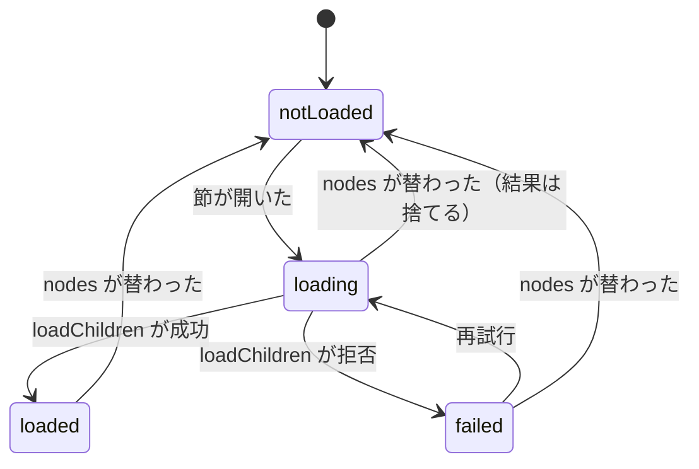
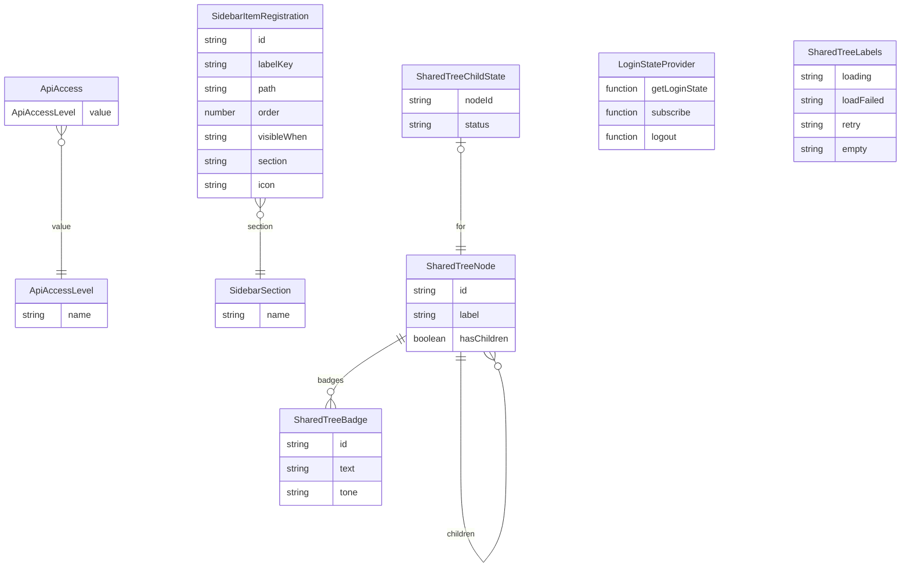

# 機能の仕様（Functional Spec）— U1 cross-cutting

## 出典

- 単位: `unit-of-work.md`（U1 cross-cutting、kind: library）、`unit-of-work-story-map.md`（U1 は US1.1 の AC1.1.15 を受け持ち、US1.2・US4.2・US5.3 の土台）
- 要件: `requirements.md`（NFR1.1・NFR1.3・NFR4.1〜NFR4.3・FR10.3〜FR10.5・C3〜C5）
- 部品: `components.md`（AccessControl・SharedTreeView・AppFrame の登録の型の拡張）
- 契約: `contract-summary.md`（C1 API の分類の注釈、C2 画面の登録の型と共有の木）
- ADR-008（`decisions.md`）、画面 `mockups.md`（S1・S4・S8）・`interaction-spec.md`（PermissionTree）・`design-system-mapping.md`、Delivery Planning `bolt-plan.md`（B2）
- この段の答え `functional-design-questions.md`（Q1: B、Q2〜Q6: A、まとめの確認 Looks correct）
- make-you-chic-ui からの対応完了の報告（5bf1ffe。固定先の更新は B9。報告の記述だけを根拠にする）
- 正の一覧: データの形は `entities.md`、決まりは `rules.md`。この文書は流れと状態の遷移の正で、ER の図と決まりの要約はそこから導いた写し。

## 1. 範囲

| 区分 | 持ち物 | 置き場 |
|---|---|---|
| バックエンド | 分類の注釈 `ApiAccess`・`ApiAccessLevel`、既存の 34 の口への印、静的な構造の検査、実行時の検査、`access`・`user` の境界テスト | `common.security`、各機能の `web`、テストの全体の置き場 |
| 画面 | ESLint の import の制限、既存の違反の直し（`useLogout`）、共有の木 `shared/tree`、登録の型の拡張と検査 | `frontend/eslint.config.js`、`app/registry`、`app/login-state`、`shared/tree`、`features/auth`・`features/registration` |

画面の部品の構成・props・状態・a11y は `frontend-components.md` に書く。

## 2. 流れ

### W1 既存の口に印を付ける（B2 のコード生成）

1. 3節の表の 10 のコントローラーに、クラスの単位で印を付ける（どのコントローラーも中の口がすべて同じ分類のため。違う分類を混ぜるコントローラーは、方法の単位で付ける）（BR1.1・BR1.9）。
2. 印を付けたパッケージ（各機能の `web`、注釈を置く `common.security`）が `packagesJudgedByTotal` に無いことを確かめる。今の一覧（7 パッケージ）には当たらず、カバレッジの下限の作業は付かない（BR1.10）。
3. 境界テストが無い `access`・`user` に、今の依存をそのまま書いた境界テストを足す（BR1.10）。

### W2 静的な構造の検査（全体の置き場の ArchUnit のテスト）

1. 本番のクラスを読み込む（テストのクラスは読まない）（BR1.6）。
2. RequestMapping を持つすべての方法を集め、方法とクラスの印を読む。印が無い・両方にある口を集める（BR1.1）。
3. 口の道を、クラスと方法の RequestMapping の道をつないで作る（置き換えの形 `${名前:既定値}` は既定値で読む）。
4. 道ごとに、ADMIN と `AdminPaths.isAdminOnly` の両方向の一致、AUTHENTICATED の道が `/api/` の下で管理者の道の外にあることを確かめる（BR1.2・BR1.3）。
5. `common.security` の注釈が機能のパッケージに依存しないことを確かめる（BR1.8）。
6. 違反があれば、すべてを並べて1回で落とす。

### W3 実行時の検査（全体の置き場の結合テスト）

1. 本番の設定でアプリを起動する（テスト用の決まり `PublicApiTestRules` とテストだけの口は有効にしない）（BR1.6）。
2. アプリが持つ口の一覧（`RequestMappingHandlerMapping`）から、口のクラスが本番のクラスのものだけを取り出す（W2 の静的な検査と同じ集合にし、2つの集合が一致することも確かめる）。口ごとに道と方法を取り出し、道の変数は見本の値に置き換え、方法の指定が無い口は 5 つの方法で確かめる（BR1.4）。
3. 3つの主体を用意する。未ログイン、管理者でないログイン中の利用者（`AuthenticatedUser` の `admin()` が偽）、管理者（`admin()` が真）。ログイン中の2つは、本番の入口と同じ `AuthenticatedUserToken` に `AuthenticatedUser` を入れて作る（`AdminAuthorizationManager` が主体の `AuthenticatedUser` の `admin()` で判断するため）。それぞれを、要求を送らずに Spring Security の判定（`WebInvocationPrivilegeEvaluator`）にかける。
4. 印ごとの期待と比べ、違いをすべて並べて落とす。

| 印 | 未ログイン | 管理者でない利用者 | 管理者 |
|---|---|---|---|
| PUBLIC | 通る | 通る | 通る |
| AUTHENTICATED | 止まる | 通る | 通る |
| ADMIN | 止まる | 止まる | 通る |

5. 判定の部品が今の版で使えないときは、同じ組を MockMvc で実際に送る形に切り替え、記録に残す（BR1.5）。

### W4 ESLint の制限（画面）

1. `eslint.config.js` が `src/features/` のディレクトリの一覧を読み、機能ごとに `no-restricted-imports` の決まりを作る。機能 A の決まりは、A の外の兄弟の機能を指す相対の道を止める（BR2.1）。
2. `src/shared/` に、`app/` と `features/` を止める決まりを当てる（BR2.2）。
3. どちらも `*.test.ts`・`*.test.tsx` には当てない（BR2.3）。
4. `./gradlew verify` の中の ESLint で、違反が 0 件であることを確かめる（BR2.4）。

### W5 既存の違反の直し（`useRegistration.ts` → `../auth/authSession`）

1. 登録の型の `LoginStateProvider` に任意の `logout` を足す（BR3.1）。
2. `auth` の `loginStateProvider` に `logout`（今の `authSession` の `logout`）を足す。
3. `app/login-state` に `useLogout` を足す。`LoginStateGate` が受け取った提供元の `logout` を文脈で渡し、`useLogout` はそれを呼ぶ関数を返す（無ければ何もしない、失敗は外へ出さない）（BR3.2）。
4. `useRegistration.ts` の `logout` の import を消し、`useLogout` を使う。登録の完了の画面の動きは変えない（BR3.3）。

### W6 共有の木の操作（画面）

1. 呼ぶ側が最上位の `nodes`・`selectedId`・`expandedIds`・`labels` を渡して描く。
2. 利用者が開閉のボタンを押すと、木は `onToggle(id, 次の状態)` を呼ぶ。呼ぶ側が `expandedIds` を替えて描き直す（BR4.4）。
3. 開いた節の子が未読なら `loadChildren(id)` を呼び、読み込み中を出す（BR4.5）。成功で子を描く（0 件なら「子が無い」）。失敗でその節の下に文と再試行を出す（BR4.6・BR4.12）。
4. 利用者が選ぶボタンを押すと、木は `onSelect(id)` を呼ぶ。呼ぶ側が `selectedId` を替え、その節に `aria-current` が付く（BR4.2・BR4.3）。
5. 呼ぶ側が `nodes` を新しい配列に替えたら、持っていた子を捨て、開いている節を読み直す。読み込み中に替わったときの古い結果は捨てる（BR4.5・BR4.7）。

### W7 登録の型の拡張と検査（画面）

1. `SidebarItemRegistration` に `section`（必須）と `icon`（任意）を足す（BR5.1・BR5.2）。
2. 今ある4件（admin・dsl・invitation・useradmin）の登録に `section: 'ADMIN'` を足す（BR5.6）。
3. `validateRegistrations` に、section の値・section ADMIN と visibleWhen ADMIN の一致・icon の名前の照合を足す。問題があれば今までどおり `RegistrationError` で起動を止める（BR5.1・BR5.3・BR5.4）。
4. 骨組み（今の `buildSidebarEntries`）は、この単位では区画を読まない。区画ごとに `navSections` へ組み立てるのは U7（BR5.6）。

## 3. 既存の口と分類（BR1.9）

コントローラー 10 個、口 34 個。分類は今の安全の決まり（`SecurityConfig`・各機能の `SecurityRuleContributor`・`AdminPaths`・`ApiDefaultAccess`）から読んだもの。

| コントローラー（パッケージ） | 口 | 数 | 印 |
|---|---|---|---|
| `AuthController`（auth.web） | POST /api/auth/login・POST /api/auth/session/refresh・POST /api/auth/session/logout | 3 | PUBLIC |
| `AppearanceController`（appearance.web） | GET /api/appearance | 1 | PUBLIC |
| `ProblemTypeController`（common.error.web） | GET /api/problems/{slug} | 1 | PUBLIC |
| `RegistrationController`（invitation.web） | POST /api/registration/verify・POST /api/registration/complete | 2 | PUBLIC |
| `ErrorPathController`（common.error.web） | /error（GET・HEAD・OPTIONS）・/error（POST・PUT・PATCH・DELETE） | 2 | PUBLIC |
| `MeController`（user.web） | GET /api/me/preferences・PUT /api/me/preferences・POST /api/me/password | 3 | AUTHENTICATED |
| `UserAdminController`（useradmin.web） | GET /api/admin/users・PUT …/{userId}/profile・POST …/grant-admin・revoke-admin・suspend・resume・reset-login-failures | 7 | ADMIN |
| `DslAdminController`（dslmanage.web） | GET status・GET preview・POST preview・DELETE preview・POST preview/generate・GET preview/download・POST apply・GET history・POST history/{revisionId}/restore・GET applied/download（すべて /api/admin/dsl の下） | 10 | ADMIN |
| `AdminCheckController`（access.web） | GET /api/admin/check | 1 | ADMIN |
| `InvitationAdminController`（invitation.web） | POST /api/admin/invitations・GET 同・POST …/{invitationId}/resend・POST …/{invitationId}/cancel | 4 | ADMIN |

内訳: PUBLIC 9（/api の下 7、/error 2）・AUTHENTICATED 3・ADMIN 22。手を入れるパッケージは auth.web・appearance.web・common.error.web・invitation.web・user.web・useradmin.web・dslmanage.web・access.web と common.security で、`packagesJudgedByTotal` には当たらない。

## 4. 印の対象外の入口（BR1.7）

| 入口 | 扱い | 守り |
|---|---|---|
| `/actuator/health` | 誰でも届く（`SecurityConfig` の公開の決まり）。Web に出すのは health だけ、`/actuator` の一覧は出さない（`application.yaml` の management） | 既存の公開の範囲のテスト |
| ほかの actuator | Web に出さない | 同上 |
| 画面の静的配信（`/**`）と SPA の `index.html` への読み替え | 誰でも届く（`anyRequest().permitAll()`）。`/api/`・`/actuator/` の下は読み替えない（`WebConfig`） | 既存の配信のテスト |
| フィルターだけが受ける入口 | 今は無い（ログインは `AuthController` の口で受ける） | W3 の実行時の検査が口の一覧から確かめる |

## 5. 状態の遷移

### 5.1 共有の木の節ごとの子の読み込み（`SharedTreeChildState`）

テキストの代替: 節は未読（notLoaded）から始まり、開くと読み込み中（loading）になる。成功で読み込み済み（loaded）、拒否で失敗（failed）になり、失敗からは再試行で読み込み中へ戻る。閉じて開き直しても読み込み済みのまま。呼ぶ側が nodes を替えると、どの状態からも未読へ戻る（読み込み中の結果は捨てる）。

### 5.2 開閉と選び

開閉（`expandedIds`）と選び（`selectedId`）は呼ぶ側が持つ。木は操作を `onToggle`・`onSelect` で知らせるだけで、2つは互いに影響しない（Q5: A）。

## 6. ER の図（`entities.md` から導いた写し）

テキストの代替: `ApiAccess` は `ApiAccessLevel` の値を1つ持つ。`SidebarItemRegistration` は `SidebarSection` を1つ持つ。`SharedTreeNode` は子の節と印（`SharedTreeBadge`）を0個以上持ち、木の中で節ごとに1つの `SharedTreeChildState` を持つ。`LoginStateProvider` と `SharedTreeLabels` はほかと関係を持たない単独の形。

## 7. 決まりの要約（`rules.md` から導いた写し）

- BR1（API の分類）: 口ごとに印は1つだけ。ADMIN と `AdminPaths` は両方向で一致し、AUTHENTICATED は `/api/` の下で管理者の道の外。印と安全の決まりは、要求を送らない実行時の判定でも、未ログイン・管理者でない利用者・管理者の3つの主体で照らす（使えなければ要求を送る形）。対象は本番のすべてのコントローラーの口で、actuator と静的配信は対象外として扱いを固定する。既存の 34 の口には U1 が、新しい口には各単位が印を付ける。
- BR2（import の制限）: 機能どうしと、shared から app・features への import を ESLint で止める。テストは対象外。本体の違反を 0 件にする。
- BR3（ログアウトの口）: 提供元に任意の `logout` を足し、機能は `useLogout` から呼ぶ。登録の完了の画面の動きは変えない。
- BR4（共有の木）: 選ぶボタンと開閉のボタンに分け、`aria-current`・`aria-expanded` を付ける。子は開いたときに読んで持ち続け、失敗は節の下で再試行できる。表示名は文字として出し、文言は labels で受ける。tree の役割と矢印のキーは使わない。
- BR5（登録の型）: section を必須、icon を任意で足し、section ADMIN は visibleWhen ADMIN、icon は許した名前だけを登録の検査で確かめる。見出し・並び・組み立ては U7。

## 8. 失敗と端の場合

| 場合 | 動き |
|---|---|
| 新しい口に印を付け忘れた | W2 で落ちる（BR1.1） |
| `/api/admin/` の下の口を AUTHENTICATED にした | W2 と W3 で落ちる（BR1.2・BR1.4） |
| PUBLIC の口の `permitAll` を書き忘れた／広げすぎた | W3 で落ちる（BR1.4） |
| 判定の部品が今の版で使えない | MockMvc の形に切り替える（BR1.5） |
| 機能が兄弟の機能を import した | ESLint で落ちる（BR2.1） |
| 提供元が `logout` を持たない | `useLogout` は何もせずに終わる（BR3.2） |
| 子の読み込みの失敗 | 節の下に文と再試行（BR4.6） |
| 登録の section が ADMIN で visibleWhen が LOGGED_IN | 起動時の登録の検査で止まる（BR5.3） |

## 9. 上流との差

1. 単位の一覧（U1 の境界）と契約 C1 は「フィルターが受けるログインなど」を印の対象外の入口に挙げているが、コードではログインは `AuthController` の口（`POST /api/auth/login`）で受けており、フィルターだけが受ける入口は無い。ログインの口には PUBLIC の印を付ける（4節）。
2. 契約 C2 の共有の木の props に `labels`（文言）を足す。項目を足すだけの互換の変更（契約の共通の決まり）で、まとめの確認で承認を得た。
3. 契約 C2 の `onToggle` は、節の id と次の開閉の状態の2つを渡す形にした（呼ぶ側が `expandedIds` を作り直しやすくするため）。C2 は名前だけを決めていて、形は決めていない。
4. 登録の型の `LoginStateProvider` に `logout` を足すのは、C2 に無い変更（既存の違反の直しのため。Q4: A）。足すだけの互換の変更で、U6・U7 の使い方は変わらない。
5. 単位の一覧の「`access` の本体に手を入れるなら `AccessBoundaryArchitectureTest` を足す」に加え、`user`（`MeController` に印を付ける）にも `UserBoundaryArchitectureTest` を足す（`team.md` の Code Style の「境界テストが無ければ足す」）。
6. bolt-plan の B2 の「`common.health` に手を入れるならテストを足す」は、印を付けるパッケージが `common.health` に当たらないため起きない。

## 10. 承認の場の決定と直し

- 日付: 2026-10-05
- 決定: 「推奨の案のとおり直す」（Request Changes。直すのは Major の指摘と、それに伴う小さな直しだけ）
- 直した指摘:
  - **R-01（Major）**: 実行時の検査の主体が2つ（未ログイン・管理者でない利用者）だけで、ADMIN の口に管理者が通ることを確かめていなかった。主体に管理者（`AuthenticatedUser` の `admin()` が真）を足し、3つの主体で確かめる形にした。ログイン中の主体は、本番の入口と同じ `AuthenticatedUserToken` に `AuthenticatedUser` を入れて作ると書いた。PUBLIC と AUTHENTICATED の期待にも管理者を足した（どちらも通る）（BR1.4・BR1.5、W3 の手順 3・4 と期待の表、7節の要約）。
  - **R-02（R-01 に伴う小さな直し）**: 実行時の検査で口の一覧から取り出すのを、口のクラスが本番のクラスのものだけにした。ArchUnit の静的な検査と同じ集合にし、2つの集合が一致することも確かめる（BR1.4、W3 の手順 2）。
- traceability.json は変えていない。AC と BR の対応は変わらない。
