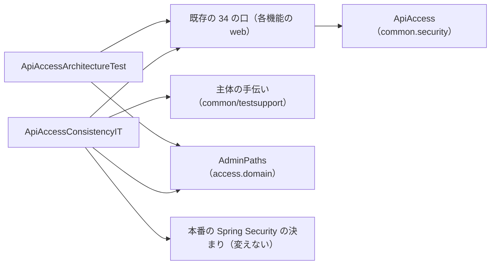

# 論理の部品（Logical Components）— U1 cross-cutting

出典: この単位の `nfr-requirements/security-requirements.md`・`tech-stack-decisions.md`、`functional-design/functional-spec.md`・`rules.md`・`frontend-components.md`、`contract-summary.md`（C1・C2）、`components.md`（AccessControl・SharedTreeView・AppFrame）、`security-design.md`（この段）、この段の答え（Q1: A、まとめの確認）。

名前は設計の名前で、コード生成で確かめて決めてよい（機能設計・要件と同じ扱い）。U1 は実行時に要求を受ける部品・データ・外への接続を持たないため、障害の範囲（blast radius）は「テストで落ちる」「画面の部品が描けない」に限られる。

## 1. バックエンド

| 部品 | 置き場 | 役目 | 頼るもの | 要件 |
|---|---|---|---|---|
| `ApiAccess`・`ApiAccessLevel` | `backend/src/main/java/cherry/mastersmith/common/security/` | 口の分類の印と値（契約 C1） | Java の標準だけ（機能のパッケージに依存しない） | NFR1.1 |
| 既存の 34 の口への印 | 各機能の `web`（8 パッケージ） | クラスの単位で印を付ける（機能設計 3節） | `ApiAccess` | NFR1.1・NFR1.6 |
| `ApiAccessArchitectureTest` | `backend/src/test/java/cherry/mastersmith/`（全体の置き場、`*Test`） | 静的な検査（印・ADMIN と `AdminPaths`・AUTHENTICATED の道・空振りの守り・口の数） | ArchUnit 1.5.1、`AdminPaths` | NFR1.1・NFR1.2・NFR1.5 |
| `ApiAccessConsistencyIT` | 同上（`*IT`） | 実行時の検査（3つの主体の判定、静的な検査との集合の一致、PUBLIC の口の一覧の定数との比べ） | Spring Boot Test、`WebInvocationPrivilegeEvaluator`、`RequestMappingHandlerMapping`、`AdminPaths`、主体の手伝い | NFR1.3・NFR1.5・NFR1.6 |
| 主体の手伝い | `backend/src/test/java/cherry/mastersmith/common/testsupport/` | 匿名のトークン、管理者でない利用者・管理者の `AuthenticatedUserToken` を作る（見本の値だけ） | auth の `AuthenticatedUserToken`・`AuthenticatedUser`（テストからだけ使う） | NFR1.3・NFR1.10 |
| `ApiAccessRules`・`PublicApiInventory`（手伝い） | `backend/src/test/java/cherry/mastersmith/common/testsupport/` | 静的な検査の規則を作る所と、PUBLIC の一覧の定数・比べる関数（`entryOf`・`diff`）。本番の検査と確かめのテストが同じものを使う（security-design.md 4.2.1・4.4.1） | ArchUnit、Spring の `RequestMappingInfo`、`AdminPaths` | NFR1.1・NFR1.2・NFR1.6 |
| 違反の見本のクラス | `backend/src/test/java/cherry/mastersmith/common/testsupport/apiaccess/` | 違反を1つずつ持つ見本と違反なしの見本（6つ）。決して設定しない条件で Bean にしない | Spring の注釈、`ApiAccess` | NFR1.1・NFR1.2 |
| `ApiAccessRulesTest`・`PublicApiInventoryTest` | `backend/src/test/java/cherry/mastersmith/`（全体の置き場、`*Test`） | 検査が違反を本当に落とすことの確かめ（検査の検査） | 上の手伝いと見本 | NFR1.1・NFR1.6 |
| `AccessBoundaryArchitectureTest`・`UserBoundaryArchitectureTest` | 各機能のテストのパッケージ | 今の依存をそのまま書いた境界テスト | ArchUnit | NFR6.3 |

テキストの代替: 既存の 34 の口は `ApiAccess` の印を持つ。静的な検査は口の印と `AdminPaths` を読む。実行時の検査は口の印・本番の Spring Security の決まり（判定の部品を通して）・主体の手伝い・`AdminPaths` を読む。本番の決まりは U1 では変えず、矢印は検査から本番の決まりへの読み取りだけ。

## 2. 画面

| 部品 | 置き場 | 役目 | 頼るもの | 要件 |
|---|---|---|---|---|
| ESLint の機能ごとの決まり | `frontend/eslint.config.js` | 機能どうしと、`shared` から `app`・`features` への import を止める | ESLint ^10.8.1 の標準のルール | NFR6.1 |
| ESLint の決まりのテスト | `frontend/` の Vitest のテスト（node の実行環境、置き場はコード生成で決める） | 止める道と許す道の見本で決まりを確かめる | ESLint の `ESLint` の部品 | NFR6.2 |
| `SharedTreeView` | `frontend/src/shared/tree/` | 共有の木（選ぶボタンと開閉のボタン、開いたときに子を読む、失敗は節の下で再試行） | React、make-you-chic-ui の `Icon` | NFR1.9・NFR4.1〜NFR4.4 |
| 登録の型と登録の検査 | `frontend/src/app/registry/`（`types.ts`・`validateRegistrations.ts`、アイコンの照合の一覧） | `section`・`icon`・`logout` を足し、section と visibleWhen・icon の名前を確かめる | make-you-chic-ui の `IconName`（型） | NFR1.8・NFR6.5 |
| `useLogout` | `frontend/src/app/login-state/` | 提供元の `logout` を機能へ渡す | 登録の型の `LoginStateProvider` | NFR6.1 |
| 既存の違反の直し | `frontend/src/features/registration/useRegistration.ts`、`features/auth/loginStateProvider.ts` | `../auth/authSession` の import を `useLogout` に替え、auth が `logout` を渡す | `useLogout` | NFR6.1 |

## 3. 障害の範囲

| 部品 | 失敗したとき | 範囲 |
|---|---|---|
| 静的な検査・実行時の検査・ESLint の決まり | `./gradlew verify` が落ちる（統合の前に止まる） | 開発の流れだけ。本番の動きに影響しない |
| 共有の木の子の読み込み | その節の下に失敗の文と再試行 | その節だけ。木のほかの節と画面は使える |
| 登録の検査 | `RegistrationError` で画面の起動を止める | 画面全体（今までの登録の検査と同じ扱い。誤った登録を出荷前に見つけるため） |
| `useLogout` | 失敗を外へ出さない | 登録の完了の画面の「ログアウトして続ける」だけ。画面の側のトークンは auth が必ず消す |

## 4. 規模と性能

U1 は API を持たないため、規模・性能の目標は当たらない（要件 NFR2 は N/A）。実行時の検査は、捨ての試しで1つの結合テストがコンパイルを含めて約 32 秒だった（security-design.md 2.1）。`verify` での増え方は Build and Test で実測して記録する（要件 NFR6.8）。
