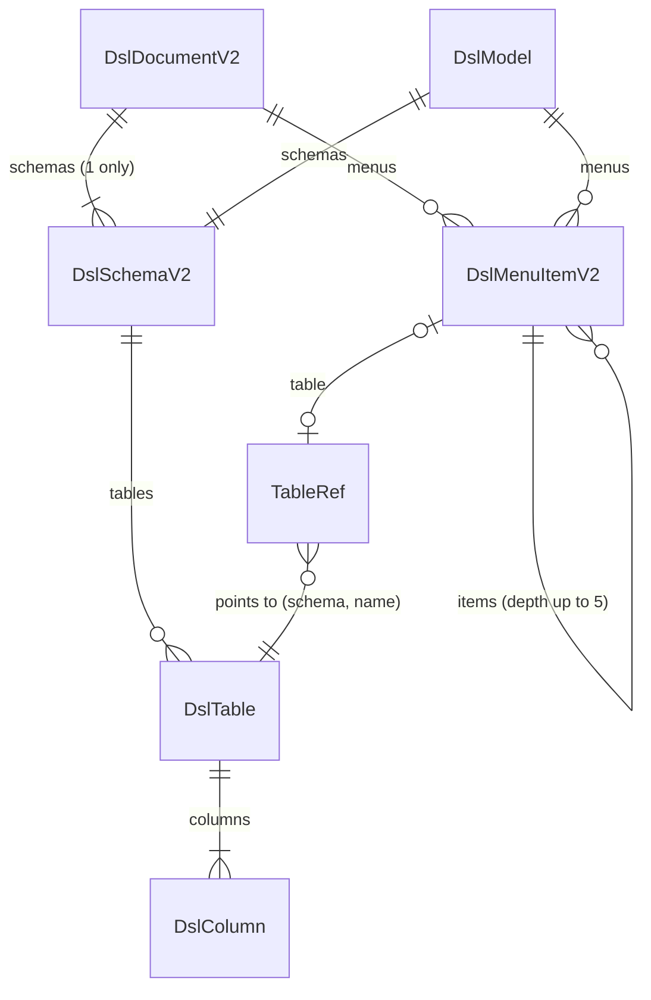

# 機能の仕様 — U2 dsl-v2

## 出典

- 単位の定義 `aidlc/spaces/default/intents/261004-role-menu/inception/units-generation/unit-of-work.md`（U2 dsl-v2）
- ストーリーと単位の対応 `aidlc/spaces/default/intents/261004-role-menu/inception/units-generation/unit-of-work-story-map.md`（主の単位は US5.2・US6.1。US1.2・US3.1・US5.1 の土台）
- 要件 `aidlc/spaces/default/intents/261004-role-menu/inception/requirements-analysis/requirements.md`（FR2.3・FR7.4・FR9.4・C2・C6）
- 部品の一覧 `aidlc/spaces/default/intents/261004-role-menu/inception/domain-design/components.md`（DslDefinition・DslManagement・DslAdminUi）と ADR（`decisions.md` の ADR-004・ADR-005・ADR-006・ADR-007）
- 契約の一覧 `aidlc/spaces/default/intents/261004-role-menu/inception/contract-design/contract-summary.md`（C3）
- ストーリー `stories.md`（US5.2・US6.1、要件との差 D1〜D3）、画面 `mockups.md`（S10）、Bolt の計画 `bolt-plan.md`（B1）
- この段の答え `functional-design-questions.md`（Q1〜Q7、すべて A。まとめの確認は Looks correct）

この文書は、流れ（手順）と状態の遷移の正である。データの形の正は `entities.md`、決まりの正は `rules.md` で、下の ER 図と決まりの要約はそこから導いた見やすさのための写しである。画面の部分は `frontend-components.md` に書く。

## 1. 部品と置き場

| 置き場 | 変えるもの |
|---|---|
| `dsl.domain` | `DslModel`（schemas・menus、版 2）、`DslSchema` を足す、`DslMenuItem.table` を組（TableRef）に、`DslFormat`（CURRENT_VERSION 2・メニューの深さの上限 5・書式のファイル名 v2）、文言の鍵（深さ・スキーマの数） |
| `dsl.parse` | `SafeYamlParser`・`LimitingParser`・`YamlTreeConverter` の上限を定数から引数へ（中身の守りは変えない） |
| `dsl.validate` | JSON Schema v2 での構文の検証、意味の検証（スキーマの数・同じスキーマの中の参照・メニューの組・深さ） |
| `dsl.service` | `DslReader` に起動時の読み方（深さだけを外す）を足す、`SafeYamlReader`（新しい口）と結果の型・位置を引く口、`DslModelMapper` の版 2 |
| `dslmanage.service` | `DslStartupLoader`（深すぎる枝の WARN）、`DslLifecycle`（プレビューの表示・適用の前の読み直し、今の状態の印）、`DslReconciler`・`DslDiffCalculator`・`DslSummaryCalculator` のスキーマの階層 |
| `dslmanage.generate` | `DslTreeBuilder`（版 2・スキーマ名・メニューの組） |
| `dslmanage.domain`・`web` | `PreviewView`（違い・要約・警告の種類）、`DslStatus` と応答に `appliedUnreadable` |
| `resources/dsl` | `dsl-schema-v2.json` を足し、`dsl-schema-v1.json` を外す（ビルドの複写と README も合わせる） |
| `frontend/src/features/dsl` | `frontend-components.md` のとおり |

境界: `dsl` は `targetdb`・`dslmanage`・web・repository に依存しない（既存の `DslBoundaryArchitectureTest`）。対象DB の設定と照らすのは `dslmanage` の照合だけ。`role` などの外の機能は `dsl.service` の口と `dsl.domain` の型だけを使い、`dsl.parse`・`dsl.validate` は使わない（`parseAndValidateStayInside` のまま）。内部DB の表と Flyway の移行は変えない。API の道と数も変えない（API の分類の印は U1 が B2 で付ける）。

## 2. DSL の読み込み（すべての入口に共通）

段の順は今のまま（BR6.6）。読み方は2つ。

1. 大きさ（10MB）を読む前に確かめる。超えれば SIZE_LIMIT。
2. 安全な読み込み（`DslFormat` の上限の値を部品へ渡す）。止まれば読み込みの段の誤り（重複キーを含む。BR1.4）。
3. 書式の版。整数の 2 でなければ UNSUPPORTED_VERSION を1件（BR1.1）。
4. 構文（同梱の `dsl-schema-v2.json`。外部の `$ref` を取りに行かない。BR1.2・BR1.7）。
5. 意味（BR1.3 スキーマの数 → BR1.5 外部キーと選択肢の参照 → BR1.6 メニューの組 → BR2.1 メニューの深さ → 既存のテーブル・カラムの決まり）。
6. 通れば本文の SHA-256 を識別にしてモデルを作る。

- **通常の読み方**（投入・復元・プレビューの読み直し・適用の前の確かめ・生成した DSL の確かめ）: 1〜6 をすべて当てる（BR2.2）。
- **起動時の読み方**: 5 の深さ（BR2.1）だけを外し、6 でモデルを作る前に深すぎる枝を落とす（BR2.3、3.2節）。結果に「落とした項目の数」を添える。

説明用の断片（形だけ）:

```java
// dsl.service（名前は Code Generation で確定）
public interface DslReader {
    DslReadResult read(byte[] yamlBytes);              // 通常（今の口）
    DslStartupReadResult readAtStartup(byte[] yamlBytes); // 深さだけを外し、落とした数を添える
    String hash(byte[] yamlBytes);
}
```

## 3. 流れ

### 3.1 投入（貼り付け・ファイル）と履歴の復元

1. 管理者が投入する、または履歴の版を選んで復元する（既存の API）。
2. 本文を通常の読み方で読む（2節）。
3. 通らなければ既存の `DSL_INVALID`（422、先頭 100 件と総数）で拒否する。版 1 は UNSUPPORTED_VERSION、深すぎるメニューは深さの誤り（BR1.1・BR2.1・BR3.2）。プレビューと適用中は変わらず、受け付けなかった投入の監査は今のとおり。
4. 通ればプレビューに置き、照合・違い・要約を求めて返す（3.5節）。

### 3.2 起動時の読み直し

1. 要求を受ける前に、内部DB の適用中の版を読む。無ければ Absent。
2. 起動時の読み方で読む。
3. 深さ以外の誤りがあれば（版 1 を含む）、既存の ERROR を1件（識別の先頭12文字・誤りの種類）出して Absent にし、起動を続ける（BR3.1）。
4. 通ればモデルを Present にする。深すぎる枝を落としていたら WARN を1件（識別の先頭12文字・落とした項目の数・上限の値）出す（BR2.3）。

深すぎる枝の落とし方（BR2.3）:

1. `menus` の直下を 1 段目として木をたどる。
2. 6 段目の項目は子ごと落とし、数える。
3. 子を落とした結果、テーブルも子も持たなくなった項目を落とし、上の段へさかのぼって同じく確かめる（落とした数に加える）。
4. 権限の対象（`schemas`）は変えない。

### 3.3 プレビューの表示

1. 管理者がプレビューを開く。
2. キャッシュにモデルがあれば使う。無ければ保存した本文を通常の読み方で読み直す（BR3.3）。
3. 通らなければ `DSL_INVALID`（422、誤りの一覧つき）を返し、プレビューの行は残す。破棄とプレビューのダウンロードはできる。
4. 通ればキャッシュに入れ、照合・違い・要約を求めて返す。

### 3.4 適用

1. 管理者が見たプレビューの識別を付けて適用する。
2. キャッシュにモデルが無ければ、内部DB を変える前に保存した本文を通常の読み方で確かめる（BR3.4）。通らなければ `DSL_INVALID`（422）で拒否し、適用中もプレビューも変わらない。
3. 既存の手順（プレビューを履歴へ移す・件数の上限・同時の適用は `DSL_PREVIEW_CHANGED`）で確定する。
4. 確定の後に、適用中のモデルを差し替え（Present）、出来事を出す（今のとおり）。

### 3.5 照合・違い・要約（プレビューに添えるもの）

- **照合**（BR5.1）: 対象DB の写しを読む（今の時間の上限のまま）。設定が無い・接続できないときは既存の警告1件。読めたら DSL のスキーマ名と写しのスキーマ名を比べ、同じならテーブル・カラム・型を既存の規則で比べ、場所は `schemas.<スキーマ>.tables.<テーブル>(.columns.<カラム>)` にする。違えば `SCHEMA_MISMATCH` を1件（DSL のスキーマ名だけを埋める）にし、テーブルは比べない。
- **違い**（BR5.2）: スキーマを名前で突き合わせ、区分を付け、その下のテーブルとカラムは今の規則で比べる。適用中が無ければすべて増えた。
- **要約**（BR5.3）: スキーマ・テーブル・ビュー・カラムの数、メニューの木（節のテーブルは組）、表示名の未設定（スキーマの表示名も数える）。

### 3.6 既定の DSL の生成

1. 管理者がスキーマを読み込む（既存の生成の API）。
2. 対象DB の写しを読む（設定が無い・使えないときは既存の 409・503）。
3. 版 2 の木を作る。`schemas` に写しのスキーマ名を1つ置き、表示名は ja・en ともスキーマ名にする。その下のテーブルは今の規則で並べ、メニューは平らに、テーブルごとに `{schema, name}` で作る（BR4.1・BR4.2）。
4. 接続先・ポート・ユーザー名・パスワード・JDBC の URL と PostgreSQL の database の項目は書かない。スキーマ名は3種類の DB とも書く（BR4.3、Q7）。
5. 本文を通常の読み方で確かめ（通らないのは想定外。BR4.4）、プレビューに置く（3.1節の 4）。

### 3.7 ダウンロードと今の状態

- 適用中とプレビューのダウンロードは、検証せずに保存した本文を返す（BR3.5）。版 1 の適用中の本文も、深すぎる本文も 500 にならずに返る。履歴ごとのダウンロードの API は無い（今のまま）。
- 今の状態は既存の `applied`・`preview` に `appliedUnreadable` を足す（BR3.6）。

### 3.8 上限つきの安全な YAML の読み込みの口（SafeYamlReader）

1. 呼ぶ側（U4 role の権限の YAML）が本文と上限（4つ）を渡す。
2. 本文のバイト数が `maxBytes` を超えれば読まずに `TOO_LARGE`（上限ちょうどは受け付ける。BR6.1）。
3. 既存の部品に上限を渡して読む。深さ・別名・展開後の節の数・タグ・重複キー・構文の誤りは最初の1件で `Rejected(区分, 位置)`（BR6.2）。部品の例外の文は捨てる（BR6.3）。
4. 読めたら `Parsed(木, 位置を引く口)` を返す。DSL の JSON Schema の検証はしない（BR6.4）。
5. 結果を文字列にしたときは区分・位置・節の数だけを出す（BR6.5）。

```java
// dsl.service（形だけ）
public interface SafeYamlReader {
    SafeYamlResult read(byte[] yamlBytes, SafeYamlLimits limits);
}
public record SafeYamlLimits(int maxBytes, int maxDepth, int maxAliases, int maxExpandedNodes) {}
```

## 4. 状態の遷移

### 4.1 適用中のモデル（提供口）

| 今の状態 | きっかけ | 次の状態 |
|---|---|---|
| Absent | 起動時の読み直しで版 2 として読めた | Present（深すぎる枝は落とした木） |
| Absent | 起動時の読み直しで深さ以外の誤り（版 1 を含む）・適用中が無い | Absent（ERROR 1件。適用中が無いときは出さない） |
| Absent・Present | 適用が確定した | Present（適用した版） |
| Present | 再起動 | 起動時の読み直しへ（上の2行） |

### 4.2 内部DB のプレビュー（読めるか）

| 今の状態 | きっかけ | 次の状態 |
|---|---|---|
| 読めるプレビュー | 版を上げた・上限を下げた再起動で、今の検証を通らなくなった | 読めないプレビュー（行はそのまま） |
| 読めないプレビュー | 表示・適用 | 読めないプレビュー（422 で拒否。変わらない） |
| 読めないプレビュー | 破棄 | プレビューなし |
| どちらでも | 投入・復元・生成が通った | 読めるプレビュー（置き換え） |

### 4.3 今の状態の印（appliedUnreadable）

| 今の状態 | きっかけ | 次の状態 |
|---|---|---|
| false | 起動時に適用中の版を読めず Absent | true |
| true | 版 2 の DSL を適用した | false |

## 5. ER 図（`entities.md` から導いた写し）



テキストの代替: DSL の根（版 2）はスキーマを1つだけ持ち（形は複数を受け付ける）、メニューの項目を0個以上持つ。スキーマはテーブルを0個以上、テーブルはカラムを1個以上持つ。メニューの項目は子の項目を持ち（深さ 5 段まで）、テーブルを指す組（スキーマ名とテーブル名）を0か1つ持つ。組は DSL の中のテーブル1つを指す。モデルは検証を通った根から作り、スキーマとメニューを持つ。

## 6. 決まりの要約（`rules.md` から導いた写し）

- 書式（BR1）: 版は 2 だけ、`schemas` はスキーマ名の対応表で中身は1つ、重なりは重複キー、外部キーと選択肢はスキーマの中、メニューは組で指す、`dsl-schema-v2.json`。
- 深さ（BR2）: 5 段まで。投入・復元・読み直しでは拒否、起動時は枝を落として WARN。
- 版を上げた後（BR3）: 起動時に読めなければ Absent、復元は 422、プレビューの表示と適用は前に読み直して 422、ダウンロードはそのまま、今の状態に印。
- 生成（BR4）: 版 2、設定のスキーマ名、平らなメニュー、接続の項目は書かない。
- 照合・違い・要約（BR5）: 名前が同じときだけ照合、違いと要約はスキーマの階層。
- 安全な読み込みの口（BR6）: 上限は呼ぶ側、区分と位置だけ、JSON Schema を含めない、中身を文字列に出さない、DSL は今の値のまま。
- 画面（BR7）・提供口（BR8）: `frontend-components.md` と契約 C3 のとおり。

## 7. 誤り・ログ

| 場合 | 応答 | ログ |
|---|---|---|
| 版 1・版が無い | 422 DSL_INVALID（UNSUPPORTED_VERSION） | 既存（受け付けなかった投入の監査と指標） |
| メニューが深すぎる（投入・復元） | 422 DSL_INVALID（SEMANTIC、深さの文言） | 既存 |
| スキーマが0か2つ以上 | 422 DSL_INVALID（SEMANTIC） | 既存 |
| 読めないプレビューの表示・適用 | 422 DSL_INVALID | 想定内のため WARN 以下・スタックトレースなし（既存の変換の境界） |
| 起動時に深すぎる枝を落とした | 応答なし | WARN 1件（識別の先頭12文字・落とした数・上限） |
| 起動時に読めない | 応答なし | ERROR 1件（既存） |
| 安全な読み込みの口の拒否 | 呼ぶ側（U4）が ROLE_TRANSFER_INVALID などに写す | 口はログを出さない |

どのログにも DSL の本文・接続情報・部品の例外の文を出さない（PM の Forbidden）。

## 8. 書き換えの要る既存のテストと道具

承認済みの設計のとおり版 2 へ書き換える（AC6.1.10。既存の E2E の書き換えは `team.md` の本数に数えない）。

| 種類 | 対象 |
|---|---|
| バックエンドの見本 | `backend/src/test/resources/cherry/mastersmith/dsl/valid-sample.yaml`・`.../dslmanage/generate/dept_mst.yaml` |
| バックエンドのテスト | `dsl/parse/SafeYamlParserTest`・`dsl/parse/YamlTreeConverterTest`・`dsl/service/DefaultDslReaderTest`・`dsl/DslSchemaPublicationIT`・`dslmanage/testsupport/DslYaml`・`dslmanage/web/DslAdminApiIT`・`dslmanage/repository/DslManageRepositoryIT`・`dslmanage/domain/DslManageDomainTest`・`dslmanage/generate/DslTreeBuilderTest`・`dslmanage/generate/TargetSchemaDslGeneratorTest`（`DslYaml` を使うほかのテストも見本の変更に合わせる） |
| スキーマ名を書かないことを確かめるテスト（書くことを確かめる形へ。接続先・ポート・ユーザー名・パスワード・JDBC の URL は書かないことのまま） | `DslTreeBuilderTest`・`TargetSchemaDslGeneratorTest`・`AbstractDefaultDslGeneratorIT`・`DslTargetDbIT` |
| 照合・違い・要約のテスト | `DslReconcilerTest` ほか `dslmanage/service` のテスト（場所の道と警告の種類） |
| 画面のテスト | `features/dsl` の `submitInput.test.ts`・`DslAdminPage.test.tsx`・`DslSubmitForm.test.tsx`・`api/dslApi.test.ts`・`api/saveFile.test.ts`、`testing/fixtures.ts`、`shared/api-client/apiClient.download.test.ts` |
| E2E | `frontend/e2e/040-dsl-admin.e2e.ts` |
| 負荷の試験の道具 | `perf/make-pattern-dsl.mjs`・`perf/ui/dsl-ui-lang.mjs` |
| ビルドと文書 | `backend/build.gradle.kts`（書式の複写と WAR の中の確かめ）・`frontend/src/features/dsl/submitInput.ts`（書式の道）・`README.md`（書式の道・例） |

足すテストの要点: 版 1・版が無いの拒否、スキーマの数（0・1・2）、スキーマ名とテーブル名の重複キー、メニューの組の無い先、深さの境界（5 段は受け付け、6 段は拒否）と起動時の枝の落とし方（さかのぼりを含む）と WARN の項目、読めないプレビューの表示と適用（422 で内部DB が変わらないことを読み直して確かめる）、`appliedUnreadable`、名前の違うスキーマの照合の警告、生成した版 2 の DSL がそのまま検証を通ること、安全な読み込みの口の上限ごとの境界（ちょうど・1つ超え）と区分・位置・例外の文が出ないこと・TRACE で木の中身が出ないこと。深さの数え方と枝の落とし方は純粋な関数にし、性質ベースのテスト（jqwik。落とした木は深さ 5 以下・残った項目の親子と並びは元と同じ・空のまとまりが無い）を当てる。

## 9. 契約 C3 との差（承認済みの契約は書き換えない）

| 項目 | 契約 C3 | この設計 | 理由 |
|---|---|---|---|
| スキーマの表示名 | `displayName: string` | `label`（ja・en の DisplayName） | 既存のテーブル・カラムの表示名と同じ形にし、画面の言語の切り替えに合わせる（Q1: A） |
| 安全な読み込みの上限 | `maxBytes・maxDepth・maxAliases` | 3つに `maxExpandedNodes` を足す | 別名の展開の爆発を呼ぶ側の上限で止める（AC3.1.7）。項目を足すだけの互換の変更 |
| 結果の位置 | `Parsed(tree, positions)` | 位置は `dsl.service` の型（JSON Pointer から行・列を引く口）で返す | `dsl.parse` の型を外へ出さない（境界テスト）。U4 はまだ作られておらず影響しない |
| `DslModel` のテーブル | 記述なし（版 1 の平らな `tables` を持つかは書いていない） | 版 1 の平らな `tables` を持たず、`schemas` の下だけに置く。組で引く口を足す（BR8.2） | テーブル名はスキーマの中でだけ一意のため |

## 10. ストーリー・画面との差

| 項目 | 上流 | この設計 |
|---|---|---|
| 版を上げる前に置かれていたプレビュー | ストーリーに無い | 表示・適用の前に読み直し、通らなければ 422 でプレビューは残す（Q4: A、BR3.3・BR3.4） |
| 今の状態の見え方 | ストーリーに無い（AC6.1.6 は権限・メニューの側だけ） | `appliedUnreadable` と画面の注意（Q5: A、BR3.6・BR7.2） |
| 照合の警告の種類 | AC6.1.4 は受け付けるか拒否するかを機能設計に回した | スキーマは1つだけ受け付け、名前の違いは `SCHEMA_MISMATCH` の警告（Q2: A） |
| 画面の「木と表に1段足す」（`mockups.md` 10節） | メニューの木にスキーマの節を足すと読める | メニューの木は括弧の中を「スキーマ名.テーブル名」にし、違いの表に見出しの行を足す（Q6: A） |
| 生成した DSL のスキーマ名 | 前の Intent の BR5.3 はスキーマ名を書かない | 書く（D1・Q7: A）。MySQL・MariaDB ではデータベース名と同じ値が出る |
| JSON Schema の公開 | 前の Intent は `dsl-schema-v1.json` | `dsl-schema-v2.json` にし、v1 は置かない（細部） |
