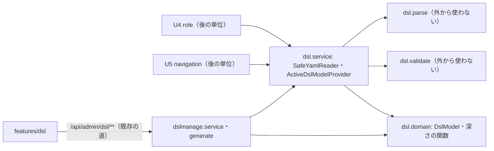

# 論理の部品 — U2 dsl-v2

## 1. 出典

- この単位の承認済みの NFR 要件 `construction/dsl-v2/nfr-requirements/security-requirements.md`・`tech-stack-decisions.md`、読み直しの記録（R-03〜R-09）
- この単位の承認済みの機能設計 `construction/dsl-v2/functional-design/functional-spec.md`・`rules.md`・`frontend-components.md`
- 契約 `inception/contract-design/contract-summary.md`（C3）、部品 `inception/domain-design/components.md`（DslDefinition・DslManagement・DslAdminUi）
- この段の答え `nfr-design-questions.md`（Q1: A・Q2: A）、`security-design.md` の捨ての試しの結果、`frontend/package-lock.json`

この文書は、部品の境界と置き方、性能（NFR2.5〜NFR2.9）・画面（NFR4.1・NFR4.3）・テスト（NFR6.1・NFR6.4〜NFR6.7）の設計と、配備の段への引き継ぎを扱う。セキュリティ・ログ・信頼性は `security-design.md`。

## 2. 部品の一覧

| 部品（論理） | 置き場 | 役目 | 変えるか | 関わる ID |
|---|---|---|---|---|
| SafeYamlReader と上限の型・結果の型・位置を引く口 | `dsl.service` | 上限つきの安全な YAML の読み込みの口（U4 role が使う） | 新規 | NFR1.5・NFR1.11 |
| SafeYamlParser・LimitingParser・YamlTreeConverter | `dsl.parse` | 読み込みの守りの実装（上限を引数で受ける） | 変える | NFR1.7・NFR1.8 |
| DslReader（通常の読み方・起動時の読み方） | `dsl.service` | DSL の読み込み（段の順は今のまま） | 変える | NFR1.10・NFR1.12 |
| DslSchemaValidator と `dsl-schema-v2.json` | `dsl.validate`・`resources/dsl` | 版 2 の構文の検証（外部の参照を取りに行かない） | 変える | NFR1.9 |
| DslSemanticValidator | `dsl.validate` | 意味の検証（スキーマの数・同じスキーマの中の参照・メニューの組・深さ） | 変える | NFR1.12 |
| メニューの深さと枝の落とし方の関数 | `dsl.domain` | 純粋な関数 | 新規 | NFR1.12・NFR2.9・NFR6.6 |
| DslModel・DslSchema・DslMenuItem の組 | `dsl.domain` | 版 2 のモデル（契約 C3） | 変える | NFR1.14 |
| ActiveDslModelProvider・ActiveDsl | `dsl.service`・`dsl.domain` | 提供口（形は変えない） | 変えない | NFR1.14 |
| DslStartupLoader と読めなかった版の ID の置き場 | `dslmanage.service` | 起動時の読み直し、WARN・ERROR、`appliedUnreadable` の判定の元 | 変える・新規 | NFR3.3・NFR5.3・NFR5.4 |
| DslLifecycle | `dslmanage.service` | プレビューの表示と適用の前の読み直し、今の状態 | 変える | NFR3.3 |
| DslReconciler・DslDiffCalculator・DslSummaryCalculator | `dslmanage.service` | スキーマの階層の照合・違い・要約 | 変える | NFR5.5 |
| DslTreeBuilder | `dslmanage.generate` | 既定の DSL を版 2 で生成 | 変える | NFR1.13・NFR2.7 |
| DSL の管理の画面（S10） | `frontend/src/features/dsl` | 版 2 の誤り・今の状態の注意・読めないプレビュー・スキーマの見出し | 変える | NFR4.1・NFR4.3 |

## 3. 依存と境界

テキストの代替: U4 role と U5 navigation と `dslmanage` は `dsl.service` の口と `dsl.domain` の型だけを使い、`dsl.parse`・`dsl.validate` は `dsl.service` の中からだけ使う。画面は既存の DSL の管理の API を通して `dslmanage` を使う。`dsl` は `dslmanage`・`targetdb`・web・repository に依存しない（`DslBoundaryArchitectureTest` を変えない）。

- 失敗の範囲: 版 2 の誤りや読めない DSL は、`dsl` と `dslmanage` の中で 422 か Absent に閉じる。U4・U5 は Absent を「DSL が無い」として扱う（契約 C3）。
- 内部DB の表・Flyway の移行・API の道と数は変えない。

## 4. 性能の設計（NFR2.5〜NFR2.9）

- **1回ずつの時間（NFR2.5）**: 読み込みと構文の検証は、版 2 でも版 1 と同じ時間（試しの T3: 約 8.2 MB で合わせて 1 秒弱）。10 秒の目標の内訳の中心は、今までどおり照合（対象DB の読み取り）。Build and Test で PostgreSQL の1種類で測る。
- **95 パーセンタイルと同時の実行（NFR2.6）**:
  - 適用の前の読み直しは、キャッシュに無いときだけ行う。ふだんの適用（投入の直後でキャッシュがある）は時間が増えない。
  - 今の状態の `appliedUnreadable` は、メモリの値を比べるだけで、内部DB の読み出しは増えない。
  - Performance Validation で k6 の `dslLight`・`dslCycle`・`dslMixed` を版 2 の DSL で流す。
- **10 MiB の読み込みのヒープ（NFR2.5・NFR2.6、承認の場の直し R-01）**:
  - 見積もりは 1件 256〜384 MB（`security-design.md` の 3節 T4・4.9）。同時の投入は、既存の `DslHeavyOperationGate` で1つに絞られる（2つ目は `DSL_BUSY`）。
  - 確かめの持ち主は Build and Test。本番と同じヒープ（`mem_limit` 2g・`MaxRAMPercentage` 50）の使い捨ての環境で、上限ちょうどの 10 MiB の DSL の投入とプレビューの表示（照合を含む）を流す。あわせて、2つの投入を同時に送ったとき、片方が 503 `DSL_BUSY` になり、もう片方が通ることを確かめる。
  - 判定の値: OutOfMemoryError とコンテナの OOMKilled が無いこと、投入と表示が 10 秒以内（NFR2.5）、`memory.peak` を記録して `mem_limit` を超えないこと。
  - Performance Validation の `dslMixed`（10 MiB の投入にログインを重ねる）は、今までどおり流す。
- **生成する DSL の大きさ（NFR2.7、読み直しの記録 R-03）**:
  - 試算の式: 前の Intent の 1 カラム約 550 バイト × 10,000 カラム ＝ 約 5.3 MB に、版 2 の字下げの増分 4 バイト × 1 カラムあたり約 24 行 × 10,000 カラム ＝ 約 0.96 MB と、メニューの組の増分（1 項目あたり約 20 バイト × 100 項目 ＝ 約 2 KB）を足して、約 6.3 MB。
  - 上限 10 MiB の内。実測は Build and Test。超えたら生成の失敗（既存）で、上限を上げるかは依頼者に諮る。
- **英語の文言（NFR2.8）**: Build and Test で `--lang` を流す。
- **木を1回たどる（NFR2.9）**: 4.5（`security-design.md`）の関数は木を1回たどるだけ。

## 5. 画面の設計（NFR4.1・NFR4.3）

- `frontend-components.md` の F1〜F6 のとおり。注意と誤りは make-you-chic-ui の `Alert`（warning・danger、role は alert）、違いの表のスキーマの見出しの行は `th scope="rowgroup"`。状態を色だけにしない。
- 足す文言の鍵は ja・en の対で置く（`frontend-components.md` の 4節）。画面部品ごとに vitest-axe を1件。

## 6. テストの置き場（NFR6.1・NFR6.4〜NFR6.7）

| ID | テスト | 置き場 |
|---|---|---|
| NFR6.1 | メニューの深さ 5 は受け付け、6 は拒否（投入と復元） | `dslmanage.web` の結合テスト・`dsl.validate` の単体テスト |
| NFR6.4 | カバレッジの下限（`dsl`・`dslmanage` のパッケージごと） | B1 の `./gradlew verify`（`:backend:cleanTest :backend:cleanIntegrationTest` を付けて実測） |
| NFR6.5 | DSL の必須のテスト（大きさ・深さ・別名・タグ・重複キー・`$ref`・拒否の応答）を版 2 で。別名の爆発の 5 秒（`security-design.md` 4.2） | `dsl.parse`・`dsl.service`・`dsl.validate` の単体テスト、既存の DSL の結合テスト |
| NFR6.6 | 深さの数え方と枝の落とし方の jqwik の性質ベースのテスト（失敗時の乱数の種を記録） | `dsl.domain` の単体テスト |
| NFR6.7 | 版 1 の DSL を持つ既存のテスト・E2E・負荷の道具の書き換え | 下の「道具の書き換えの持ち主」 |

- **道具の書き換えの持ち主**（読み直しの記録 R-04）:
  - 書き換えるのは、`perf/dsl-timing.sh`・`perf/make-large-dsl.mjs`・`perf/make-pattern-dsl.mjs`・`perf/ui/*`・k6 の `perf/k6/scenarios.js` の DSL の入力と、E2E の `040-dsl-admin.e2e.ts`。
  - 書き換えは B1 のコード生成が持つ。Build and Test と Performance Validation は、書き換えた道具を流すだけにする。
- **画面の道具の版**（読み直しの記録 R-08、`frontend/package-lock.json`）: fast-check 4.10.2・Vitest 5.0.2・vitest-axe 0.1.0・@testing-library/react 16.3.3・@testing-library/user-event 14.6.7。バックエンドは SnakeYAML 2.7・networknt 3.0.6・jqwik 1.10.1（`backend/gradle.lockfile`）。新しい依存は足さない。

## 7. 配備の段への引き継ぎ

deployment-pipeline と deployment-execution の段で、手順と確かめに入れてもらう。

1. **版を上げる入れ替え**（読み直しの記録 R-07、AC6.1.6）:
   - 版 1 の適用中の DSL がある内部DB で入れ替えると、起動時に DSL が無い扱い（Absent）になる。権限の対象と業務のメニューは空になり、DSL の画面には「適用中の DSL は使われていません」の注意が出る。
   - 入れ替えの後に、DSL の画面で版 2 の既定の DSL を生成し、プレビューを確かめて適用する。
   - 版 1 のプレビューが残っていれば、表示は 422 の誤りの一覧になるため、先に破棄する。
   - 監査に残る操作（生成・適用・破棄）のため、行う前に依頼者に伝える（`project.md` の学び）。
2. **前の版のアプリへの戻し**（Q2: A、AC6.1.8・要件との差 D2）:
   - 前の版のアプリには、読めないプレビューの読み直し（BR3.3・BR3.4）が無い。版 2 のプレビューが残ったまま戻すと、表示は 500 になり、適用は本文を履歴へ移した後に失敗する。
   - そのため、戻しの手順の最初に「戻す前に、DSL の画面でプレビューがあれば破棄する」を置く。
   - 戻した後は、前の版の DSL の画面で既定の DSL を生成し直し（前の版の書式の版 1）、プレビューを確かめて適用する。
   - 戻しの練習で、次の3つを確かめる。
     - 前の版の起動（ヘルスチェック）
     - 版 2 の適用中の DSL が読めず DSL が無い状態になること
     - 生成し直して適用すると DSL が使えること
   - 内部DB の表は変えないため、戻しはイメージだけで行える（`team.md` の「前進のみ・前の版が動く」）。
3. **ダウンロード**: 適用中とプレビューのダウンロードは検証せず本文を返す。そのため、戻しの前に版 2 の DSL を手元に残したいときは、ダウンロードで取り出せる（任意）。

## 8. 上流との差

- 機能設計 BR3.6 の判定の形を、起動時に読めなかった版の ID との比べに変えた（Q1: A。`security-design.md` の 5節）。
- `tech-stack-decisions.md` の対応表の NFR1.5 の行の範囲の表記の誤り（読み直しの記録 R-09）は、`security-design.md` の 5節に記録した。
- そのほかの差は無い。
