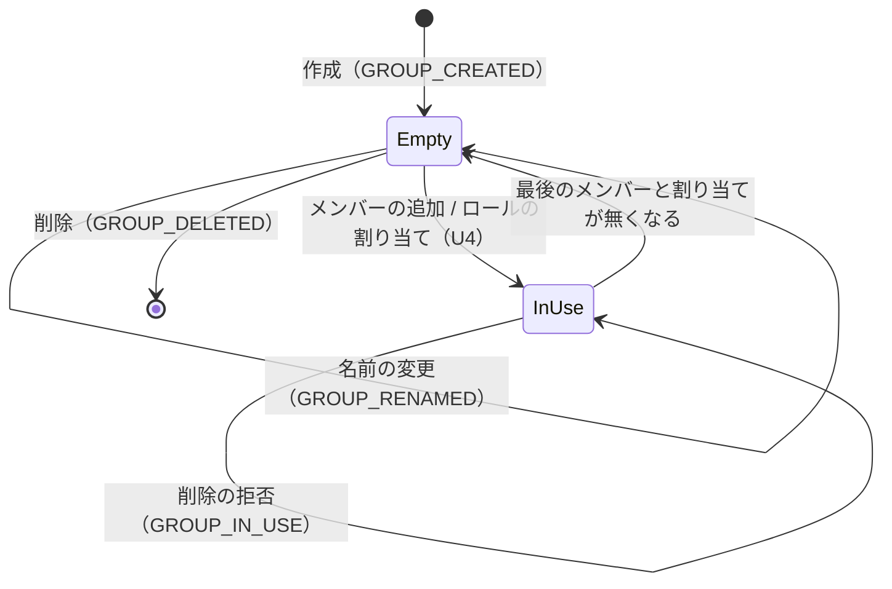
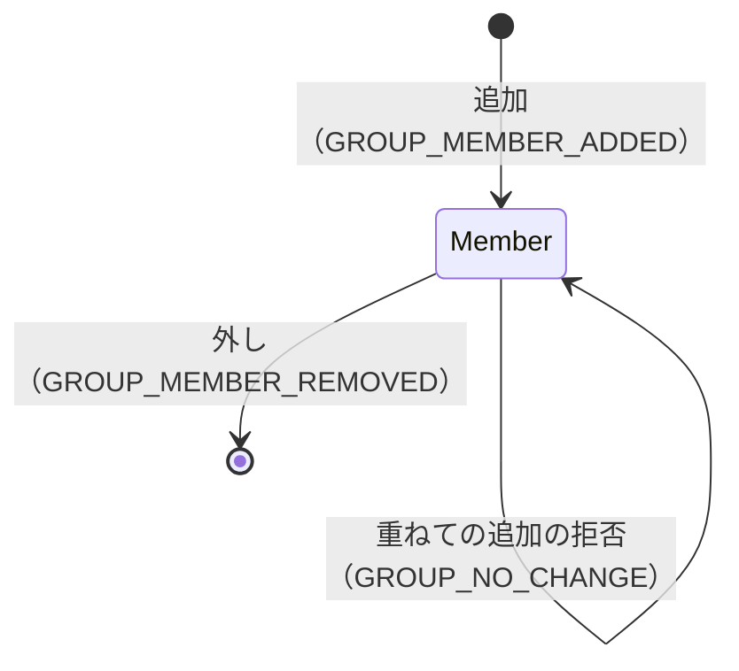
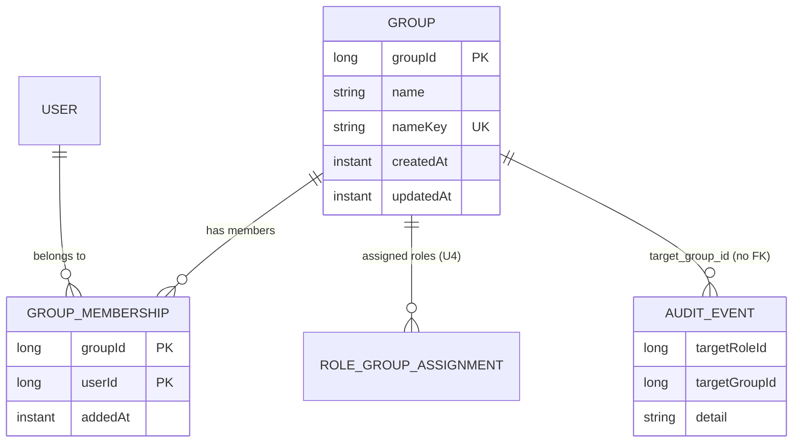

# 機能の仕様（Functional Spec）— U3 group

## 出典

- `unit-of-work.md`（U3 group の持ち物と境界）
- `unit-of-work-story-map.md`（US2.1 が主、US2.2 のグループの部分）
- `requirements.md`（FR4.1・FR4.1a・FR4.3〜FR4.5・FR11.1・FR12.1〜FR12.3・NFR1.1〜NFR1.6・NFR2.1・NFR3.1・NFR5.1・C1・C2）
- `components.md`（GroupManagement・AuditLog・UserAccount）
- `contract-summary.md`（C1・C4・C6・C10 と「業務の理由の拒否の code」「未決の論点」）
- 関係する上流: `stories.md`（US2.1・US2.2 と「前提と読み方」）、`decisions.md`（ADR-001・ADR-002・ADR-006）、`mockups.md` の S6・`interaction-spec.md`、`bolt-plan.md` の B3
- この段の答え: `functional-design-questions.md` の Q1〜Q6（すべて A）と、まとめの確認（Looks correct。「この段で決める設計の要点」を含む）
- 決まりの層: `team.md`（Code Style・Testing Posture・Deployment）、`project.md`（Forbidden・Mandated・学び）

このファイルは流れと状態の遷移の正である。データの形の正は `entities.md`、判断の正は `rules.md` で、下の ER の図と決まりの要約はそこから導いた見やすさのための写しである。

---

## 1. 全体

- パッケージは `cherry.mastersmith.group` の下に `web`（API と DTO）・`service`（業務処理、トランザクションの境界、単位の境界の口）・`domain`（`GroupName`・結果の型・出来事・code）・`repository`（表の読み書きと行の排他）。作るのは B3。
- 依存: `group` → `user`（service と domain）・`common`。`role` → `group`（口だけ）。`audit` → `group.domain`（出来事の型）。`group` は `role`・`audit`・`useradmin` に依存しない（`GroupBoundaryArchitectureTest`）。
- 変える操作はすべて1つのトランザクションで、入力の判定 → グループの行の排他 → 待ち合わせの口 → 拒否の判定 → 書き換え → 監査の出来事、の順に進む（BR5.1）。排他の前に書き込みは無い。
- 業務処理の層は結果の型（sealed interface の record）を返し、web の層が `switch` で場合を尽くして `BusinessException` に変える（BR10.1）。

### 1.1 単位の境界の口の形（説明用の断片）

```java
// group.service（U4 role が使う・実装する。契約 C4 に足した形）
interface GroupMembershipQuery {
    Set<Long> groupIdsOfUser(long userId);
    boolean exists(long groupId);
    List<GroupSummary> summaries(Set<Long> groupIds);
    GroupRowLock lockForAssignment(long groupId);   // 呼ぶ側のトランザクションの中だけ（Q2）
    Map<Long, Set<Long>> memberUserIds(Set<Long> groupIds);  // 承認の場の直しで足す
}
interface GroupDeletionGuard {                     // role が実装する（ADR-002）
    DeletionDecision canDelete(long groupId);
    Map<Long, Integer> assignedRoleCounts(Set<Long> groupIds);  // Q3
}
```

---

## 2. 流れ

### 2.1 作成（POST /api/admin/groups）

1. 本文の `name` だけを読む（BR2.2）。`GroupName` を作る。誤りなら 400 `VALIDATION_FAILED`（監査なし、BR1.1〜BR1.3）。
2. トランザクションを始める。書く前に、`GroupName` が作った鍵で `nameKey` を読み、同じグループがあれば書き込みなしで `GROUP_NAME_DUPLICATE`（BR1.4）。失敗の出来事を出して確定させる。
3. 行を足し（`createdAt`・`updatedAt` は時計の今。`nameKey` は `GroupName` の鍵）、その場で DB へ送る（flush。BR5.5）。
4. 成功の出来事 `GROUP_CREATED`（detail は Name(name)）。201 と作ったグループ（`groupId`・`name`・`createdAt`・`updatedAt`）を返す。
5. 手順 3 で一意の違反（同時の作成の重なり）を受けたら、そのトランザクションを巻き戻し、書き込みの無い新しいトランザクションで失敗の出来事（理由 `GROUP_NAME_DUPLICATE`、対象のグループは空、detail は Name(要求の名前)）だけを出して確定させる（BR5.7・BR8.2・BR8.4）。409 `GROUP_NAME_DUPLICATE`。
6. 手順 3 で一意の鍵の待ちが上限を超えたら、巻き戻して 409 `GROUP_BUSY`（監査なし、BR5.2）。

作成は既存の行を変えないため、グループの行の排他は無い。同じ名前の同時の作成は一意の制約が1つだけを通す。重なった側が違反になるか待ちの上限切れになるかは、NFR 設計の捨ての試しのコードで確かめる（BR5.2）。

### 2.2 名前の変更（PUT /api/admin/groups/{groupId}）

1. `GroupName` を作る。誤りなら 400（監査なし）。
2. グループの行を排他する（BR5.1）。上限切れは巻き戻して 409 `GROUP_BUSY`（監査なし、BR5.2）。無ければ `GROUP_NOT_FOUND`。
3. 待ち合わせの口（`GroupBarrier.afterLock(RENAME, groupId)`。本番は何もしない）。
4. 今の名前と文字どおり同じなら `GROUP_NO_CHANGE`（BR1.5）。
5. 書く前に鍵を読み、ほかのグループと `nameKey` が同じなら `GROUP_NAME_DUPLICATE`（BR1.4）。
6. 名前・`nameKey`・`updatedAt` を書き換え、その場で DB へ送る（flush）。一意の違反（別のグループの同じ名前への同時の変更・作成）は、巻き戻してから書き込みの無い新しいトランザクションで失敗の出来事だけを出し、`GROUP_NAME_DUPLICATE`（BR5.5・BR5.7）。一意の鍵の待ちの上限切れは、巻き戻して `GROUP_BUSY`（監査なし、BR5.2）。
7. 成功の出来事 `GROUP_RENAMED`（detail は Rename(before, after)）。204。
8. 4〜5・2 の `GROUP_NOT_FOUND` は、書き込みなしで確定させて失敗の出来事を出す（NO_CHANGE の detail は Name(今の名前)、重なりは Rename(before, 要求の名前)、無いは空）。

対象の行の排他は、同じ名前へ向かう別のグループの変更とは行が違うため効かない。その重なりは一意の制約が守る（BR5.2・BR5.7）。

### 2.3 削除（DELETE /api/admin/groups/{groupId}）

1. グループの行を排他する。上限切れは `GROUP_BUSY`、無ければ `GROUP_NOT_FOUND`（失敗の出来事、detail は空）。
2. 待ち合わせの口（`afterLock(DELETE, groupId)`）。
3. メンバーの数を数え、問う口 `canDelete(groupId)` に必ず聞く（BR4.3）。
4. メンバーが 1 以上か Blocked なら `GROUP_IN_USE`。応答に `members` と `assignedRoles`（BR4.1・BR4.2）。失敗の出来事（detail は InUse(name, members, assignedRoles)）。
5. どちらも 0 ならグループの行を消し、その場で DB へ送る（flush）。外部キーの違反（最後の守り）が起きたら、巻き戻してから書き込みの無い新しいトランザクションで失敗の出来事だけを出し、`GROUP_IN_USE` に読み替える（BR5.4・BR5.7）。
6. 成功の出来事 `GROUP_DELETED`（detail は Name(消した名前)）。204。

U4 のグループへのロールの割り当ては、同じグループの行を `lockForAssignment` で排他してから書くため（BR5.3）、手順 1〜5 の間に割り当てが入ることはない。

### 2.4 メンバーの追加（POST /api/admin/groups/{groupId}/members）

1. 本文の `userId` だけを読む。無い・整数でないなら 400（監査なし）。
2. グループの行を排他する。上限切れは `GROUP_BUSY`、無ければ `GROUP_NOT_FOUND`（BR3.5）。
3. 待ち合わせの口（`afterLock(ADD_MEMBER, groupId)`）。
4. 利用者の有無を `user` の口で確かめる。無ければ `USER_NOT_FOUND`（BR3.1。停止中は足せる、BR3.2）。
5. すでにメンバーなら `GROUP_NO_CHANGE`（BR3.3）。
6. メンバーの行を足し（`addedAt` は時計の今）、その場で DB へ送る（flush）。主キーの違反は `GROUP_NO_CHANGE`、外部キーの違反は `GROUP_NOT_FOUND` に読み替える。どちらも、巻き戻してから書き込みの無い新しいトランザクションで失敗の出来事だけを出す（BR5.4・BR5.5・BR5.7）。主キーの待ちの上限切れは、巻き戻して `GROUP_BUSY`（監査なし、BR5.2）。
7. 成功の出来事 `GROUP_MEMBER_ADDED`（対象の利用者つき、detail は Membership(groupName)）。204。拒否は失敗の出来事（対象の利用者は要求の ID）。

### 2.5 メンバーの外し（DELETE /api/admin/groups/{groupId}/members/{userId}）

1. グループの行を排他する。上限切れは `GROUP_BUSY`、無ければ `GROUP_NOT_FOUND`。
2. 待ち合わせの口（`afterLock(REMOVE_MEMBER, groupId)`）。
3. メンバーでなければ（存在しない利用者を含む）`GROUP_NO_CHANGE`（BR3.4）。
4. メンバーの行を消す。成功の出来事 `GROUP_MEMBER_REMOVED`（detail は Membership(groupName)）。204。
5. その利用者のグループ経由のロールは次の要求から外れる（BR3.6）。作業ロールの読み替えは U4 の解決の口が行う。

### 2.6 一覧（GET /api/admin/groups?page=）

1. `page` を既存の `Paging.parsePage` で読む。誤りは 400（BR7.1）。
2. 読み取りだけのトランザクションで、全体の件数と、ID の順のページ分のグループと、各グループのメンバーの数を読む（BR7.2・BR7.3）。
3. ページの ID をまとめて問う口 `assignedRoleCounts` に渡し、ロールの数を埋める（BR6.2）。
4. `{ items: [groupId, name, memberCount, assignedRoleCount], page, size: 20, total }` を返す。監査なし。

### 2.7 詳細（GET /api/admin/groups/{groupId}）

1. 読み取りだけのトランザクションで、グループを読む。無ければ 404 `GROUP_NOT_FOUND`（監査なし）。
2. メンバーの行を足した順に読み、利用者の要約（氏名・メールアドレス・停止）を `user.service` の読み取りの口でまとめて読む（伏せ字の型、BR9.1）。
3. `{ groupId, name, members: [userId, displayName, email, suspended] }` を返す。ページ送りしない（BR7.4）。

### 2.8 排他と待ち合わせ

- 行の排他は、既存の利用者の行の排他と同じく、行を読むときの排他（待ちの上限 3 秒）で取る。取れなければ `GroupRowLock.Busy` を返し、業務処理は先に巻き戻しの印を付けてから DB に触れずに `Busy` の結果を返す（BR5.2）。
- 待ち合わせの口 `GroupBarrier`（`group.service`）は排他を取った直後に呼ぶ。本番は何もしない部品（`NoOpGroupBarrier`）、テストは `@Primary` の部品で止めて、もう一方の要求を確実に重ねる（`useradmin` の形と同じ）。
- 一意の鍵（`nameKey`）・主キーの待ちの上限切れも `GROUP_BUSY` に読み替える（作成・別の名前への変更・メンバーの追加。BR5.2）。
- DB の違反を業務の拒否に読み替えたときは、違反の起きたトランザクションを確定させず巻き戻し、書き込みの無い新しいトランザクションで失敗の出来事だけを出す（BR5.7）。
- H2 での行の排他の待ち・外部キーの待ち・上限切れの後の巻き戻し・例外の文に入る値は、NFR 設計で捨ての試しのコードで確かめる（ADR-006、`project.md` の学び）。試しには、同じ名前の同時の作成と、同じ名前への同時の変更の2つを入れ、重なった側が違反になるか待ちの上限切れになるかを確かめる（R-02）。

### 2.9 問う口

- `GroupDeletionGuard` は `role` が実装する。`group` に既定の実装は無い（BR6.1）。
- B3 では `role` のパッケージに仮の実装（数は 0・Allowed）を置き、B5 で本物に置き換える（BR6.3）。B3 のテストでは `group/testsupport` のテスト用の実装（`@Primary`、数と Blocked を決められる）で、割り当てが残るときの拒否と数の応答を確かめる。

### 2.10 監査の出来事

- 業務処理は確定の前に `GroupAuditEvent` を出し、`audit` の `AuditEventListener` が確定の後に別のトランザクションで `audit_events` に記録する（既存の形、BR8.1）。拒否は書き込みなしで確定させてから記録される（BR8.2）。DB の違反の読み替えの拒否は、巻き戻した後の書き込みの無い新しいトランザクションで出来事を出す（BR5.7）。巻き戻した `GROUP_BUSY` は出来事を出さない（BR8.3）。
- `audit` は `GroupAuditEvent` を `AuditEvent` に写す（種類は操作と結果から、理由は `GroupAuditFailure` から、`detail` は `GroupAuditDetail` を決めたキーの JSON にしたもの）。`AuditEvent` に `targetRoleId`・`targetGroupId`・`detail` と、ロール・グループ向けのファクトリーを足す（BR8.4〜BR8.6）。
- 移行は V10 からで、グループの表・メンバーの表と、監査の表の3列を足す（前進のみ、BR8.8）。

---

## 3. 状態の遷移

### 3.1 グループ



テキストの代替: グループは作成で「空（メンバー 0・割り当て 0）」になる。メンバーかロールの割り当てが1つでもあれば「使用中」で、削除は拒否され状態は変わらない。メンバーと割り当てがすべて無くなると「空」に戻る。名前の変更はどちらの状態でもでき、状態を変えない。削除できるのは「空」のときだけで、削除の後は行が残らない。

### 3.2 メンバー（グループと利用者の組）



テキストの代替: 組は追加で「メンバー」になり、外しで無くなる。メンバーの組への重ねての追加と、無い組の外しは変えるものが無い操作として拒否され、状態は変わらない。

---

## 4. エンティティの関係（`entities.md` から導いた図）



テキストの代替: グループは0人以上のメンバーの組を持ち、各組は1人の利用者（UserAccount の持ち物）を指す。グループへのロールの割り当て（U4 の持ち物）はグループを指す。監査の行は `target_group_id` でグループを指すが、参照の制約は置かない（グループの削除の後も行は残る）。`AUDIT_EVENT` は足す3項目だけを示した。

---

## 5. 決まりの要約（`rules.md` から導いた写し）

- 名前（BR1）: 前後の空白を取り除き 1〜64 コードポイント、制御文字は拒否。重なりは大文字と小文字を区別しない。同じ名前への変更は変えるものが無い。
- 認可と入力（BR2）: 管理者の印だけ、ADMIN に分類。本文は決めた項目だけ。存在しない ID は理由ごとの code。
- メンバー（BR3）: 登録の終わった利用者だけ、停止中も可。重ねての追加・メンバーでない人の外しは変えるものが無い。所属は次の要求から効く。
- 削除（BR4）: メンバーか割り当てが残れば拒否し、残りの数を返す。
- 排他（BR5）: 最初にグループの行を排他。行の排他と一意の鍵・主キーの待ちの上限切れは `GROUP_BUSY`。U4 の割り当ても同じ行を排他。外部キーは最後の守り。違反は業務の拒否に読み替え、巻き戻した後の書き込みの無い新しいトランザクションで失敗の出来事だけを出す。
- 境界の口（BR6）: 問う口は group が定義し role が実装。数をまとめて返す。B3 は role に仮の実装。メンバーの利用者の ID をまとめて読む口を U4 に出す。
- 一覧と詳細（BR7）: 20 件のページ、ID の順。行にメンバーとロールの数。詳細はメンバーを足した順に全件。
- 監査（BR8）: 成功と業務の拒否を残し、入力の誤り・BUSY・読み取りは残さない。detail は決めた型からの JSON で 16,384 文字まで、秘密と個人に関する値を入れない。
- 漏えい（BR9）・誤りの応答（BR10）: 下の 6・7節。

---

## 6. 誤りの code と状態コード

| code | 状態 | 起きる操作 | 監査 |
|---|---|---|---|
| VALIDATION_FAILED（既存） | 400 | 名前の規則・本文の項目・page・ID の型 | 残さない |
| AUTHENTICATION_REQUIRED（既存） | 401 | すべて（未認証） | 既存のまま |
| ACCESS_DENIED（既存） | 403 | すべて（管理者でない・停止中） | 既存の ACCESS_DENIED |
| GROUP_NOT_FOUND | 404 | 詳細・名前の変更・削除・メンバーの追加と外し | 変える操作は FAILURE |
| USER_NOT_FOUND（既存の定義を user.domain へ移す） | 404 | メンバーの追加 | FAILURE |
| GROUP_NAME_DUPLICATE | 409 | 作成・名前の変更 | FAILURE |
| GROUP_IN_USE | 409 | 削除（応答に members・assignedRoles） | FAILURE |
| GROUP_NO_CHANGE | 409 | 名前の変更・メンバーの追加と外し | FAILURE（理由 NO_CHANGE） |
| GROUP_BUSY（新しい） | 409 | 作成・名前の変更・削除・メンバーの追加と外し（行の排他と、一意の鍵・主キーの待ちの上限切れ） | 残さない |

応答は Problem Details に `code` を足した形で、例外の文や DB の例外の文を載せない（BR9.3）。

---

## 7. テストの観点（`team.md` の必須のテストに当てたもの）

- **認可（AC2.1.6、NFR1.2）**: 7つの口のすべてについて、未認証 401・管理者の印だけを欠く利用者（全スキーマを FULL にしたロールを作業ロールにする。ロールは B5 以降のため、B3 では管理者の印を持たない利用者で確かめ、B5 で作業ロールつきの利用者を足す）403・管理者 200/201/204・停止中の管理者 403 を、パラメーターを使う表のテストで書く。
- **API の分類（AC1.1.15）**: 7つの口がすべて ADMIN の印を持ち、U1 の構造の検査と実行時の検査で通ること。
- **一括代入（BR2.2）**: 作成・名前の変更の本文に `groupId`・`createdAt` などを足しても、ID と作成の時刻が変わらず名前だけが変わる。メンバーの追加の本文に余分な項目を足しても反映しない。
- **IDOR（BR2.3、AC2.1.11）**: 存在しないグループの ID・存在しない利用者の ID・招待中の人（利用者の行が無い）で拒否され、読み直したグループとメンバーが変わらない。
- **名前の境界（AC2.1.2、BR1）**: 64 コードポイントちょうど（サロゲートペアの文字を含む）は受け付け、65 は拒否。空・空白だけ（全角の空白を含む）・改行やタブを含む名前は拒否。「Sales」があるときの「sales」の作成は重なり、自分の「Sales」→「SALES」は受け付ける。全角の「Ｓａｌｅｓ」は別の名前。名前の正規化と検証の関数には性質ベースのテスト（jqwik。取り除いた結果に前後の空白が無い、受け付けた名前は 1〜64、鍵は大文字と小文字だけの違いで等しい、鍵の長さが列の長さ 256 に収まる）を当てる。鍵は Java の1か所で作るため、事前の判定と保存の値が食い違わない（R-04）。
- **変えるものが無い（AC2.1.13）**: 3つの操作が `GROUP_NO_CHANGE` で拒否され、監査に FAILURE（NO_CHANGE）が残る。
- **削除（AC2.1.3・AC2.1.4・AC2.1.7）**: メンバーが残る・テスト用の問う口が Blocked を返す・両方、のそれぞれで `GROUP_IN_USE` と残りの数。何も無ければ削除され監査に残る。
- **同時の重なり（AC2.1.5、NFR3.1）**: 待ち合わせの口で削除を排他の直後に止め、その間にメンバーの追加を送る（逆の順も）。終わった後に「グループが消えていればメンバーは 0、メンバーが残っていればグループは残る」こと、負けた側が業務の code の 4xx（`GROUP_NOT_FOUND`・`GROUP_IN_USE`・`GROUP_BUSY`）で 500 にならないことで判定する。同じ名前の作成の重なり（1つだけ作られ、もう一方は `GROUP_NAME_DUPLICATE` か、一意の鍵の待ちの上限切れなら `GROUP_BUSY`）、同じ名前への変更の重なり（同じ）、同じメンバーの追加の重なり（もう一方は `GROUP_NO_CHANGE` か `GROUP_BUSY`）も確かめる。違反で負けた側は 500 にならず、監査に FAILURE（`GROUP_NAME_DUPLICATE`・`NO_CHANGE`）が1行残ること（BR5.7。書き込みの後の確定で失敗しないこと）を、監査の行を読んで確かめる。待ちの上限切れで `GROUP_BUSY`・状態は変わらない・監査が無いこと。どちらに当たるかは NFR 設計の捨ての試しのコードの結果に合わせてテストの期待を決める。ロールの割り当てとの重なりは B5 で U4 が確かめる。
- **監査（AC2.1.1・AC2.1.4・AC2.1.13、AC1.1.16）**: 操作ごとに、操作した人・対象のグループ（と利用者）・detail・結果が埋まる。業務の拒否は FAILURE と理由が残り、400・`GROUP_BUSY`・読み取りは残らない。足す種類と理由の名前が 32 文字以内。detail の JSON が決めたキーだけを持ち、16,384 文字を超えない。
- **漏えい（AC2.1.12、NFR1.6）**: 一覧・詳細・作成の応答にパスワードのハッシュ値・招待のトークンのハッシュ値・ロックの判定の内部の値が無い。TRACE を有効にした `GroupSecretLeakIT` で、詳細を読み・メンバーを足し外ししても、メンバーのメールアドレス・氏名がアプリのログに出ない。監査の行（detail を含む）にメールアドレス・氏名・パスワード・トークンが無い（既存の `AuditSecretLeakIT` の列の一覧に3列を足す）。一意の違反の例外の文が応答とログに出ない（既存の `*UniqueViolationSecretLeakIT` と同じ形）。
- **次の要求から（AC2.1.9・AC2.1.10）**: B3 では `GroupMembershipQuery.groupIdsOfUser` が外した直後の読み取りでそのグループを返さないことまで。作業ロールの変わり方は B5 で U4 が確かめる。
- **移行と戻し（BR8.8）**: 移行の後に既存の監査の行が読め、足した列が空であること。前の版のアプリが動くことの確かめは配備の段。
- **境界（`GroupBoundaryArchitectureTest`）**: `group` が `role`・`audit`・`useradmin` に依存しない、`group` に依存してよいのは `role`・`audit` だけ、トランザクションの境界は `group.service` だけ。

---

## 8. 上流（契約 C4・C6・C10）との差

承認済みの契約・設計の文書は書き換えず、差をここに記録する（`project.md` の決まり）。どれも項目・口を足す互換の変更か、既存の作りに合わせた読み替えである。

- **C4 に排他の口を足す**（Q2: A）: `GroupMembershipQuery` に `lockForAssignment(groupId) → GroupRowLock（Locked(exists) か Busy）` を足す。U4 のグループへの割り当て・外しはこれで同じ行を排他する。
- **C4 の問う口に数の方法を足す**（Q3: A）: `GroupDeletionGuard` に `assignedRoleCounts(groupIds) → map<groupId, int>` を足し、`canDelete` も同じ数で答える。名前は契約のまま `GroupDeletionGuard` とする。
- **C4 の「実装が無いと起動に失敗する」の B3〜B4 の扱い**（Q4: A）: B3 で `role` のパッケージに仮の実装（数は 0・Allowed）を置く。`group` には既定を置かず、ADR-002 の決まりは守る。B5 で本物に置き換える。
- **C4 に読み取りの口を足す**（承認の場の決定）: `GroupMembershipQuery` に `memberUserIds(groupIds) → map<groupId, set<userId>>`（まとめて1回、存在しないグループは結果に含めない）を足す。U4 の割り当ての一覧（グループ経由の利用者）が使う。
- **code の表に `GROUP_BUSY`（409）を足す**（Q2: A、承認の場の直し R-02）: 行の排他と、一意の鍵・主キーの待ちの上限切れ。巻き戻し、監査なし。
- **C6 の `size` を受けない**: 一覧は既存の `common.paging.Paging` に合わせ、`page` だけを受けて 20 件に固定する。応答の `size` は 20。
- **C6 の一覧の並び**: 契約に書かれていない。グループの ID の順とした。
- **USER_NOT_FOUND の置き場**: 契約は「既存の code があれば使い回す」。既存の定義は `useradmin.domain` にあり、ほかの機能は使えない（`UserAdminBoundaryArchitectureTest`、code の二重の定義は起動で止まる）。定義を `user.domain.UserProblemTypes` へ移す（code・状態コード・文言は変えない）。B3 で `user.domain`・`useradmin.domain` の本体に手が入る。
- **`user.service` に読み取りの口を足す**: 詳細のメンバーの氏名・メールアドレス・停止を、メンバーの ID の集合でまとめて読む口（伏せ字の型を返す）。今の `findById` を 1 人ずつ呼ぶと、メンバー 50 人で 50 回の読み取りになるため。`user.service` は `packagesJudgedByTotal` に入っていない。
- **C10 の `detail`**（Q6: A）: キーを決めた型から作る JSON の文字列で、列は 16,384 文字まで。超えそうな中身は呼ぶ側が要約にし、途中で切らない。U3 の detail の場合は Name・Rename・Membership・InUse の4つ。
- **C10 の `failureReason`**: 既存の列 `failure_reason`（列挙 `AuditFailureReason`）に `GROUP_NOT_FOUND`・`GROUP_NAME_DUPLICATE`・`GROUP_IN_USE` を足し、`USER_NOT_FOUND`・`NO_CHANGE` は既存の値を使う。

---

## 9. U4 role への引き継ぎ

- **排他の口**: グループへのロールの割り当て・外しは、自分のトランザクションの中で `lockForAssignment(groupId)` を呼んでから書く。`Busy` なら巻き戻して `GROUP_BUSY`（409）、`exists` が偽なら `GROUP_NOT_FOUND`（404）で断る（BR5.3）。割り当ての表からグループへの外部キー（削除の制限）も置く（BR5.4）。
- **数の方法**: `GroupDeletionGuard` の `canDelete` と `assignedRoleCounts` の2つを実装する。数はグループへの直接の割り当ての数で、渡した ID のすべてにキーを返す（無ければ 0）。
- **メンバーの読み取り**: 割り当ての一覧（グループ経由の利用者）は `memberUserIds(groupIds)` でまとめて1回読む。存在しないグループは結果に含まれない（BR6.5）。
- **違反の後の失敗の監査**: 一意・主キー・外部キーの違反を業務の拒否に読み替えるときは、違反の起きたトランザクションを巻き戻し、書き込みの無い新しいトランザクションで失敗の出来事だけを出す。名前の重なりは書く前にトランザクションの中で鍵を読んで判定し、同時の重なりの違反だけをこの経路に回す。一意の鍵・主キーの待ちの上限切れは `GROUP_BUSY` と同じ扱い（BUSY の code はロールの側で決める）にする（BR5.2・BR5.7）。
- **名前の鍵**: ロールの名前の鍵も Java の1か所で作って通常の列に保存し、一意の制約を置く（生成列にしない）。列の長さはサロゲートペアと小文字化の膨らみを見込む（R-03・R-04）。
- **仮の実装の置き換え**: B3 で `role` のパッケージに置く仮の実装を B5 で本物に置き換え、仮の実装が残っていないことを B5 の終わりの条件に入れる。グループの削除と割り当ての追加の同時の重なり（AC2.1.5 のロールの側）を B5 で待ち合わせのテストにする。
- **名前の規則**: ロールの名前も BR1.1〜BR1.5 と同じ規則（前後の空白を取り除いて 1〜64 コードポイント、制御文字は拒否、重なりは大文字と小文字を区別しない、全角と半角は別、同じ名前への変更は変えるものが無い）にそろえる。
- **監査の線引き**: 業務の理由の拒否は FAILURE と理由で残し、入力の誤り（400）・排他の上限切れ・読み取りは残さない（BR8.2・BR8.3）。U3 が足す `target_role_id`・`target_group_id`・`detail` の列と、ロール・グループ向けのファクトリーを使う。
- **detail の上限**: 16,384 文字。権限の設定の保存（1つの表の分の前後の値）は収まる見込みで、import のように超えうるものは要約の形（数と先頭の何件か）を決めて渡す。JSON は決めた型から作り、途中で切らない（BR8.5〜BR8.7）。
- **USER_NOT_FOUND**: `user.domain.UserProblemTypes` の定義を使う（BR10.2）。

---

## 10. 承認の場の決定と直し

依頼者は承認の場で Request Changes を選び、直す範囲を「推奨の案のとおり直す」（Major の指摘と、それに伴う小さな直しだけ）と決めた。レビューの記録は `aidlc/spaces/default/intents/261004-role-menu/.aidlc-reviews/functional-design/units/group/590127822cc937f0/` の 1 回目。直したのは次の点で、R-05〜R-10 は今回は直していない。

- **R-01（Major）違反の後の失敗の監査**: 一意・主キー・外部キーの違反を業務の拒否に読み替えたときは、違反の起きたトランザクションを巻き戻し、書き込みの無い新しいトランザクションで失敗の出来事だけを出す（巻き戻しの印が付いたトランザクションは確定させない）。違反を起こしうる書き込みは操作の中で DB へ送り（flush）、確定の前に違反が起きるようにする。名前の重なりは書く前にトランザクションの中で鍵を読んで判定し、同時の重なりの違反だけをこの経路に回す。BR5.7 を足し、BR1.4・BR5.4・BR5.5・2.1〜2.4・2.8・2.10・7節を直した。U4 role も同じ形にそろえる（9節）。
- **R-02（Major）一意の鍵・主キーの待ちの上限切れ**: 行の排他に加え、作成・別の名前への変更・メンバーの追加の書き込みでの一意の鍵・主キーの待ちの上限切れも `GROUP_BUSY` に読み替える。重なった側が違反になるか待ちの上限切れになるかは、NFR 設計の捨ての試しのコード（同じ名前の同時の作成・同じ名前への同時の変更）で確かめる。BR5.2・2.1・2.2・2.4・2.8・6節・7節を直した。
- **R-04（Minor、伴う直し）名前の鍵の作り**: `nameKey` は DB の生成列ではなく Java の `GroupName` の1か所で作り、通常の列に保存して一意の制約を置く（小文字化の食い違いを避ける）。entities.md・BR1.4 を直した。
- **R-03（Minor、伴う直し）名前の列の長さ**: `name` は UTF-16 の 128 単位、`nameKey` は 256 単位（サロゲートペアと小文字化の膨らみを見込む）。entities.md を直した。
- **U4 role の設計の直しで使う口**: `GroupMembershipQuery` に `memberUserIds(groupIds)` を足した（BR6.5、entities.md、1.1 の断片、8節・9節）。契約 C4 に足すだけの互換の変更。
