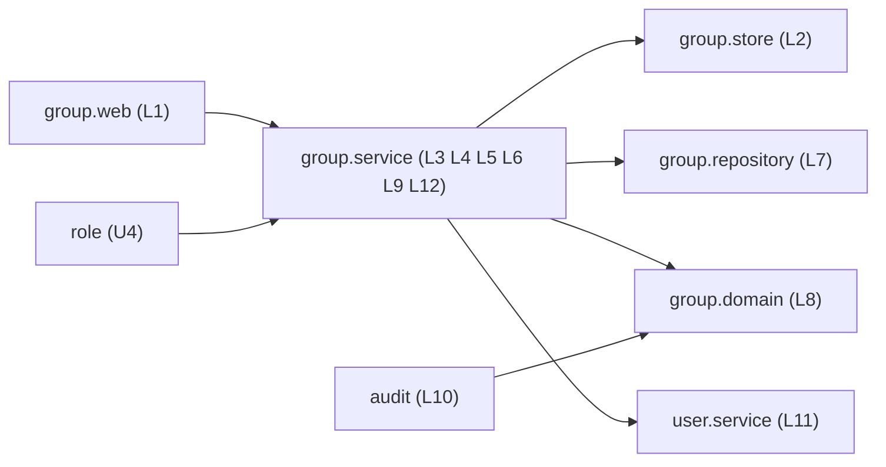

# 論理の部品 — U3 group

## 出典

- この単位の承認済みの NFR 要件 `construction/group/nfr-requirements/`（7つの成果物）
- この単位の承認済みの機能設計 `construction/group/functional-design/`（`functional-spec.md`・`rules.md`・`entities.md`）
- `contract-summary.md`（C1・C4・C6・C10）、`components.md`（GroupManagement・AuditLog・UserAccount）
- この段の答え: `nfr-design-questions.md` の Q1〜Q3（すべて A）とまとめの確認
- 捨ての試しの結果（`reliability-design.md` の1節）

## 1. 部品の一覧

| ID | 部品（パッケージ） | 受け持ち | TraceAspect |
|---|---|---|---|
| L1 | `GroupAdminController`（`group.web`） | 7つの口。`ApiAccess(ADMIN)`。DTO の受け渡し、結果の型を `switch` で `BusinessException` に変える。伏せ字の値を取り出すのはここだけ | 対象 |
| L2 | `GroupStore`（`group.store`、用途名の下位パッケージ） | グループの行の排他（3,000 ms のヒント）と、違反を起こしうる書き込みと flush（作成・名前の変更・削除・メンバーの追加と外し）。例外を中で受けて `StoreOutcome` に変える。`EntityManager` を直接使う | **対象の外**（Q3: A） |
| L3 | `GroupAdminService`（`group.service`） | 業務処理。`TransactionTemplate` で1つ目と2つ目のトランザクションを組む。業務の判定、監査の出来事、待ち合わせの口 | 対象 |
| L4 | `GroupMembershipQueryImpl`（`group.service`） | U4 への読み取りと排他の口（`groupIdsOfUser`・`exists`・`summaries`・`memberUserIds`・`lockForAssignment`）。`lockForAssignment` は L2 に任せ、`GroupRowLock`（Locked(exists)・Busy）で返す | 対象（引数と戻り値は ID と真偽値だけ） |
| L5 | `GroupDeletionGuard`（`group.service`、インターフェース） | U4 が実装する問う口（`canDelete`・`assignedRoleCounts`）。B3 では `role` のパッケージに仮の実装 | 対象 |
| L6 | `GroupBarrier`・`NoOpGroupBarrier`（`group.service`） | 待ち合わせの口（`beforeLock`・`afterLock`・`afterCheck`・`afterWrite` の4点。`reliability-design.md` の 2.1）。テストは `group/testsupport` の `@Primary` の部品 | 対象 |
| L12 | `GroupStoreTransactions`（`group.service`） | store を呼ぶ1つ目のトランザクションの入口。結果が `Done` 以外なら必ず巻き戻しの印を付ける（`reliability-design.md` の 2.3。U4 の `RoleStoreTransactions` と同じ形） | 対象 |
| L7 | `GroupRepository`・`GroupMemberRepository`（`group.repository`） | 読み取りだけ（一覧・件数・詳細・所属・数）。書き込みの方法と `@Modifying` を置かない | 対象 |
| L8 | `GroupName`・`GroupAuditEvent`・`GroupAuditDetail`・`GroupProblemTypes`（`group.domain`） | 名前の正規化と鍵、監査の出来事と detail の型、code の定数 | 対象 |
| L9 | `GroupProblemTypeCatalog`（`group.service`） | code の一覧を起動時に集める | 対象 |
| L10 | `AuditEventListener` の受け取りと `AuditEvent` の項目とファクトリー（`audit.service`・`audit.domain`） | `GroupAuditEvent` を写して記録。detail の長さの上限 | 対象 |
| L11 | `user.service` のまとめて読む口 | メンバーの氏名・メールアドレス・停止を ID の集合で1回で読み、伏せ字の型で返す | 対象 |

本体に手が入るパッケージは `group.*`（新しい。`group.store` を含む）・`audit.domain`・`audit.service`・`user.domain`・`user.service`・`useradmin.domain` で、どれも `packagesJudgedByTotal` に入っていない。パッケージごとの下限（行 80%・分岐 70%）がそのまま当たる（NFR6.4）。

## 2. 依存の向き

テキストの代替: `group.web` は `group.service` だけを呼ぶ。`group.service` は `group.store`（書き込みと排他）・`group.repository`（読み取り）・`group.domain`・`user.service` を使う。U4 の `role` は `group.service` の口（L4・L5）だけを使い、`audit` は `group.domain` の出来事の型だけを使う。`group` は `role`・`audit`・`useradmin` に依存しない。

`GroupBoundaryArchitectureTest` で次を確かめる。

- `group` が `role`・`audit`・`useradmin` に依存しない。
- `group` に依存してよいのは `role`・`audit` だけ。
- `group.store` を使うのは `group.service` だけ。
- `group.service` が `EntityManager` を使わない。
- `group.repository` に書き込みの方法・`@Modifying` が無い。
- トランザクションの境界は `group.service` の `TransactionTemplate` だけ。

## 3. 失敗の範囲

- グループの操作は内部DB だけを使い、外への呼び出しは無い。失敗の範囲は1要求のトランザクションに閉じる。
- 待ちの上限切れは巻き戻して `GROUP_BUSY` で返し、ほかの要求に広げない。
- 書き込みの同時の数が接続プールの上限に達したときの2本使いの時間切れは、既知の制約（`scalability-design.md` の2節）。

## 4. 上流との差（承認済みの文書は書き換えない）

| 差 | 上流 | この設計 | 理由 |
|---|---|---|---|
| 一意の鍵・主キーの待ちの上限 | NFR3.3「上限（3 秒）」 | 3 秒は行の排他のヒントにだけ当たり、一意の鍵・主キーの待ちは H2 の既定の約 2,000 ms のまま（依頼者の決定で受け入れ） | 捨ての試し（T1〜T3）。`SET LOCK_TIMEOUT` はプールの接続に残り、ほかの機能に響くため変えない（`reliability-design.md` の 1.3） |
| 接続の合否の回 | NFR2.7 の 4 VU の回（上限 10） | 上限 11・書き込み 5 VU。時間切れ 0・500 が 0 件・`acquire` の最大 20 ms 未満 | Q1: A と承認の場の直し R-01（`scalability-design.md` の 2.3） |
| 20 VU の回の期待 | NFR2.7「借りるまでの待ちの最大が 0 より大きい」 | 上限に届いた証拠（`acquire` 10 ms 以上）。合否に使わない記録。流し直しは1回まで | Q1: A、NFR 要件の読み直しの R-02、承認の場の直し R-01 |
| 待ち合わせの口の点 | 機能設計は排他の直後の口だけ | 4つの点（`beforeLock`・`afterLock`・`afterCheck`・`afterWrite`） | API 経由で時間に頼らない重なりを作るため（承認の場の直し R-02） |
| 巻き戻しの印の置き場 | 機能設計・NFR 要件は業務処理の操作ごとを前提 | `GroupStoreTransactions` に集める。書き込みの前の拒否の失敗の出来事も2つ目のトランザクションで出す | 付け忘れを構造で防ぐ（読み直しの R-05、U4 と同じ形） |
| 書き込みと排他の置き場 | 機能設計は層（web・service・domain・repository）だけを示す | 用途名の下位パッケージ `group.store` を足す | Q3: A。例外の文が TraceAspect を通らないため |
| `group_members(user_id)` の索引 | 機能設計の表に索引の記述が無い | 足す | `groupIdsOfUser` を1回の読み取りに収めるため（`performance-design.md` の1節） |
| `user.service` のまとめて読む口 | 機能設計の 8節で足すとした | 名前を `findSummariesByIds(Set<Long>)` とする | 形を決めただけ |
| 同じ名前の重なりの 409 の code | NFR3.3・NFR3.7 で未確定 | 先の側が約 2 秒以内に確定すれば `GROUP_NAME_DUPLICATE`、そうでなければ `GROUP_BUSY`。受け入れた振る舞い | 捨ての試し（T1・T2）。依頼者の決定（`reliability-design.md` の5節、NFR 要件の読み直しの R-07） |

## 5. コード生成（B3）への引き継ぎ

- `group.store` の部品と `StoreOutcome` の区分（`reliability-design.md` の 2.2）。区分の順は「`RowLockFailures.isLockFailure` → SQLState 23505・23503 と制約の名前 → 想定外」。
- store を呼ぶ1つ目のトランザクションは、すべて `GroupStoreTransactions` を通す。`Done` 以外で必ず巻き戻しの印を付ける（捨ての試しの T5。付け忘れは `UnexpectedRollbackException` で 500）。
- 移行は次の空き番号で、`groups`・`group_members`（`user_id` の索引を含む）と `audit_events` の3列。
- `application.yaml` の `org.hibernate.orm.jdbc.error: OFF` を変えない。
- テスト: `GroupConnectionUsageIT`・`GroupConcurrencyIT`・`GroupNameConflictIT`・`GroupStoreConstraintIT`・`GroupStoreTransactionsIT`・`GroupStoreClassificationTest`・`GroupUniqueViolationSecretLeakIT`・`GroupSecretLeakIT`・`GroupAuditIT`・`GroupBusyLogIT`・`GroupAdminMetricsIT`・`GroupAdminAuthorizationApiIT`・`GroupAdminMassAssignmentIT`・`GroupAdminIdorApiIT`・`GroupMembershipQueryCountIT`・`GroupAdminListQueryCountIT`・`GroupNameProperties`・`GroupBoundaryArchitectureTest`。
- k6 の8場面と `groupPoolLimit`（合否の回: 上限 11・5 VU、記録の回: 上限 10・20 VU）の台本と、データの用意の手順（`perf/README.md`）。

## 6. U4 role への引き継ぎ

- **排他の口**: グループへの割り当て・外しは `lockForAssignment` を必ず通す。排他を通らない書き込みは、外部キーの違反（捨ての試しの T4 (ii)）でしか止まらない。`Busy` は巻き戻して `GROUP_BUSY`。
- **違反の後の形**: U4 の `RoleStoreTransactions` と group の `GroupStoreTransactions` は同じ形（`Done` 以外で印を付け、2つ目の `TransactionTemplate` で失敗の出来事だけを出す。T5）。違反・上限切れを起こしうる書き込みは、TraceAspect の対象の外の用途名の下位パッケージにまとめる（Q3: A と同じ形）。
- **待ちの上限**: 一意の鍵・主キーの待ちは H2 の既定の約 2 秒で切れる（T1〜T3）。ロールの名前の重なりでも、違反と上限切れの両方を読み替える。
- **接続プールの場面**: U4 の NFR 設計の形（上限 11・書き込み 5 VU の合否の回、上限 10・20 VU の記録の回）にそろえた（`scalability-design.md` の 2.4）。
- **同時の重なりのテスト**: 「待たない違反」と「先の側を放さない上限切れ」の形と、4つの点の待ち合わせの口は U4 と同じ。グループの削除とグループへの割り当ての重なり（`reliability-design.md` の 4.2 の #8）は B5 で U4 が確かめる。

## 7. 承認の場の決定と直し

依頼者は NFR 設計の承認の場で Request Changes を選び、決定の文は「推奨の案のとおり直す」（直す範囲: 各単位の読み直しの Major と、単位の間でそろえる3点）。この成果物では、R-01・R-02・R-05 とそろえる点3の直しに合わせて、部品（L6 の4つの点、L12 の `GroupStoreTransactions`）、上流との差の表、コード生成と U4 への引き継ぎを直した。中身は `scalability-design.md` の3節と `reliability-design.md` の6節。
- **B5 での 403 の表の足し直し**: グループの管理の7つの口に「全スキーマを FULL にしたロールを作業ロールにする、管理者の印だけを欠く利用者」の行を足す（`security-design.md` の2節）。
- **問う口の実装**: B3 の仮の実装を B5 で本物に置き換える（数はグループへの直接の割り当ての数、無ければ 0）。
- **`memberUserIds`**: 割り当ての一覧（グループ経由の利用者）で1回で読む。存在しないグループは結果に含まれない。
