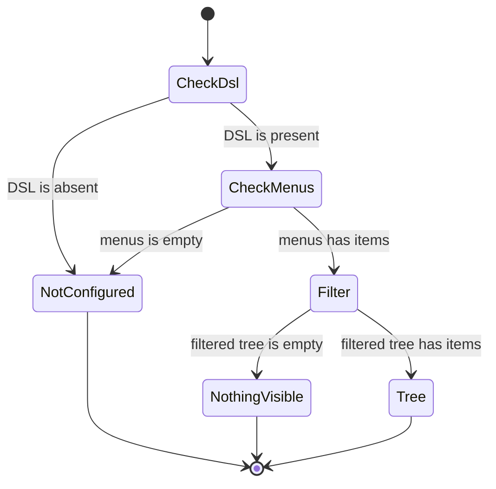
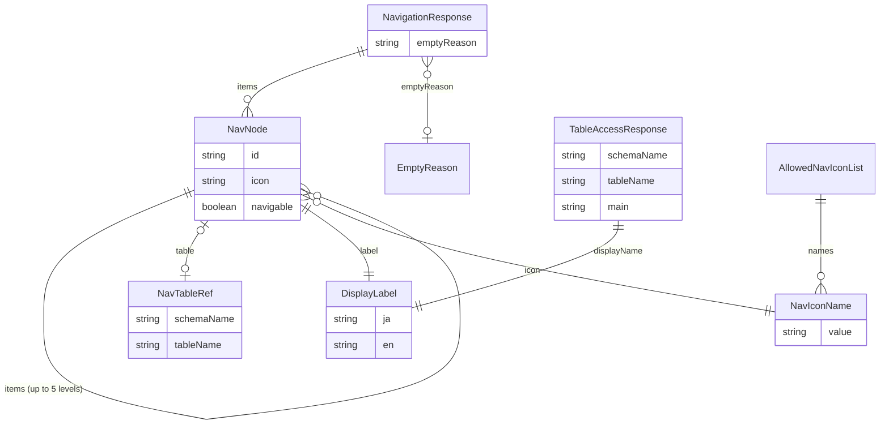

# 機能の仕様 — U5 navigation

## 出典

- 単位の定義 `aidlc/spaces/default/intents/261004-role-menu/inception/units-generation/unit-of-work.md`（U5 navigation、kind: service、Bolt B7）
- ストーリーと単位の対応 `aidlc/spaces/default/intents/261004-role-menu/inception/units-generation/unit-of-work-story-map.md`（主の単位は US5.1。画面は U7、menus の形は U2、解決は U4）
- 要件 `aidlc/spaces/default/intents/261004-role-menu/inception/requirements-analysis/requirements.md`（FR8.3・FR9.1〜FR9.3・FR9.5・FR9.6・FR10.1〜FR10.5・NFR1.1〜NFR1.6・NFR2.2・NFR6.2）
- 部品の一覧 `aidlc/spaces/default/intents/261004-role-menu/inception/domain-design/components.md`（Navigation）と ADR（`decisions.md` の ADR-001・ADR-003）
- 契約の一覧 `aidlc/spaces/default/intents/261004-role-menu/inception/contract-design/contract-summary.md`（C1・C3・C5・C9）
- ストーリー `stories.md`（US5.1 の AC5.1.1〜AC5.1.18）、画面 `mockups.md`（S1・S2）・`interaction-spec.md`（NavTree・TablePlaceholderPage）
- 先に確定した単位: `construction/dsl-v2/functional-design/`（版 2 のモデル、menus の組、深さ 5 段）、`construction/role/functional-design/`（`EffectivePermissionResolver`・`PermissionSnapshot`）、`construction/cross-cutting/functional-design/`（`ApiAccess`、`app/registry` のアイコンの一覧）
- この段の答え `functional-design-questions.md`（Q1〜Q4 A・Q5 B・Q6 A、まとめの確認で「この段で決める設計の要点」も承認）

データの形は `entities.md`、判定の決まりは `rules.md` が正。この文書は流れと状態の遷移の正で、ER の図と決まりの要約はそこから導いた見やすい形である。

---

## 1. 部品と依存

| パッケージ | 持つもの |
|---|---|
| `navigation.domain` | 応答の木の値（`NavNode` など）、絞る純粋な関数 `MenuFilter`、アイコンの照らし合わせ `NavIconPolicy`、結果の型 `TableAccessResult` |
| `navigation.service` | `NavigationService`（メニューの木と置き場の問い合わせ）、アイコンの一覧のファイルの読み込み（起動時に1回） |
| `navigation.web` | `NavigationController`（2本の API、`ApiAccess(AUTHENTICATED)`）、応答の record（`NavigationResponse`・`TableAccessResponse`）、結果の型から `BusinessException` への変換 |

- 依存: `navigation` → `dsl.service`・`dsl.domain`（`ActiveDslModelProvider`・`DslModel`）、`role.service`・`role.domain`（`EffectivePermissionResolver`・`PermissionSnapshot`・`MainPermission`）、`access.domain`（`AccessProblemTypes.ACCESS_DENIED`）、`auth.domain`（主体 `AuthenticatedUser`）、`common`。どの機能も `navigation` に依存しない（BR7.1、`NavigationBoundaryArchitectureTest`）。
- `repository` の層と内部DB の表は持たない（BR6.2）。

## 2. 流れ

### 2.1 業務のメニューの API（GET /api/me/navigation）

1. 認証の仕組みが主体を決める。未認証は 401、停止中の利用者は既存の認証の決まりで通らない（BR6.1）。問い合わせの引数は読まない（BR1.1）。
2. 主体の `userId` を要求の文脈から読む。
3. `ActiveDslModelProvider.current()` を1回呼ぶ。`Absent` なら `{items: [], emptyReason: NOT_CONFIGURED}` を 200 で返す。解決の口は呼ばない（BR1.2）。
4. `menus` が空なら同じく `NOT_CONFIGURED`（BR1.3）。
5. `EffectivePermissionResolver.snapshotFor(userId)` を1回呼ぶ（BR1.4）。作業ロールが無ければ写しはすべて NONE。写しと 3 の DSL の識別が違っても読み直さない（BR1.5）。
6. `MenuFilter` に `menus`・「テーブルの主権限」（写しの `main(schema, table, null)`）・「アイコンの照らし合わせ」を渡して絞る（2.3）。
7. 結果が空なら `emptyReason: NOTHING_VISIBLE`、空でなければ null（BR2.5・BR3.3）。200 で返す。監査なし（BR7.3）。

### 2.2 テーブルの置き場の問い合わせ（GET /api/me/table-access?schema=…&table=…）

1. 認証は 2.1 の 1 と同じ（BR6.1）。
2. 引数 `schema`・`table` を検証する。無い・空は 400 `VALIDATION_FAILED`（BR5.1）。長さと文字の種類は問わない（要求の大きさは既存の仕組みの範囲）。
3. `snapshotFor(userId)` を1回呼び、`main(schema, table, null)` を求める。DSL が無い・組が DSL に無いときも同じく呼ぶ（写しが NONE を返す）（BR5.2）。
4. NONE なら `NotVisible`。READ・FULL なら `current()` のモデルから組のテーブルを引いて表示名を得て `Visible`。引くときに組がモデルに無ければ（3 と 4 の間に DSL が適用し直された）`NotVisible` にする（BR5.2・BR5.3）。
5. 画面入出力の層が `switch` で、`Visible` を 200 `{schemaName, tableName, displayName: {ja, en}, main}`、`NotVisible` を `BusinessException(ACCESS_DENIED)`（403）に変える（BR7.2）。403 は監査に残さず、既存の WARN の1行だけ（BR5.5）。メニューに出ているかは見ない（BR5.4）。

### 2.3 絞る関数（MenuFilter、純粋な関数）

項目ごとに深さ優先で、子から先に決める（BR2.1〜BR2.6・BR3.1・BR3.5）。

1. 項目の位置の道を作る（親の道 + `.` + 絞る前の DSL の順での番号。1段目は番号だけ）（BR3.1）。
2. 子を同じ手順で絞る。
3. テーブルを持てば、テーブルの主権限を求める（カラムは見ない。DSL に無い組は NONE）（BR2.1・BR2.6）。
4. 出し方を決める（BR2.2・BR2.3・BR3.5）:

| テーブル | 見える（READ・FULL） | 絞った後の子 | 結果 |
|---|---|---|---|
| あり | はい | 問わない | 出す。`navigable` true、`table` に組、子は絞った後の子 |
| あり | いいえ | 1つ以上 | 出す。`navigable` false、`table` null（移れないまとまり） |
| あり | いいえ | 0 | 落とす |
| なし | — | 1つ以上 | 出す。`navigable` false、`table` null |
| なし | — | 0 | 落とす |

5. `label` は DSL の `ja`・`en` をそのまま、`icon` は 2.4 で照らした名前にする（BR3.2・BR4.2）。
6. 残った項目を元の順のまま並べる（BR2.4）。

説明用の断片（形だけ）:

```java
// 子から先に絞り、出さない項目は空を返す
Optional<NavNode> filter(DslMenuItem item, String path, MenuFilterInput in) {
    List<NavNode> children = filterChildren(item.items(), path, in);
    boolean visible = item.table() != null
            && in.tableMain(item.table()) != MainPermission.NONE;
    if (!visible && children.isEmpty()) {
        return Optional.empty();
    }
    return Optional.of(new NavNode(path, label(item), in.iconOf(item.icon()),
            visible ? ref(item.table()) : null, visible, children));
}
```

### 2.4 アイコンの照らし合わせ

1. 起動時に `navigation/allowed-icons.txt` を読み、`#` の行と空行を飛ばして名前の集まりにする（BR4.1）。ファイルが無い・名前が0個・`list` が無い・重なりがあれば起動を止める（BR4.3）。
2. 項目の `icon` が集まりの名前と文字どおり一致すればそのまま、null・空・一致しなければ `list`（BR4.2）。置き換えのログは出さない。
3. 画面のテストが同じファイルを読み、`app/registry` の一覧と一致することを確かめる（BR4.4）。

## 3. 状態の遷移

この単位は保存する状態を持たない。応答の形は、要求のたびに次の入力の組で決まる（BR1.2〜BR1.5・BR2.5・BR3.3）。

| 適用中の DSL | menus | 作業ロールと権限 | items | emptyReason |
|---|---|---|---|---|
| Absent | — | 問わない | 空 | NOT_CONFIGURED |
| Present | 空 | 問わない | 空 | NOT_CONFIGURED |
| Present | あり | 作業ロールが無い | 空 | NOTHING_VISIBLE |
| Present | あり | すべての項目が見えない | 空 | NOTHING_VISIBLE |
| Present | あり | 1つ以上見える | 絞った木 | null |



テキストの代替: まず適用中の DSL を見て、無ければ NOT_CONFIGURED。あれば menus を見て、空なら NOT_CONFIGURED。menus があれば作業ロールの写しで絞り、空なら NOTHING_VISIBLE、項目が残れば絞った木を返す（emptyReason は null）。

前の要求との関係: 作業ロールの切り替え・権限の設定の変更・割り当ての変更・DSL の適用は、次の要求の木と問い合わせの結果に効く（写しを要求をまたいで持たないため。AC5.1.5・AC5.1.11）。同じ DSL の間は、作業ロールを切り替えても同じ項目の `id` は変わらない（BR3.1）。DSL を適用し直すと `id` は変わりうる。

## 4. ER の図（`entities.md` から導いた形）



テキストの代替: メニューの応答は項目を0個以上と、空のときの理由を0か1つ持つ。項目は子の項目を0個以上（深さ 5 段まで）、テーブルの組を0か1つ、表示名の組を1つ、許したアイコンの名前を1つ持つ。置き場の問い合わせの応答は表示名の組を1つ持つ。アイコンの一覧のファイルは許した名前を0個以上（起動時の検査で1個以上・`list` を含む）持つ。

## 5. 決まりの要約（`rules.md` から導いた形）

- 読み取り（BR1）: 主体は要求の文脈から。DSL は `current()` を1回、権限は `snapshotFor` を1回。DSL が無い・menus が空は空の木。DSL の識別の食い違いで読み直さない。管理のメニューは返さない。
- 絞る（BR2）: テーブルの階層の主権限だけで判定。テーブルと子の両方を持つ項目は3つの場合。子の無いまとまりはさかのぼって落とす。親子と並びを保つ。純粋な関数と6つの性質。
- 応答（BR3）: `id` は絞る前の位置の道。表示名は `{ja, en}` をそのまま。`emptyReason` は NOT_CONFIGURED か NOTHING_VISIBLE。識別・ロール・権限の値を載せない。
- アイコン（BR4）: 一覧のファイルから読み、無い名前は `list`。ファイルの誤りで起動を止める。画面の一覧との一致をテストで確かめる。
- 置き場（BR5）: 引数で受け、無い・空だけを拒否（長さでは拒否しない）。DSL 無し・組が無い・NONE は同じ 403。READ・FULL は 200。メニューを見ない。監査なし。
- API と構造（BR6・BR7）: ログインだけの印、読み取りだけ、3つの層と境界テスト、結果の型、指標は既存だけ、個人に関する値を受け渡さない。

## 6. 誤りの code と状態コード

| 場面 | 状態 | code | 出どころ |
|---|---|---|---|
| 未認証（2本とも） | 401 | `AUTHENTICATION_REQUIRED` | 既存（BR6.1） |
| 停止中の利用者（2本とも） | 既存の認証の拒否のまま | 既存 | 既存（BR6.1） |
| 置き場の引数が無い・空 | 400 | `VALIDATION_FAILED` | 既存の共通の code（BR5.1） |
| 置き場の DSL 無し・組が無い・NONE | 403 | `ACCESS_DENIED` | 既存の `access.domain.AccessProblemTypes`（BR5.2） |
| メニューの DSL 無し・menus が空・作業ロール無し・すべて NONE | 200（誤りにしない） | — | BR1.2・BR1.3・BR2.5 |
| 内部DB の誤りなど想定外 | 500 | 既存の想定外の code | 既存（例外のまま投げる、BR7.2） |

この単位の新しい code は無いため、`NavigationProblemTypes`・`NavigationProblemTypeCatalog` は置かない。

## 7. テストの観点

`team.md` の「役割・権限の機能では、次のテストを必ず書く」と「N 階層のメニュー（ナビゲーションの木）の画面では、次のテストを必ず書く」のうち、この単位（サーバー側）に当たるもの。画面の開閉・`aria-current`・キーボード・axe は U7 が持つ。

- **権限ごとの API の認可**: 2本ともログインだけの分類で、未認証 401・ログインした利用者 200（置き場は READ のとき）・停止中の利用者は通らない、をパラメーターを使うテストの表で書く。「その権限を持たない 403」に当たるのは置き場の NONE で、要る権限（そのテーブルの READ）だけを欠き、ほかのテーブルの READ を持つ作業ロールの利用者で確かめる（BR6.1・BR5.2）。
- **API の分類の網羅**: 2本に `ApiAccess(AUTHENTICATED)` があり、U1 の網羅の検査を通る（BR6.1）。
- **割り当ての変更の反映**: 作業ロールの切り替え・テーブルの主権限の変更・割り当ての外しの直後の次の要求で、木の項目と置き場の 200／403 がサーバー側で切り替わる。変更の前に出したアクセストークンのままで確かめる（BR1.4、AC5.1.5・AC5.1.11）。
- **IDOR の防止**: 問い合わせの引数に `userId` を足してもほかの利用者の木・権限が返らない（BR1.1）。
- **画面の出し分けをサーバーの代わりにしない**: メニューに出ないテーブルでも置き場の問い合わせでサーバーが判定する。NONE と DSL に無いテーブルと DSL が無いときが同じ 403・同じ本文で、表示名を含まない（BR5.2・BR5.4、AC5.1.4）。
- **深さの上限**: 5 段ちょうどの木（dsl-v2 が受け付ける最大）が欠けずに返り、深さが元を超えない（BR2.4。上限を超える DSL の拒否は U2 が確かめる）。
- **信頼できない入力**: `label` に `<script>`・`<`・`>`・`&`・`"`・`'` を含めても、応答の JSON に文字どおりの値で入る（サーバーで変えない。描き方は U7）。`icon` が null・空・大文字違い・前後に空白・一覧に無い名前は `list`。名前に `/`・`..`・`?`・`#`・`%`・空白・`javascript:`・`https://` を含むテーブルでも、置き場の問い合わせが 200／403 を正しく返し、400 の要求の拒否にならない。引数が無い・空のときだけ 400 `VALIDATION_FAILED` で、長い名前（例: 300 文字）のテーブルでも権限があれば 200 になる（BR3.2・BR4.2・BR5.1、AC5.1.7・AC5.1.13）。
- **絞る関数（性質ベース、jqwik）**: 任意の木（深さ 5 段まで、テーブルと子の組み合わせ、同じテーブルを指す項目の重なりを含む）と任意の主権限の割り当てで、(a) 移れる項目の実効はすべて READ・FULL (b) 子の無いまとまりが無い (c) 残った項目の親子と並びが元と同じ（`id` で元の項目に戻せる） (d) すべて NONE なら空 (e) どれかのテーブルを NONE から READ に強めても残る項目は減らない (f) 深さは元を超えない。失敗時の乱数の種を記録する（BR2.7、AC5.1.15）。あわせて例で、テーブルと子の両方を持つ項目の3つの場合、DSL に無いテーブルを指す項目が落ちること（AC5.1.14）、`id` の番号が落とした項目で詰まらないことを確かめる。
- **空の理由**: DSL 無し・menus が空は NOT_CONFIGURED、作業ロール無し・すべて NONE は NOTHING_VISIBLE、項目があれば null（BR3.3、AC5.1.6・AC5.1.17）。
- **DSL の識別の食い違い**: 写しを作る前後で DSL を差し替えたとき、新しい DSL で権限の無い項目が出ない（BR1.5。待ち合わせで重なりを作る）。
- **アイコンの一覧**: ファイルの読み方（`#` の行・空行・前後の空白）、ファイルが無い・名前が0個・`list` が無い・重なりで起動が止まる（BR4.1・BR4.3）。画面のテストで一覧のファイルと `app/registry` の一覧が一致する（BR4.4）。
- **境界テスト**: `NavigationBoundaryArchitectureTest`（BR7.1）。
- **監査とログ**: 2本とも監査の行が増えない。置き場の 403 の WARN にスキーマ名・テーブル名が出ない（BR5.5・BR7.3）。

## 8. 契約 C9 との差

承認済みの契約の文書は書き換えず、差をここに記録する（`project.md` の学び）。C9 の持ち主は U5 で、使う側の U7 の機能設計で受け入れを確かめる。

| 項目 | 契約 C9 | この設計 | 理由 |
|---|---|---|---|
| メニューの表示名 | `label: string` | `label: {ja, en}` | 既存の DSL の API と dsl-v2 の Q1 A にそろえ、言語の切り替えで読み直さない（Q1 A）。型の変更 |
| 置き場の表示名 | `displayName`（文字列） | `displayName: {ja, en}` | 同上（Q1 A） |
| 項目の識別 | 無い | `id`（絞る前の DSL の木での位置の道） | 入れ子のサイドバーの `id` と開閉の状態のため（Q2 A）。足すだけ |
| 空の理由 | 無い | `emptyReason`（NOT_CONFIGURED・NOTHING_VISIBLE・null） | ホームの2つの文言を見分けるため（Q3 A）。足すだけ |
| 置き場の道 | `GET /api/me/tables/{schemaName}/{tableName}/access` | `GET /api/me/table-access?schema=…&table=…` | 道の中の `%2F`・`%25`・`..`・`;` が要求の検査で 400 になるため（Q4 A）。道の変更 |
| アイコンの一覧 | 未決 | `backend/src/main/resources/navigation/allowed-icons.txt` に 18 個。サーバーはこれで照らし、画面のテストが `app/registry` との一致を確かめる | Q5 B |
| 置き場の 400 | 無い | 引数 `schema`・`table` が無い・空のときだけ 400 `VALIDATION_FAILED`。長さでは拒否しない | 引数で受ける形（Q4 A）に伴う入力の検証（BR5.1）。まとめの確認の要約に無かった決まり（承認の場の直し R-01・R-02） |
| アイコンの一覧のファイルの誤り | 無い | ファイルが無い・読めない・名前が0個・`list` が無い・重なりがあるときは起動を止める | 設定の誤りを早く止める（BR4.3）。まとめの確認の要約に無かった決まり（承認の場の直し R-02） |

## 9. app-frame-ui（U7）への引き継ぎ

- **id の前置き**: `NavNode.id` は前置きの無い位置の道（例 `2.0`）。管理のメニューの登録の `id` と重ならないよう、`navSections` に入れるときに U7 が前置き（例 `biz:`）を付ける。開閉の状態（`navExpandedIds`）も前置きつきで持つ。DSL を適用し直すと `id` が変わりうるため、覚えた開閉の状態に無い `id` は無視する。
- **画面の道が要求の検査に当たる件**: 画面の道 `/tables/{スキーマ名}/{テーブル名}`（`interaction-spec.md` の TablePlaceholderPage、`mockups.md` 1.1）は、名前に `/`・`%`・`..`・`;` があると、エンコードした `%2F`・`%25` などで Spring Security の要求の検査に当たり、直接開く・再読み込みすると index.html を返す前に 400 `REQUEST_REJECTED` になる（`access/web/AccessRequestRejectedHandler.java`）。AC5.1.8・AC5.1.13 に関わるため、U7 の設計で画面の道の形（例: 問い合わせの引数 `/tables?schema=…&table=…`）を決める。サーバーの API は Q4 A で引数にした。
- **同じテーブルを指す項目が複数あるときの今の項目**: dsl-v2 は同じ組を複数の項目が指すことを禁じていない。AC5.1.3・AC5.1.8 で、今の道に当たる項目が複数あるときにどれを `current` にし、どの祖先を開くか（例: すべて、または最初の1つ）を U7 が決める。
- **label が空のときの既定の表示**: `label` の `ja`・`en` は空の文字列（未設定）がありうる。表示の言語の値が空のときの既定（例: もう片方の言語、テーブルの組の名前、「—」）を U7 が決める。サーバーは変えずに返す（BR3.2）。
- **エスケープ**: `label`・`displayName` は文字として描き、HTML として描かない（BR3.2、AC5.1.7）。
- **アイコン**: サーバーが照らした後の名前が来るが、画面も `app/registry` の一覧でもう一度照らし、知らない名前は `list` にする。一覧のファイル（`backend/src/main/resources/navigation/allowed-icons.txt`）と `app/registry` の一覧の一致のテストは、ファイルを作る U5 の Bolt（B7）で `frontend/src/app/registry/` の下に置く。make-you-chic-ui の固定先を上げる B9 でアイコンが変わったら、一覧のファイルと `app/registry` の一覧の両方を直す（直し忘れはこのテストで止まる）。
- **空の理由の文言**: `NOT_CONFIGURED` は「業務のメニューが設定されていません」、`NOTHING_VISIBLE` は「表示できる業務のメニューがありません」の案内（`mockups.md` 1.3）。
- **置き場の 403**: 本文の `code` は `ACCESS_DENIED`。古いメニューから移って 403 のときは、業務のメニューを読み直す（AC5.1.11）。
- **置き場の 400**: 引数 `schema`・`table` が無い・空のときだけ `VALIDATION_FAILED`。名前の長さでは拒否しないため、画面も名前の長さで問い合わせを止めない。

## 10. 承認の場の決定と直し

- 決定: 依頼者は承認の場で Request Changes を選び、直す範囲を「推奨の案のとおり直す」（Major の指摘と、それに伴う小さな直しだけ）とした。ほかの指摘は直さない。
- R-01（Major）: 置き場の問い合わせの名前の長さの上限 256（BR5.1）をやめた。DSL の側に名前の長さの上限が無く、上限を置くとメニューに出るのに開けないテーブルができるため。引数が無い・空のときだけ 400 `VALIDATION_FAILED` にし、長さでは拒否しない（要求の大きさは既存の仕組みの範囲）。直した所: `rules.md` の BR5.1 と要約の表、`entities.md` の ENT-007 と要約、この文書の 2.2・5節・6節・7節・9節。
- R-02（R-01 に伴う小さな直し）: 8節の契約 C9 との差の表に、まとめの確認の要約に無かった決まり（引数が無い・空のときの 400、アイコンの一覧のファイルが無い・壊れているときに起動を止める BR4.3）を足した。
- `traceability.json` は BR の id が変わらないため直していない。
