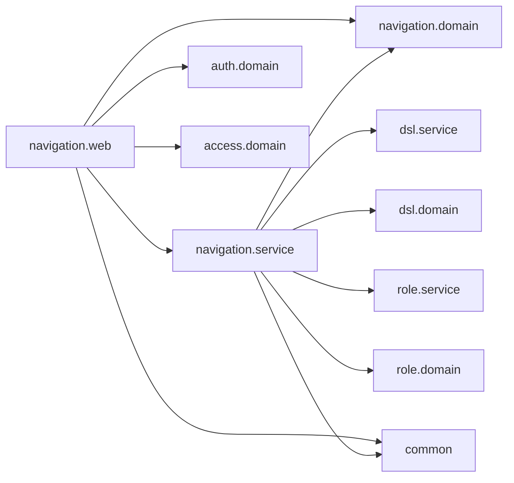

# 論理部品 — U5 navigation

## 出典

- この単位の承認済みの NFR 要件 `construction/navigation/nfr-requirements/`（7つ。とくに `tech-stack-decisions.md` の NFR6.1・NFR6.2・NFR6.4〜NFR6.7）
- この単位の承認済みの機能設計 `construction/navigation/functional-design/functional-spec.md`（1節の部品と依存）・`rules.md`・`entities.md`
- 契約 `inception/contract-design/contract-summary.md`（C1・C3・C5・C9）、部品の一覧 `inception/domain-design/components.md`（Navigation）
- この段の答え `nfr-design-questions.md`（Q1 A・Q2 A・Q3 A と、まとめの確認）
- 統合の点: role の NFR 設計 `construction/role/nfr-design/logical-components.md`（5節・6節）・`reliability-design.md`（3節）

## 1. 部品の一覧

| ID | 部品（パッケージ） | 役目 | TraceAspect |
|---|---|---|---|
| L1 | `NavigationController`（`navigation.web`） | 2本の API、`ApiAccess(AUTHENTICATED)`、空の引数の確かめ、結果の型から応答への変換 | 対象（引数は名前だけ） |
| L2 | `NavigationService`（`navigation.service`） | DSL の提供口と解決の口を呼び、絞る関数を当てる。置き場は `resolve` を1回 | 対象 |
| L3 | `MenuFilter`（`navigation.domain`） | 絞る純粋な関数 | 対象 |
| L4 | `NavIconPolicy`（`navigation.domain`） | アイコンの照らし合わせ | 対象 |
| L5 | `AllowedNavIconList`（`navigation.service`） | 起動時に一覧のファイルを読み、誤りなら起動を止める | 対象 |
| L6 | `NavNode`・`NavTableRef`・`DisplayLabel`・`EmptyReason`・`TableAccessResult`（`navigation.domain`） | 値と結果の型 | 対象 |
| L7 | `NavigationBarrier`・`NoOpNavigationBarrier`（`navigation.service`） | 待ち合わせの口（Q2 A）。本番は何もしない | 対象 |
| T1 | `ConnectionCountingDataSource` とそれをかぶせる `BeanPostProcessor`、測る要求に印を付けるサーブレットのフィルター（`src/test/java` の `navigation/testsupport`） | スレッドごとと印ごとの同時に借りている接続の最大を数え、`reset()` で空にする（Q2 A、承認の場の直し R-01。`scalability-design.md` の 2節） | テストだけ |
| T2 | `TestNavigationBarrier`（`navigation/testsupport`、`@Primary`） | 点で止めて合図で再開する | テストだけ |
| T3 | 解決の口と DSL の提供口の数える替え物（`navigation/testsupport`） | 呼び出しの回数・例外を投げる場合 | テストだけ |

## 2. 依存の向き

テキストの代替: `navigation.web` は `navigation.service`・`navigation.domain`・`auth.domain`（主体）・`access.domain`（`ACCESS_DENIED`）・`common` に依存する。`navigation.service` は `navigation.domain`・`dsl.service`・`dsl.domain`・`role.service`・`role.domain`・`common` に依存する。どの機能も `navigation` に依存しない。

`NavigationBoundaryArchitectureTest` の規則（承認済みの NFR6.5 に、この段の部品を足す）:

- navigation が依存してよいのは上の図の先だけ。`dsl.parse`・`dsl.validate`・`role.repository`・`role.store` に依存しない。
- どの機能も navigation に依存しない。
- `NavigationBarrier` の本番の実装は `NoOpNavigationBarrier` だけ（`navigation.service` の中）。テストの部品（T1〜T3）は `src/test/java` だけに置く。
- `AuthenticatedUser` は `navigation.web` だけが読み、service・domain の公開のメソッドの引数と戻り値に現れない（`security-design.md` の 6節）。

## 3. 失敗の範囲

- 2本の API は読み取りだけで、失敗は1要求の中に閉じる。解決の口の DB の誤りは 500（共通の本文）。
- 一覧のファイルの誤りは起動の失敗で、統合の前の `./gradlew verify` で止まる。
- DSL の適用し直しとの重なりでは、権限の無い項目を返さない（`reliability-design.md` の 2節）。

## 4. 上流との差（承認済みの文書は書き換えない）

- **置き場の解決の口**: 機能設計 BR5.2 は `snapshotFor` を1回としていた。NFR 要件の Q1 A で `resolve` を1回にした（承認済み）。role の承認済みの NFR 要件の「`snapshotFor` を1回（必須）」とも食い違っていたが、role の NFR 設計の Q2 A で引き継ぎの文言が「対象が1つなら `resolve` でよい」に改められ、解けた（navigation の R-08 の決着）。
- **NFR1.12 の測り方**: 承認済みの NFR 要件は「メニューの応答から組を集め、集めた組に無い DSL のテーブルに送って 403」で、組は4つだった。この段の Q1 A で、期待はテストの用意から書いた期待の表で持ち、組は7つにした。「継承の階層の場合を網羅する」の文言は外し、口の値の網羅は role の `EffectivePermissionConsistencyIT` に任せた（`security-design.md` の 5節）。
- **接続の数の測り方**: 承認済みの NFR2.6 は「解決の口の読み取りの途中で止め、HikariCP の使用中の数が 1」と書いていた。この段の Q2 A で、テストだけの `DataSource` の包みでスレッドごとの最大を数える形にした（`scalability-design.md` の 2節）。
- **DSL の差し替えの重なりを作る口**: 承認済みの NFR1.10 は「待ち合わせの口で止める」とだけ書いていた。この段の Q2 A で、navigation の側に `NavigationBarrier`（L7）を置いた。role の承認済みの設計には手を入れない。
- **空の引数**: 機能設計 BR5.1 は「無い・空なら 400」。捨ての試し N2-f で、Spring の結び付けは空を拒否しないと分かったため、画面入出力の層で空を明示して確かめる（決まりの中身は変わらない）。
- **性質ベースのテストの生成器**: 承認済みの8つの性質のまま。入力の木の生成器は、深さ 1〜5・子の数 0〜5・テーブルの重なりを含む形にし、`id` の性質 (g)(h) のために同じ木に2通りの権限を当てる。

## 5. コード生成（B7）への引き継ぎ（テストの一覧）

| テスト | 種類 | 確かめること | 設計の節 |
|---|---|---|---|
| `NavigationAuthorizationApiIT` | 結合 | 401・停止中・200・要るテーブルだけ欠く 403 | `security-design.md` 1節 |
| `NavigationApiIT` | 結合 | 絞り込み・メニューに出ない READ の置き場 200・IDOR・同じ 403 の本文・反映・深さ 5・空の理由 | `security-design.md` 2節・3節 |
| `NavigationUntrustedInputIT` | 結合 | 試し N1 の 23 種の名前・label・icon・空の引数 400 | `security-design.md` 4節 |
| `NavigationMenuAccessConsistencyIT` | 結合 | 期待の表で7つの組 | `security-design.md` 5節 |
| `NavigationQueryExposureIT` | 結合 | 問い合わせの値が記録に出ない・監査が増えない | `observability-design.md` 2節 |
| `NavigationDslSwapIT` | 結合 | DSL の差し替えの重なり（4つの場合） | `reliability-design.md` 2節 |
| `NavigationFailureIT` | 結合 | 想定外の失敗は 500 の共通の本文 | `reliability-design.md` 3節 |
| `NavigationConnectionUsageIT` | 結合 | スレッドごとの接続の最大が 1 | `scalability-design.md` 2節 |
| `NavigationCallCountTest` | 単体 | 呼び出しの回数 | `performance-design.md` 1節 |
| `MenuFilterPropertyTest` | 単体（jqwik） | 8つの性質 | 4節 |
| `NavIconPolicyTest`・`AllowedNavIconListTest` | 単体 | 照らし合わせ・一覧のファイルの読み方と誤り | `reliability-design.md` 4節 |
| `NavigationBoundaryArchitectureTest` | 構造 | 2節の規則 | 2節 |
| `frontend/src/app/registry/allowedNavIcons.test.ts` | 画面（Vitest） | 一覧のファイルと `app/registry` の一覧の一致 | 承認済みの NFR6.7 |
| k6 の4場面 | 負荷 | p95・checks | `performance-design.md` 3節 |

- カバレッジ: `navigation.domain`・`navigation.service`・`navigation.web` はパッケージごとの下限の対象。`NoOpNavigationBarrier` もテストで呼ばれる（本番の経路で呼ぶため）。

## 6. ほかの単位への引き継ぎ

- **U4 role**: navigation は、メニューで `snapshotFor` を1回、置き場で `resolve` を1回呼ぶ。口の値の網羅は role の `EffectivePermissionConsistencyIT`（B5）に任せている。navigation の結合テストは role の解決の口の本物を使い、`RoleBarrier` は使わない。
- **U7 app-frame-ui**: 置き場の引数は、画面が必ず正しくエンコードする（`encodeURIComponent`）。エンコードしない文字や 8 KiB を超える問い合わせは Tomcat の HTML の 400 になり、正しくない `%` の並びは 500 になる（`security-design.md` の 7節・8節）。空の引数は 400 `VALIDATION_FAILED`。
- **共通の部品（common.error）**: 正しくない `%` の並びで値が ERROR のログに出る件（`observability-design.md` の 3節）は、依頼者の決定で受け入れた制約とした。アプリ全体の直し（共通の誤りの変換で 400 にし、例外の文をログに出さない）は後の Intent に回す。

## 承認の場の決定と直し

- 決定: 依頼者は承認の場で Request Changes を選び、決定の文は「推奨の案のとおり直す」（各単位の読み直しの Major と、単位の間でそろえる3点）。navigation で直すのは R-01・R-02 の2件。
- R-01（Major）: T1 の役目に、測る要求の印と `reset()` を足した（中身は `scalability-design.md` の 2節と末尾の節）。
- R-02（Major）: 6節の共通の部品への引き継ぎを、受け入れた制約と後の Intent への持ち越しに改めた（中身は `observability-design.md` の 3節と末尾の節）。
