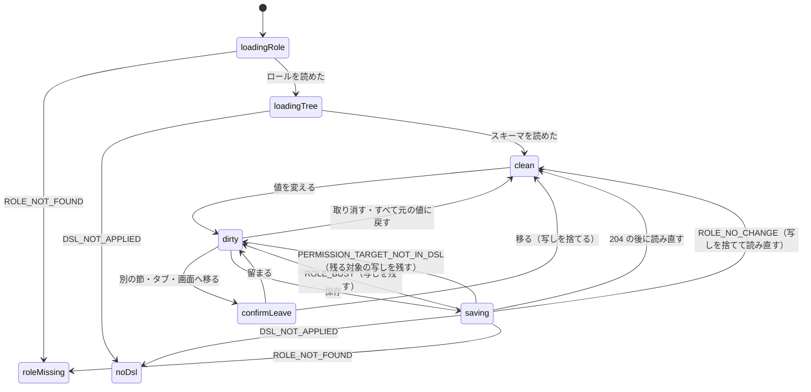

# 機能の仕様 — U6 role-admin-ui

U6 は kind が ui の単位で、`entities.md`・`rules.md` を作らない（段の定義の `produces_kinds`）。この文書が、画面の流れ（番号つきの手順）と画面の状態の遷移の正で、ほかの成果物に頼らずに読めるように書く。画面の単位の決まりは 2節の D1〜D32 に番号で持ち、`traceability.json` はこの番号と節を指す。部品・props・型・文言は `frontend-components.md` に書く。

## 出典

- 作る単位 `aidlc/spaces/default/intents/261004-role-menu/inception/units-generation/unit-of-work.md`（U6 の持ち物と境界）と、ストーリーと単位の対応 `inception/units-generation/unit-of-work-story-map.md`（US1.1・US1.2・US2.1・US2.2・US3.1 の画面、US5.3 の新しい管理の画面の登録、E2E は U6・U7 をまたぐ）。
- 要件 `inception/requirements-analysis/requirements.md`（FR1〜FR4・FR7・FR11、NFR1・NFR4・NFR6）。
- 部品の一覧 `inception/domain-design/components.md`（RoleAdminUi・GroupAdminUi・RoleTransferUi・UserAdminUi・SharedTreeView・ApiClient）。
- 契約の一覧 `inception/contract-design/contract-summary.md`（C2 共有の型と木、C6 グループの管理の API、C7 役割・権限の管理の API、共通の決まり、業務の理由の拒否の code）。
- ストーリー `inception/user-stories/stories.md`（「前提と読み方」の画面の共通の決まりと各 AC）。画面 `inception/refined-mockups/` の `mockups.md`（S3〜S7・S9・10a 節）・`interaction-spec.md`・`accessibility-checklist.md`・`design-system-mapping.md`・`make-you-chic-ui-request.md`。Bolt の計画 `inception/delivery-planning/bolt-plan.md`（B8）。
- 先に確定した単位の機能設計: cross-cutting（`construction/cross-cutting/functional-design/frontend-components.md` の共有の木と登録の型）、group（`construction/group/functional-design/functional-spec.md` の 2節・8節）、role（`construction/role/functional-design/functional-spec.md` の 2節・6節・8節・10節、`entities.md` の TransferError・TransferPlan）。
- この段の答え `construction/role-admin-ui/functional-design/functional-design-questions.md`（決まっていること、設計の要点、Q1 A・Q2 B・Q3 A・Q4 A・Q5 A・Q6 A、まとめの確認は Looks correct）。
- `aidlc/spaces/default/memory/team.md`（Testing Posture の画面のテスト・役割・権限の画面の出し分け・E2E の決まり、Code Style のフロントエンド）と `project.md`（実際のブラウザの axe・開いた部品のはみ出し・E2E の見本の型・make-you-chic-ui の口の確かめの学び）。
- 既存のコード: `frontend/src/main.tsx`（`BrowserRouter`）、`frontend/src/app/routing/decideRoute.ts`（`matchPath`）、`frontend/src/app/admin-forbidden/`、`frontend/src/shared/`（api-client・paging・validation・modal）、`frontend/src/features/useradmin/`・`features/dsl/`（同じ形の前例）、`frontend/e2e/`、`vendor/make-you-chic-ui`（固定先 e82b651 の Table・Tabs・Modal・Dropdown・Select）。

---

## 1. 全体

### 1.1 置き場と登録

| 機能 | 置き場 | 画面 | 道（登録の path） | access・layout |
|---|---|---|---|---|
| roleadmin | `frontend/src/features/roleadmin/` | S3 ロールの一覧 | `/admin/roles` | ADMIN・SHELL |
| roleadmin | 同上 | S4 ロールの詳細「権限の設定」 | `/admin/roles/:roleId` | ADMIN・SHELL |
| roleadmin | 同上 | S5 ロールの詳細「割り当て」 | `/admin/roles/:roleId/assignments` | ADMIN・SHELL |
| groupadmin | `frontend/src/features/groupadmin/` | S6 グループの一覧 | `/admin/groups` | ADMIN・SHELL |
| groupadmin | 同上 | S6 グループの詳細 | `/admin/groups/:groupId` | ADMIN・SHELL |
| roletransfer | `frontend/src/features/roletransfer/` | S7 権限の受け渡し | `/admin/role-transfer` | ADMIN・SHELL |
| useradmin（広げる） | `frontend/src/features/useradmin/` | S9 利用者のロールの読み取り（Modal） | 既存の `/admin/users` | 既存のまま |

- サイドバーの項目（管理の区画）: 「ロール」`order` 240・「グループ」250・「権限の受け渡し」260。どれも `section: 'ADMIN'`・`visibleWhen: 'ADMIN'`、アイコンは付けない（D1）。詳細の道（`:roleId`・`:groupId`）はサイドバーの項目にしない。
- 機能どうしは import しない。ほかの画面へのリンク（DSL の管理 `/admin/dsl`、ロールの一覧・詳細、グループの詳細）は道の文字列を各機能の中に持つ（U1 の ESLint の制限）。名前の検査の純粋な関数は roleadmin と groupadmin の両方が使うため `frontend/src/shared/validation/` に置く（D7）。
- 画面は遅延読み込み（`lazy`）で、入口の JavaScript に入れない（既存の管理の画面と同じ）。

### 1.2 使う API（受ける側）

| 画面 | 方法と道 | 本文・引数 | 成功の応答 | この画面が扱う拒否 |
|---|---|---|---|---|
| S3 | GET `/api/admin/roles?page=` | page（1 から） | 200 `RolePage` `{items: [roleId, name, userCount, groupCount], page, size: 20, total}`（ロールの ID の順） | VALIDATION_FAILED |
| S3 | POST `/api/admin/roles` | `{name}` | 201 `Role` | VALIDATION_FAILED・ROLE_NAME_DUPLICATE・ROLE_BUSY |
| S3・S4 | PUT `/api/admin/roles/{roleId}` | `{name}` | 204 | VALIDATION_FAILED・ROLE_NOT_FOUND・ROLE_NAME_DUPLICATE・ROLE_NO_CHANGE・ROLE_BUSY |
| S3 | DELETE `/api/admin/roles/{roleId}` | なし | 204 | ROLE_NOT_FOUND・ROLE_IN_USE（`assignedUsers`・`assignedGroups`）・ROLE_BUSY |
| S4・S5 | GET `/api/admin/roles/{roleId}`（承認の場の決定で U4 の設計に入った。10節） | なし | 200 `Role` `{roleId, name, createdAt, updatedAt}` | ROLE_NOT_FOUND |
| S4 | GET `/api/admin/roles/{roleId}/permissions/schemas` | なし | 200 `PermissionNodes` | ROLE_NOT_FOUND・DSL_NOT_APPLIED |
| S4 | GET `/api/admin/roles/{roleId}/permissions/tables?schema=` | スキーマ名は問い合わせの引数（エンコード） | 200 `PermissionNodes` | VALIDATION_FAILED・ROLE_NOT_FOUND・DSL_NOT_APPLIED |
| S4 | GET `/api/admin/roles/{roleId}/permissions/columns?schema=&table=` | スキーマ名とテーブル名は問い合わせの引数（エンコード） | 200 `PermissionNodes` | VALIDATION_FAILED・ROLE_NOT_FOUND・DSL_NOT_APPLIED |
| S4 | PUT `/api/admin/roles/{roleId}/permissions` | `{scope: {schemaName, tableName or null}, entries: [{schemaName, tableName, columnName, main, create, delete}]}`（載せた対象だけを置き換える差分の保存、null は設定なし） | 204 | VALIDATION_FAILED・ROLE_NOT_FOUND・ROLE_NO_CHANGE・DSL_NOT_APPLIED・PERMISSION_TARGET_NOT_IN_DSL・ROLE_BUSY |
| S4 | POST `/api/admin/roles/{roleId}/permissions/clear`（Should） | `{targets: [{schemaName, tableName, columnName}]}` | 204 | VALIDATION_FAILED・ROLE_NOT_FOUND・ROLE_NO_CHANGE・ROLE_BUSY |
| S5 | GET `/api/admin/roles/{roleId}/assignments` | なし | 200 `RoleAssignments` `{users: [userId, displayName, email, suspended, sources], groups: [groupId, name]}` | ROLE_NOT_FOUND |
| S5 | POST `/api/admin/roles/{roleId}/assignments` | `{userId}` か `{groupId}` のどちらか一方 | 204 | VALIDATION_FAILED・ROLE_NOT_FOUND・USER_NOT_FOUND・GROUP_NOT_FOUND・ROLE_NO_CHANGE・ROLE_BUSY・GROUP_BUSY |
| S5 | DELETE `.../assignments/users/{userId}`・`.../assignments/groups/{groupId}` | なし | 204 | ROLE_NOT_FOUND・GROUP_NOT_FOUND・ROLE_NO_CHANGE・ROLE_BUSY・GROUP_BUSY |
| S5・S6 | GET `/api/admin/users?page=&q=` | 候補の検索（既存） | 200（20 件） | VALIDATION_FAILED |
| S5・S6・S9 | GET `/api/admin/users/{userId}/roles` | なし | 200 `[{roleId, name, sources}]` | USER_NOT_FOUND |
| S6 | GET `/api/admin/groups?page=` | page | 200 `GroupPage` `{items: [groupId, name, memberCount, assignedRoleCount], page, size: 20, total}`（グループの ID の順） | VALIDATION_FAILED |
| S6 | POST `/api/admin/groups` | `{name}` | 201 `Group` | VALIDATION_FAILED・GROUP_NAME_DUPLICATE・GROUP_BUSY |
| S6 | GET `/api/admin/groups/{groupId}` | なし | 200 `GroupDetail` `{groupId, name, members: [userId, displayName, email, suspended]}`（ページ送りなし） | GROUP_NOT_FOUND |
| S6 | PUT `/api/admin/groups/{groupId}` | `{name}` | 204 | VALIDATION_FAILED・GROUP_NOT_FOUND・GROUP_NAME_DUPLICATE・GROUP_NO_CHANGE・GROUP_BUSY |
| S6 | DELETE `/api/admin/groups/{groupId}` | なし | 204 | GROUP_NOT_FOUND・GROUP_IN_USE（`members`・`assignedRoles`）・GROUP_BUSY |
| S6 | POST `/api/admin/groups/{groupId}/members` | `{userId}` | 204 | VALIDATION_FAILED・GROUP_NOT_FOUND・USER_NOT_FOUND・GROUP_NO_CHANGE・GROUP_BUSY |
| S6 | DELETE `/api/admin/groups/{groupId}/members/{userId}` | なし | 204 | GROUP_NOT_FOUND・GROUP_NO_CHANGE・GROUP_BUSY |
| S6 | GET `/api/admin/groups/{groupId}/roles` | なし | 200 `[{roleId, name}]` | GROUP_NOT_FOUND |
| S7 | GET `/api/admin/role-transfer/export` | なし | 200 `application/yaml`（添付のファイル名） | なし（DSL の有無によらない） |
| S7 | POST `/api/admin/role-transfer/check` | 本文は YAML のテキスト、`Content-Type: application/yaml` | 200 `TransferCheck` | ROLE_TRANSFER_INVALID・DSL_NOT_APPLIED・PAYLOAD_TOO_LARGE・UNSUPPORTED_MEDIA_TYPE |
| S7 | POST `/api/admin/role-transfer/apply` | 確かめと同じ本文、ヘッダー `X-Role-Transfer-Fingerprint` に指紋 | 200 `TransferResult` `{created, replaced}` | ROLE_TRANSFER_INVALID・ROLE_TRANSFER_STALE・DSL_NOT_APPLIED・ROLE_NO_CHANGE・ROLE_BUSY・PAYLOAD_TOO_LARGE・UNSUPPORTED_MEDIA_TYPE・VALIDATION_FAILED |

- `PermissionNodes` の各節: `schemaName`・`tableName`・`columnName`・`displayName`・`explicit {main, create, delete}`（null は設定なし）・`effective {main, create, delete}`・`inheritedFrom`（`EXPLICIT`・`TABLE`・`SCHEMA`・`DEFAULT`）・`inMenu`・`inCurrentDsl`・`hasChildren`。
- `TransferCheck`: `fingerprint`・`roles [{name, roleId or null, action: CREATE・REPLACE, added, changed, cleared, notInDsl, changes [{target, before, after, reason: ADDED・CHANGED・CLEARED, inCurrentDsl}]}]`・`untouchedRoles [name]`。
- `ROLE_TRANSFER_INVALID` の `errors [{reason, line, column, path}]`（最大 100 件、サーバーの文言は無い）。
- 権限の木の道は、名前を道に入れず問い合わせの引数で渡す（名前が道に入ると要求の検査で 400 になるため。承認の場の直し、13節）。上の道は直しの例の形で、正確な道と引数の名前は直した後の role の `functional-spec.md` の確定の形に合わせる。
- すべて既存の ApiClient（`apiRequest`・`apiDownload`）を通し、トークン・401 での更新・`Accept-Language` は ApiClient に任せる。応答は型の項目だけを写して新しい値にし（知らない項目は捨てる）、必要な項目が無い・型が違う本文は通信の失敗として扱う（既存の useradmin と同じ）。道の中の ID と名前は `encodeURIComponent` してから入れる。
- 全体の共通の決まり: 誤りは Problem Details の `code` で分け、作成は 201、変更・削除・割り当ては 204、一覧は `{items, page, size, total}`（契約の共通の決まり）。

---

## 2. 画面の単位の決まり（D1〜D32）

| ID | 決まり | 出典 |
|---|---|---|
| D1 | 道と登録は 1.1 のとおり。新しい管理の画面3つをサイドバーの管理の区画（`section: 'ADMIN'`・`visibleWhen: 'ADMIN'`、240・250・260）に登録する。サイドバーに出さないことは見せ方だけで、判定はサーバー | 設計の要点、cross-cutting の BR5、AC5.3.1、FR10.3 |
| D2 | 管理の API が 403 `ACCESS_DENIED` を返したら `useAdminForbidden(error, 道)` に渡し、骨組みの権限なしの表示に任せる（画面は forbidden の状態を持たない）。道の直接の入力でも、管理者でなければ骨組みが `ADMIN_FORBIDDEN` を出す | team.md の画面の出し分け、project.md の Mandated、NFR1.1 |
| D3 | 拒否の文言は `code` と状態だけで選び、`detail`・`title`・内部の値は出さない。知らない code・code の無い応答・通信の失敗は「操作できませんでした。もう一度お試しください」の汎用の文言。応答・要求の値をコンソールとブラウザの保存に出さない | interaction-spec の共通の決まり、既存の failureMessage の形、NFR1.6 |
| D4 | `ROLE_BUSY`・`GROUP_BUSY` は「ほかの操作と重なりました。少し待ってからもう一度お試しください」と出し、入力・未保存の写し・開いている Modal をそのまま残す | role の 10節、group の Q2 A |
| D5 | 一覧（S3・S6）は make-you-chic-ui の `Table` に `labels` を画面の言語で渡し、20 件のページ送り（`shared/paging` の `PAGE_SIZE`・`correctedPage`・`pagerButtonDisabledAfter`）で、サーバーの順（ID の順）のまま出す。読み直しの間のページ送りの押下は捨てる。空のときは「ロール（グループ）がありません。[作る]」 | contract C6・C7、role・group の 8節（page だけ 20 件）、mockups S3・S6 |
| D6 | 行の操作は「開く」と、Dropdown（`placement="bottom-end"`）の「名前を変える」「削除」。削除は数によらず押せ、判定はサーバー | mockups S3、project.md の学び（はみ出し） |
| D7 | 作成・名前の変更の Modal は名前を1つ入れる。画面でも、前後の空白（全角を含む）を除いて 1〜64 コードポイント・制御文字を含まないことを確かめ、入力欄の下に文字で出して `aria-describedby` で結ぶ。残りの文字数を示す。判定の正はサーバーで、`*_NAME_DUPLICATE`・`*_NO_CHANGE`・`VALIDATION_FAILED` も入力欄の下に出す。送るのは `{name}` だけ | AC1.1.2・AC1.1.9・AC1.1.14・AC2.1.2・AC2.1.13、role・group の名前の規則、NFR1.4 |
| D8 | 削除の確かめ（ロール・グループ）と適用の確かめは Modal（`role="alertdialog"`、背景のクリックで閉じない、はじめのフォーカスは「やめる」、閉じたら開いたボタンへ戻す）。ロールは「ロール『営業』を削除します。権限の設定も消え、元に戻せません。」 | AC1.1.7、interaction-spec の共通の決まり |
| D9 | `ROLE_IN_USE` は応答の `assignedUsers`・`assignedGroups` から「利用者 2 人とグループ 1 つに割り当てられているため削除できません。先に割り当てを外してください。」と、そのロールの割り当てのタブへのリンクを出す。`GROUP_IN_USE` は `members`・`assignedRoles` から「メンバー 3 人とロール 1 つが残っているため削除できません。」。数が読めないときは数を除いた文言にする。氏名・メールアドレスは出さない | AC1.1.3・AC1.1.8・AC2.1.3・AC2.1.7 |
| D10 | S4 の左の木は `shared/tree` の `SharedTreeView`。最上位はスキーマの節（子あり）、子はテーブルの節（子なし。カラムは右の表）。節の id はスキーマ名とテーブル名を JSON の配列にした文字列（`["SALES"]`・`["SALES","ORDER_LINE"]`）で、名前に何が入っても重ならない。開いた節だけ子を読み、開閉と選びは画面が持つ | AC1.2.1・AC1.2.14・AC6.1.1、cross-cutting の C2 の props、FR11.2 |
| D11 | 実効の値は文字で区別する: 「READ（明示）」「READ（スキーマ 販売DB から継承）」「READ（テーブル 受注明細 から継承）」「NONE（既定）」（補助権限は「可」「不可」）。継承の元の名前は表示名（無ければ物理名）。カラムの行は主権限だけで、補助権限の欄を持たない。〔Should〕テーブルの設定に「業務のメニュー: 出る・出ない」を `inMenu` から文字で出す。〔Should〕`inCurrentDsl` が偽の節・行に「⚠ 今の DSL に無い」の印（Badge の文字）を付け、選ぶと「この設定は今の DSL に無いため使われていません。[設定を消す]」 | AC1.2.2〜AC1.2.4・AC1.2.7・AC1.2.16、mockups S4 |
| D12 | 未保存の変更は「対象 → 明示の値」の写しで持つ。サーバーの値に戻した対象は写しから消す。保存の `entries` は写しから作る純粋な関数で作り、写しの対象だけを載せ、`scope` の外を含めない。この関数に fast-check の性質のテストを当てる | 設計の要点、role の差分の保存（BR4.4）、team.md の性質ベースのテスト |
| D13 | 「保存」は写しが空なら押せず、横に「変更はありません」と文字で示す。保存の間は表の入力を押せなくし、成功したら選んでいる段と親の段を読み直し（実効の値・`inMenu`・木の印が変わりうる）、Alert「保存しました」と読み上げで伝え、フォーカスは保存のボタンに残す。表の下に「保存していない変更: n 件」と「変更を取り消す」 | AC1.2.5（画面の部分）・AC1.2.17、interaction-spec の PermissionTable |
| D14 | 保存の拒否の後: `ROLE_BUSY` は D4（写しを残す）。`ROLE_NO_CHANGE` は「変わる点がありませんでした」と出して写しを捨てて読み直す。`PERMISSION_TARGET_NOT_IN_DSL` は「保存しようとした対象が今の DSL にありません」と出して読み直し、今の DSL に残る対象の写しは残し、消えた対象に D11 の印を付ける。`DSL_NOT_APPLIED` は S4 を対象が無い表示に切り替える。`ROLE_NOT_FOUND` は D32 | AC1.2.6・AC1.2.13・AC1.2.17、設計の要点 |
| D15 | 未保存の変更があるまま移るときは確かめる。画面の中（木の別の節・タブ・「← ロールの一覧」）と、画面の外（サイドバー・ユーザーメニュー・ブラウザの戻る・道の変更）は `useBlocker` で、読み込み直し・タブを閉じるは `beforeunload` で確かめる。Modal「保存していない変更があります。移ると変更は保存されません。」［留まる］［移る］（はじめのフォーカスは「留まる」）。data router が使えないと確かめられたときは 7.3 の形に切り替える | AC1.2.15、Q2 B |
| D16 | S5 の利用者の表は 氏名・メールアドレス・出どころ・操作。出どころは「直接」「グループ 営業部」を文字で「・」でつないで並べ、同じロールは1行。「外す」は出どころに直接があるときだけ出し、直接の割り当てだけを外す。グループの表は 名前・「外す」。外した後は割り当てを読み直す | AC2.2.2・AC2.2.7・AC2.2.8 |
| D17 | 候補の Modal（利用者を足す・メンバーを足す）は1人ずつ足す。氏名かメールアドレスの一部を入れて「検索」（Enter でも）で `GET /api/admin/users?page=1&q=` を読み、最大 20 件を出す（打つたびには読まない）。候補の行は 氏名・メールアドレス・印（「（利用停止）」「割り当て済み」または「メンバー済み」）・「足す」。済みの候補は「足す」を押せず理由を文字で示す。足したら Modal は開いたまま、その候補を済みに変え、結果を Modal の中の `role="status"` で伝える。閉じたら表を読み直す。招待中の人は API が返さないため出ない | AC2.1.8・AC2.2.15・AC2.2.16、Q3 A |
| D18 | グループの候補（S5「グループを足す」）は `GET /api/admin/groups?page=` を 20 件ずつのページ送りで出す（検索の引数が無い）。足し方と済みの印は D17 と同じ | 設計の要点 |
| D19 | 〔Should〕S5 で利用者の直接の割り当てを外すとき、その利用者のロールを `GET /api/admin/users/{userId}/roles` で読み、このロールの出どころが直接だけ（外すとロールが無くなる）なら確かめを出す: 「田中 一郎さんの作業ロールがこのロールなら、外した後は 経理 に変わります。」（残りのロールが無ければ「作業ロールが無くなります。」）。残りの最初のロールはロールの ID の最も小さいもの。グループ経由で残るときは確かめずに外す。読めないときは確かめを出して条件の文言だけにする | AC2.2.9、Q4 A、role の Q1 A |
| D20 | S6 のメンバーの外しは確かめなしで送り、成功したらその利用者のロール（`GET /api/admin/users/{userId}/roles`）を読み、このグループに割り当てたロールのうち無くなったものを Alert に「田中 一郎さんは営業部から外れました。グループ経由のロール: 経理 も外れます。」と出す。無くなったロールが無ければ前の文だけ。ロールが読めなければ前の文だけ | mockups S6、AC2.1.9・AC2.1.10 |
| D21 | S6 の詳細は、メンバーの表（氏名・メールアドレス・「（利用停止）」・外す）と、割り当てたロールの読み取り（`GET /api/admin/groups/{groupId}/roles`。各ロールはそのロールの割り当てのタブへのリンク、無ければ「ありません」）。ロールの割り当ては S5 で変える | mockups S6、RQ2 A |
| D22 | S7 の書き出しは `apiDownload` で受け、`Content-Disposition` の名前（無ければ `roles.yaml`）でブラウザに保存させる。書き出しの間はボタンを押せなくする | AC3.1.1、設計の要点 |
| D23 | S7 のファイルの選択はネイティブの `input type="file"`（`accept=".yaml,.yml"`）を見える label とボタンで包む。選んだ時点で `File.size` を上限（仮に 10 MiB、NFR 要件の段で確定）と比べ、超えれば読まずに「ファイルが大きすぎます（上限 10 MiB）」と出す。上限ちょうどは送る。判定の正はサーバー | interaction-spec の RoleTransferPage、team.md の信頼できない入力、AC3.1.7 |
| D24 | 確かめの結果は素の table（make-you-chic-ui の Table の見た目）で、列は ロール・変わり方（作る・置き換える）・足す・変わる・消える・今の DSL に無い。行ごとの開閉のボタンの名前は「営業の変わる点を開く／閉じる」（`aria-expanded`）。開いた行は変わる対象（スキーマ・テーブル・カラムの名前）・前・後・理由の表を 100 件ずつのページ送りで出し、理由は「READ → 設定なし（ファイルに無い）」のように文字で、今の DSL に無い対象は「⚠ 今の DSL に無い」。表の下に「置き換えるロールでは、ファイルに無い対象の設定は「設定なし」に戻ります（消える: 4）。」と「ファイルに無いロール（経理）は残ります。」。ロールが1つも無い・変わる点が無いときは「変わる点はありません」で適用を押せない | AC3.1.2・AC3.1.3・AC3.1.6・AC3.1.9・AC3.1.14、mockups S7 |
| D25 | 「適用する」は D8 の確かめ「2 つのロールを置き換え・作成します。置き換えるロールでは、ファイルに無い対象の設定（4 件）は設定なしに戻ります。ファイルに無いロールは残ります。」の後に、確かめと同じファイルの本文と指紋を送る。成功は Alert「作成 1・置き換え 1」で、結果の表を閉じる。`ROLE_TRANSFER_STALE` は「確かめた後にロールの設定が変わったため、適用できませんでした。もう一度[確かめる]を押してください。」（ファイルの選択を残す）。`ROLE_NO_CHANGE` は「変わる点はありませんでした」 | AC3.1.3・AC3.1.10・AC3.1.11・AC3.1.14 |
| D26 | `ROLE_TRANSFER_INVALID` の誤りの一覧は、DSL の誤りの一覧と同じ見た目の部品を roletransfer の中に持つ。先頭に件数の警告（`role="alert"`、表示の時にフォーカス）、表は 行・列・場所（`path`）・種類（`reason` を日本語と英語の文言に写す）。無い値は「—」。`DSL_NOT_APPLIED` は「DSL が適用されていないため読み込めません。」、413 は D23 の文言、415 は D3 の汎用 | AC3.1.5・AC3.1.12・AC3.1.13（画面の部分） |
| D27 | S9: 利用者の管理の行の「操作」に「ロールを見る」を足す（どの行でも押せる）。選ぶと読み取りの Modal（題「田中 一郎さんのロール」）を開き、`GET /api/admin/users/{userId}/roles` を1回読んで「営業（直接・グループ 営業部）」「経理（グループ 経理部）」を並べ、無ければ「ロールはありません」。Modal の下にロールの一覧へのリンク。閉じたら行の「操作」へフォーカスを戻す。表の列と既存の操作は変えない | Q5 A、mockups S9、AC2.2.7 |
| D28 | 文言は日本語と英語（既定は日本語）。ロール・グループ・スキーマ・テーブル・カラムの名前と氏名は訳さず、文字として描く（`<`・`&` を含んでもタグにならない）。画面に HTML を直接埋めない | NFR4.3、stories の画面の共通 |
| D29 | 読み込み中は「読み込んでいます」の文字と押せないボタン、読み込みの失敗は「読み込めませんでした。[もう一度]」（既存の管理の画面と同じ）。読み込みの状態は `role="status"` で伝える | interaction-spec の共通の決まり |
| D30 | 操作の結果（作成・変更・削除・保存・割り当て・外し・適用）は画面の上の Alert と `aria-live="polite"` の読み上げで伝え、拒否は理由と次にすることを文字で出す | stories の画面の共通、NFR4.1 |
| D31 | 幅は mockups 10a のとおり: 768px 未満で S4 の木と表を縦に積み（木で選ぶと表の見出しへフォーカス）、表の1行を2段にし、一覧と結果の表は外枠の中で横に動き1列目を固定、Modal は幅いっぱい（左右 16px）。どの幅でも画面全体の横のスクロールを出さない | mockups 10a、accessibility-checklist |
| D32 | S4・S5 はまず `GET /api/admin/roles/{roleId}` でロールを読み、見出し「ロール: 営業」を出す。404 `ROLE_NOT_FOUND`（削除された・無い ID）・道の `roleId` が正の整数でないときは「このロールはありません。」とロールの一覧へのリンクを出し、ほかの読み込みをしない。S6 の詳細の `GROUP_NOT_FOUND` も同じ形。この API は承認の場の決定で U4 の設計に入ったため、足されなかったときの切り替え先は持たない | Q1 A、承認の場の決定（R-01）、AC1.1.12（画面の部分） |

---

## 3. 画面の流れ

### 3.1 S3 ロールの一覧（`/admin/roles`）

W3.1 開く
1. 見出し（h1「ロール」）と「ロールを作る」を出し、`GET /api/admin/roles?page=1` を読む（D29）。
2. 応答の行を Table に出す（名前・利用者・グループ・操作）（D5）。0 件なら空の案内（D5）。

W3.2 ページ送り
1. 押した向きで `page` を変えて読む。読み直しの間の押下は捨てる（D5）。
2. 応答の行が空で全件数が 1 以上なら `correctedPage` で最後のページを1回だけ読む。押したボタンが読んだ先で押せなくなったときだけフォーカスを一覧の見出しへ移す。

W3.3 作る
1. 「ロールを作る」で Modal（題「ロールを作る」、名前の入力、［やめる］［作る］）を開く。
2. 入力ごとに D7 の検査を当て、誤りがあれば入力欄の下に出し［作る］を押しても送らない。
3. `POST /api/admin/roles` に `{name}` を送る。間は［作る］を処理中にする。
4. 201 なら Modal を閉じ、Alert「ロール『営業』を作りました」、今のページを読み直す（D30）。
5. 拒否は D7（重なり・入力）、D4（BUSY）、D3（ほか）。Modal は開いたまま入力を残す。

W3.4 名前を変える
1. 行の Dropdown の「名前を変える」で、今の名前を入れた Modal を開く。
2. W3.3 の 2〜5 と同じで、送るのは `PUT /api/admin/roles/{roleId}` の `{name}`。`ROLE_NO_CHANGE` は「今と同じ名前です」、`ROLE_NOT_FOUND` は Modal を閉じて「このロールはありません」と出して読み直す。

W3.5 削除
1. 行の Dropdown の「削除」で D8 の確かめを開く。
2. ［やめる］なら何も送らずに閉じる（AC1.1.7）。
3. ［削除する］で `DELETE /api/admin/roles/{roleId}`。204 なら Alert「ロール『営業』を削除しました」、読み直す。
4. `ROLE_IN_USE` は確かめを閉じ、D9 の文言と割り当てのタブへのリンクを Alert に出す。`ROLE_NOT_FOUND` は読み直す。BUSY は D4。

W3.6 開く
1. 行の「開く」で `/admin/roles/{roleId}`（S4）へ移る。

### 3.2 S4 ロールの詳細「権限の設定」（`/admin/roles/:roleId`）

W4.1 開く
1. 道の `roleId` を確かめ、`GET /api/admin/roles/{roleId}` を読む（D32）。見出し「ロール: 営業」、「← ロールの一覧」、タブ［権限の設定］［割り当て］（道で選ぶ）を出す。
2. `GET .../permissions/schemas` を読む。`DSL_NOT_APPLIED` なら「権限を設定する対象がありません。DSL の管理の画面で DSL を適用してください。[DSL の管理へ]」だけを出す（AC1.2.6）。
3. スキーマの節を木に出す（D10）。スキーマが1つなら、そのスキーマを開いて選んだ状態で始める（この Intent ではスキーマは1つ）。

W4.2 木の節を開く・選ぶ
1. スキーマの節を開くと `loadChildren` が `.../permissions/tables?schema=` を読み、テーブルの節を出す（木の部品が読み込み中・失敗と再試行を出す）。
2. 節を選ぶとき、写しが空でなければ D15 の確かめを出し、［留まる］なら選びを変えない。
3. スキーマを選ぶと右の表は「スキーマの設定」（主権限・CREATE・DELETE の Select と実効の値）だけ。値はスキーマの段の応答の節から作る。
4. テーブルを選ぶと右の表は「テーブルの設定」（主権限・CREATE・DELETE・〔Should〕業務のメニュー）と「カラム」の表。テーブルの値はテーブルの段の応答から、カラムは `.../permissions/columns?schema=&table=` を読んで作る。

W4.3 値を変える
1. Select（選択肢は 設定なし・NONE・READ・FULL、補助権限は 設定なし・可・不可）を変えると写しを更新する（D12）。サーバーの値に戻したら写しから消す。
2. 写しの件数を「保存していない変更: n 件」に出し、「保存」「変更を取り消す」を押せるようにする（D13）。実効の値の表示は保存まで変えず、変えた行には「（未保存）」の文字を添える。

W4.4 保存
1. 「保存」で写しから `entries` を作り（D12）、`scope` は選んでいる節（スキーマなら `tableName: null`）で `PUT .../permissions` を送る。
2. 間は saving（表を押せなくする）。
3. 204 なら写しを空にし、選んでいる段と親の段を読み直し、Alert「保存しました」（D13）。
4. 拒否は D14。

W4.5 変更を取り消す
1. 写しを空にし、表をサーバーの値に戻す（確かめは出さない。取り消すのは保存していない値だけ）。

W4.6 今の DSL に無い設定を消す（Should）
1. 「⚠ 今の DSL に無い」の節・行を選ぶと「この設定は今の DSL に無いため使われていません。[設定を消す]」を出す。値の Select は出さない。
2. ［設定を消す］で `POST .../permissions/clear` にその対象を送る（確かめなし）。テーブルを消すときは、そのテーブルの下の設定のあるカラムも同じ要求に含める。
3. 204 なら Alert「設定を消しました」と読み直し。`ROLE_NO_CHANGE` は読み直すだけ。

W4.7 タブ・一覧へ移る
1. ［割り当て］のタブ・「← ロールの一覧」は道を変える。写しがあれば D15 の確かめ。

### 3.3 S5 ロールの詳細「割り当て」（`/admin/roles/:roleId/assignments`）

W5.1 開く
1. W4.1 の 1 と同じ（D32）。
2. `GET .../assignments` を読み、利用者の表とグループの表を出す（D16）。どちらも空なら「割り当てはありません」。

W5.2 利用者を足す
1. 「利用者を足す」で候補の Modal（D17）。今の割り当ての利用者のうち出どころに直接がある人を「割り当て済み」にする（グループ経由だけの人は足せる）。
2. 「足す」で `POST .../assignments` に `{userId}`。204 なら候補を「割り当て済み」に変え、`role="status"` に「田中 一郎さんに割り当てました」。
3. 拒否: `ROLE_NO_CHANGE` は候補を「割り当て済み」に変えて「すでに割り当てられています」。`USER_NOT_FOUND` は「この利用者はいません」と候補を押せなくする。`ROLE_NOT_FOUND` は Modal を閉じて D32。BUSY は D4。
4. Modal を閉じたら割り当てを読み直し、フォーカスを「利用者を足す」へ戻す。

W5.3 グループを足す
1. 「グループを足す」で候補の Modal（D18）。今の割り当てのグループを「割り当て済み」にする。
2. W5.2 の 2〜4 と同じで、本文は `{groupId}`。`GROUP_NOT_FOUND` は「このグループはありません」、`GROUP_BUSY` は D4。

W5.4 利用者を外す
1. 行の「外す」（直接があるときだけ）を押すと、〔Should〕D19 の判定をして必要なら確かめ（D8 と同じ形の Modal、［やめる］［外す］）を出す。
2. `DELETE .../assignments/users/{userId}`。204 なら Alert「田中 一郎さんから営業を外しました」と読み直し（グループ経由で残るなら行と出どころが変わる。AC2.2.8）。
3. `ROLE_NO_CHANGE` は「すでに外れています」と読み直し。BUSY は D4。

W5.5 グループを外す
1. 行の「外す」で `DELETE .../assignments/groups/{groupId}`（確かめなし）。結果と拒否は W5.4 の 2・3 と同じ（`GROUP_BUSY`・`GROUP_NOT_FOUND` は D4・読み直し）。

### 3.4 S6 グループ（`/admin/groups`・`/admin/groups/:groupId`）

W6.1 一覧
1. W3.1・W3.2 と同じ形で `GET /api/admin/groups?page=` を読み、名前・メンバー・ロール・操作を出す。
2. 作る・名前を変える・削除は W3.3〜W3.5 と同じ形（`/api/admin/groups`、`GROUP_*` の code、D9 の `GROUP_IN_USE` の文言）。削除の確かめは「グループ『営業部』を削除します。元に戻せません。」。

W6.2 詳細を開く
1. `GET /api/admin/groups/{groupId}` と `GET /api/admin/groups/{groupId}/roles` を読む。`GROUP_NOT_FOUND` は D32 と同じ形（グループの一覧へのリンク）。
2. 見出し「グループ: 営業部」、「← グループの一覧」、「名前を変える」、メンバーの表、割り当てたロール（D21）を出す。

W6.3 メンバーを足す
1. 「メンバーを足す」で候補の Modal（D17）。今のメンバーを「メンバー済み」にする。
2. 「足す」で `POST .../members` に `{userId}`。204 なら候補を「メンバー済み」に変える。`GROUP_NO_CHANGE` は「すでにメンバーです」、`USER_NOT_FOUND`・`GROUP_NOT_FOUND`・BUSY は W5.2 と同じ形。
3. 閉じたら詳細を読み直す。

W6.4 メンバーを外す
1. 行の「外す」で `DELETE .../members/{userId}`（確かめなし）。
2. 204 なら D20 の Alert を出し、詳細を読み直す。`GROUP_NO_CHANGE` は「すでに外れています」と読み直し。BUSY は D4。

### 3.5 S7 権限の受け渡し（`/admin/role-transfer`）

W7.1 書き出す
1. 「書き出す」で `GET /api/admin/role-transfer/export` を `apiDownload` で受け、保存させる（D22）。失敗は D3。

W7.2 ファイルを選ぶ
1. ファイルを選ぶと名前と大きさを出し、D23 の大きさの確かめをする。前の確かめの結果・誤りの一覧は消す。

W7.3 確かめる
1. 「確かめる」でファイルをテキストとして読み、`POST .../check` に `application/yaml` で送る。間は checking。
2. 200 なら結果の表（D24）と指紋を画面の中だけに持つ（ブラウザの保存に置かない）。変わる点が無ければ noChange。
3. 拒否: `ROLE_TRANSFER_INVALID` は誤りの一覧（D26）、`DSL_NOT_APPLIED`・413・415 は D26 の文言。

W7.4 適用する
1. 「適用する」で D25 の確かめを開く。［やめる］なら何も送らない。
2. ［適用する］で同じファイルの本文と指紋（ヘッダー）を `POST .../apply` に送る。間は applying。
3. 200 なら D25 の結果。拒否は D25（STALE・NO_CHANGE）、D26（INVALID・DSL・413・415）、D4（BUSY）。STALE のときは結果の表を消し、ファイルの選択と「確かめる」を残す。
4. 確かめの後に別のファイルを選び直したら、前の指紋は捨てる（同じファイルの確かめからやり直す）。

### 3.6 S9 利用者のロール（利用者の管理の画面）

W9.1 ロールを見る
1. 行の「操作」の「ロールを見る」で D27 の Modal を開き、読み込み中を出して `GET /api/admin/users/{userId}/roles` を読む。
2. 200 なら一覧を出す。`USER_NOT_FOUND` は「この利用者はいません」。403 は D2。ほかは D3。
3. Modal の中の「ロールの一覧へ」で `/admin/roles` へ移る。閉じたら行の「操作」へフォーカスを戻す。

---

## 4. 状態の遷移

### 4.1 一覧（S3・S6 の一覧、共通）

| 状態 | 中身 | 次の状態 |
|---|---|---|
| loading | 最初の読み込み（D29） | populated・empty・load-error |
| populated | 行と操作 | reloading（ページ送り・操作の後）・dialog-open |
| empty | 空の案内と「作る」 | reloading・dialog-open |
| reloading | 前の行を残して読み直す（ページ送りの押下は捨てる） | populated・empty・load-error |
| load-error | 「読み込めませんでした。[もう一度]」 | loading |
| dialog-open | 作成・名前の変更・削除の確かめのどれか1つ | populated（閉じる・成功の後の reloading を経る） |

### 4.2 名前の Modal（S3・S6 の作成・名前の変更）

| 状態 | 中身 | 次 |
|---|---|---|
| editing | 入力と D7 の画面の検査 | submitting（誤りが無いとき）・closed |
| submitting | ［作る］［変える］を処理中、入力を押せない | closed（成功）・rejected |
| rejected | 入力欄の下か Modal の中に理由（D7・D4・D3） | editing（入力を変える）・submitting・closed |

### 4.3 S4 権限の設定



テキストの代替: ロールを読む（loadingRole）→ 無ければ roleMissing、あれば木を読む（loadingTree）→ DSL が無ければ noDsl、あれば clean。値を変えると dirty、取り消すか元の値に戻すと clean。dirty のまま移ろうとすると confirmLeave で、留まれば dirty、移れば写しを捨てて clean。保存（saving）の後は、成功なら読み直して clean、`ROLE_BUSY` は写しを残して dirty、`ROLE_NO_CHANGE` は写しを捨てて clean、`PERMISSION_TARGET_NOT_IN_DSL` は今の DSL に残る対象の写しだけを残して dirty（残りが無ければ clean）、`DSL_NOT_APPLIED` は noDsl、`ROLE_NOT_FOUND` は roleMissing。

- clean と dirty の中に、木の子の読み込み（notLoaded・loading・loaded・failed、共有の木が持つ）とカラムの読み込み（loading・loaded・failed と再試行）がある。カラムの読み込みに失敗したら右の表に「読み込めませんでした。[もう一度]」。
- orphan（Should）: 選んだ節・行が `inCurrentDsl: false` のときは値の入力を出さず、W4.6 の消す操作だけ。clearing の間は押せない。

### 4.4 S5 割り当て・S6 詳細

| 状態 | 中身 | 次 |
|---|---|---|
| loading | ロール（グループ）と割り当て（メンバー・ロール）を読む | ready・missing・load-error |
| ready | 表 | picker-open・removing・confirm-remove（S5 の D19） |
| picker-open | 候補の Modal（searching・results・adding・added・rejected） | ready（閉じた後に読み直す） |
| confirm-remove | D19 の確かめ | removing・ready |
| removing | 行の「外す」を処理中 | ready（読み直す）・rejected の Alert |
| missing | D32 の案内 | なし |
| load-error | 読み込みの失敗 | loading |

### 4.5 S7 受け渡し

| 状態 | 中身 | 次 |
|---|---|---|
| idle | 書き出すボタン・ファイルの選択 | exporting・fileTooLarge・fileSelected |
| exporting | 書き出すを押せない | idle |
| fileTooLarge | D23 の文言（送らない） | fileSelected（選び直す）・idle |
| fileSelected | 「確かめる」を押せる | checking |
| checking | 確かめるを押せない | checked・noChange・invalid・rejected |
| checked | 結果の表（D24）、適用を押せる | confirmApply・fileSelected（選び直す） |
| noChange | 「変わる点はありません」、適用を押せない | fileSelected |
| invalid | 誤りの一覧（D26） | fileSelected |
| confirmApply | D25 の確かめ | applying・checked |
| applying | 適用を待つ | applied・stale・rejected |
| applied | Alert「作成 n・置き換え n」 | idle |
| stale | 確かめのやり直しの案内（ファイルの選択を残す） | checking |
| rejected | DSL_NOT_APPLIED・413・415・BUSY・汎用の文言 | fileSelected |

---

## 5. 誤りの code ごとの表示

| code | 状態 | 出す所と文言（日本語の例） | 画面の後の動き |
|---|---|---|---|
| VALIDATION_FAILED | 400 | 名前の Modal は入力欄の下「名前を正しく入れてください」、ほかは D3 の汎用 | 入力を残す |
| AUTHENTICATION_REQUIRED | 401 | ApiClient が更新し、だめならログインへ（既存） | 既存のまま |
| ACCESS_DENIED | 403 | 骨組みの権限なしの表示（D2） | 画面の表示を骨組みに任せる |
| ROLE_NOT_FOUND | 404 | 「このロールはありません。」（D32） | 一覧は読み直す、詳細は missing |
| GROUP_NOT_FOUND | 404 | 「このグループはありません。」 | 一覧・候補は読み直す、詳細は missing |
| USER_NOT_FOUND | 404 | 「この利用者はいません。」 | 候補を押せなくする、S9 は Modal に出す |
| ROLE_NAME_DUPLICATE・GROUP_NAME_DUPLICATE | 409 | 入力欄の下「同じ名前のロール（グループ）があります」 | 入力を残す |
| ROLE_NO_CHANGE・GROUP_NO_CHANGE | 409 | 名前は「今と同じ名前です」、割り当て・メンバーは「すでに割り当てられて（外れて）います」、保存は「変わる点がありませんでした」、適用は「変わる点はありませんでした」 | 読み直す（名前の Modal は入力を残す） |
| ROLE_IN_USE・GROUP_IN_USE | 409 | D9 | 一覧は変えない |
| ROLE_BUSY・GROUP_BUSY | 409 | D4 | 入力・写しを残す |
| PERMISSION_TARGET_NOT_IN_DSL | 409 | 「保存しようとした対象が今の DSL にありません」 | D14 |
| DSL_NOT_APPLIED | 409 | S4 は対象が無い表示、S7 は「DSL が適用されていないため読み込めません。」 | S4 は noDsl |
| ROLE_TRANSFER_INVALID | 400 | 誤りの一覧（D26） | 結果の表を消す |
| ROLE_TRANSFER_STALE | 409 | D25 の文言 | stale |
| PAYLOAD_TOO_LARGE | 413 | 「ファイルが大きすぎます（上限 10 MiB）」 | fileSelected |
| UNSUPPORTED_MEDIA_TYPE | 415 | D3 の汎用 | fileSelected |
| 知らない code・通信の失敗・500 | — | D3 の汎用 | 入力を残す |

---

## 6. 共通の作り

- 状態と操作は画面ごとのフック（`useRoleList`・`useRolePermissions`・`useRoleAssignments`・`useGroupList`・`useGroupDetail`・`useRoleTransfer`、名前は `frontend-components.md`）が持ち、部品は値と操作を受けて描くだけ（既存の useradmin と同じ形）。
- フォーカス: Modal を閉じたら開いたボタンへ戻す（`finalFocusRef`）。行の Dropdown から開いたときは行の「操作」のボタンへ戻す（既存の useradmin の形）。読み直しで行が消えたら一覧の見出しへ。
- 結果の Alert は1つだけ持ち、次の操作で置き換える。

---

## 7. 未保存の変更の確かめ（Q2 B）

### 7.1 ルーターを data router にする

- `frontend/src/main.tsx` の `BrowserRouter` を、`createBrowserRouter` に今の `App` を1つの道（`path: '*'`）で包む形と `RouterProvider` に替える。`App` の中の振り分け（`AppRouter`・`decideRoute`・`Routes`）は変えない。
- テストは、`useBlocker` を使う部品だけ `createMemoryRouter`（同じ包み方）で描く。ほかのテストの `MemoryRouter` は変えない。

```tsx
// 説明用の断片（形だけ）
const router = createBrowserRouter([{ path: '*', element: <App /> }])
createRoot(rootElement).render(<RouterProvider router={router} />)
```

### 7.2 確かめの当て方

- S4 の画面が `useBlocker((args) => 写しが空でない && 移る先の道が今の道と違う)` を持ち、`blocked` になったら D15 の Modal を出す。［留まる］は `reset()`、［移る］は写しを捨てて `proceed()`。タブの切り替え・「← ロールの一覧」・サイドバー・ユーザーメニュー・ブラウザの戻るは、どれも道が変わるためここで止まる。
- 木の節の選びは道を変えないため、画面の中で同じ Modal を出す（W4.2 の 2）。
- 写しが空でない間は `beforeunload` を張り、読み込み直し・タブを閉じるときにブラウザの確かめを出す（文言はブラウザが決める）。写しが空になったら外す。
- 骨組みのログアウト（ユーザーメニューの操作）は道を変える前にトークンを捨てる操作のため、確かめは出ないことがある。保存していない変更は失われる（差として 9節に書く）。

### 7.3 使えないときの切り替え

- コード生成の最初に、7.1 の差し替えで今の画面のテスト・E2E（010〜130）が変わらないことと、`useBlocker` がサイドバーの移動で止まることを小さく確かめる。どちらかが成り立たなければ、`main.tsx` を戻し、Q2 の A（画面の中の移動は Modal、読み込み直し・タブを閉じるは `beforeunload`、サイドバー・ユーザーメニュー・ブラウザの戻るは止めない）に切り替え、AC1.2.15 の「別の画面へ」の一部を満たさないことをコード生成の成果物に差として記録し、承認の場で伝える。

---

## 8. テストの方針

### 8.1 画面のテスト（Vitest＋Testing Library＋user-event＋vitest-axe）

- 部品ごとに vitest-axe を1件（誤りの状態と、2語の氏名・64 文字の名前の見本を含める）。描画の後に反映される値は `waitFor` で待ち、時間の上限は延ばさない。説明文は英語、メールアドレスは `example.com` だけ。
- API の関数は各画面の props（`api`）で差し替える（既存の useradmin と同じ）。
- 確かめること（主なもの）:
  - S3・S6: 一覧・空・失敗と再試行・ページ送り（読み直しの間の押下を捨てる）、作成・名前の変更の D7 の境界（64 と 65 コードポイント、空白だけ、全角の空白、制御文字）とサーバーの code ごとの入力欄の下の文言、削除の確かめ（はじめのフォーカスが「やめる」、やめると送らない）、`*_IN_USE` の数とリンク、BUSY で入力が残る、`detail` の目印が画面に出ない、Dropdown が `bottom-end`。
  - S4: 木の開閉（`aria-expanded`）と選び（`aria-current`）、実効の値の文字（明示・継承の元・既定）、カラムに補助権限の欄が無い、Select の名前に対象が入る、保存の可否と理由、`entries` に変えた対象だけが載る、保存の後の読み直し、D14 の code ごとの写しの扱い、noDsl の案内、orphan の印と消す操作（Should）、未保存の確かめ（木の節・タブ・`useBlocker` で止まる移動、留まる・移る）、`beforeunload` の張り外し。
  - S5: 出どころの文字、外すが直接のときだけ、外した後に出どころが変わる、候補の Modal（検索・20 件・済みの印・利用停止の印・足した後も開いたまま・閉じたら読み直す）、D19 の条件つきの確かめ（直接だけ・グループ経由で残る・残りが無い・読めない）。
  - S6: メンバーの表、割り当てたロールのリンク、メンバーの外しの D20 の Alert（無くなるロールあり・なし・読めない）。
  - S7: ファイルの大きさの境界（上限ちょうどは送る、1 バイト超えは送らない）、本文の型と指紋のヘッダー、結果の表の行の開閉の名前、100 件ずつのページ送り、理由と ⚠ の文字、noChange で適用を押せない、適用の確かめ、STALE でファイルの選択が残る、誤りの一覧の件数とフォーカス、`reason` の文言が日本語と英語にある。
  - S9: 「ロールを見る」が Dropdown にある、Modal の題に氏名、出どころの並び、無いとき、閉じたら行の「操作」へ戻る。既存の useradmin のテストが通る。
  - 英語の表示で、画面の文言がすべて英語（名前は入れた値のまま）。
- 性質ベースのテスト（fast-check、失敗時の種を記録）: D12 の `entries` を作る関数（写しが空なら空、値を戻すと消える、`scope` の外を含まない、同じ対象は1つ）。D19 の「外すとロールが無くなるか・残りの最初のロール」を求める関数（出どころに直接以外があれば無くならない、残りの最初は ID の最小）。

### 8.2 実際のブラウザのアクセシビリティと幅（本数に数えない）

- `frontend/e2e/` に U6 の画面の検査を1ファイル足す（番号は既存の後、140 の見込み。コード生成で決める）。流れの E2E ではないため、`team.md` の本数に数えない（`project.md` の読み方）。
- 状態: S3 の一覧と開いた Dropdown と名前の誤りの Modal、S4 の保存の誤り（BUSY）と未保存の確かめと orphan、S5 の候補の Modal（利用停止・済みの印）と D19 の確かめ、S6 の詳細と D20 の Alert、S7 の結果の行を開いた状態と誤りの一覧、S9 の Modal。見本は 2語の氏名・64 文字のロール名・長いメールアドレス。
- 表示の設定の 20 組（`support/displayCombos.ts`）すべてで axe の違反 0 件・横のはみ出しなし・開いた Dropdown と Modal が画面の中に収まることを確かめる。幅の 360px・768px・1280px は既定の1組で確かめる（768px 未満で S4 が縦に積まれ、一覧と結果の表の1列目が見える）。
- API は `support/adminApiRoute.ts` で差し替え、見本に画面の側の型を付ける。見本の形が本物と同じことは 8.3 の流れの E2E で確かめる。内部DB に書かず、初期管理者は変えない。

### 8.3 流れの E2E（F の流れ、Q6 A）

- B8 で F の流れの1本を新しいファイルに書く（番号はコード生成で決める）。前提を自分で作る: 招待から登録まで済ませた利用者（既存の `support/registeredUser.ts`）と、この流れで作るロール（名前は走らせるごとに一意）。初期管理者の状態・ロールは変えない。
  1. 管理者でログインし、S3 でロールを作る。
  2. S4 でテーブルの主権限を READ にして保存する。
  3. S5 で作った利用者に割り当てる。
  4. 作った利用者でログインし、`GET /api/me/work-role` と `GET /api/me/navigation` の応答で、作業ロールが作ったロールでテーブルの項目が出ることを確かめる。応答の項目の名前と型が 8.2 の見本と一致することも確かめる。
- B9（U7）で同じファイルに、画面での作業ロールの切り替えとサイドバーの業務のメニューの変化を足して仕上げる（本数は1本のまま）。
- 統合の前に手元で E2E 全体を流す（画面・認証に関わる変更）。

---

## 9. 上流との差（承認済みの文書は書き換えず、ここに記録する）

| # | 上流 | 上流の書き方 | この設計 | 理由 |
|---|---|---|---|---|
| (a) | 契約 C7 | ロール1件を読む API が無い | `GET /api/admin/roles/{roleId}` を使う。承認の場の決定で role の機能設計に入った（10節・13節） | 詳細の道を直接開く・読み込み直す・S6 と S9 と拒否の文言からリンクで移る、のどれでも名前と有無を読むため（Q1 A） |
| (j) | 契約 C7 | 権限の木の道はスキーマ名・テーブル名を道に入れる（`.../schemas/{schemaName}/tables` など） | 名前を問い合わせの引数で渡す道を使う（1.2） | 名前が道に入ると要求の検査で 400 になるため、承認の場の直しで role の設計が変わった（13節） |
| (b) | stories.md AC1.2.15・mockups S4 | 別のロールや別の画面へ移るときに確かめる | data router と `useBlocker` で画面の外の移動も止め、読み込み直しは `beforeunload`。使えなければ画面の中の移動だけ（7.3）。骨組みのログアウトでは確かめが出ないことがある | 今のルーターは画面の外の移動を止められないため（Q2 B） |
| (c) | stories.md AC2.2.9（Should） | 作業ロールが変わることが確かめで分かる | ロールが無くなる利用者に「作業ロールがこのロールなら〔最初のロール〕に変わる」と条件つきで示す | 管理の API は他人の作業ロールを返さず、FR6.2 の線引きを保つため（Q4 A） |
| (d) | mockups S9 | 既存の利用者の詳細にロールを足す | 行の「操作」に「ロールを見る」を足し、読み取りの Modal で出す | 利用者の管理に詳細の画面が無く、表の形と既存のテストを変えないため（Q5 A） |
| (e) | design-system-mapping.md | make-you-chic-ui の Table に行の開閉が無い | 固定先 e82b651 の Table は `renderDetail`（2f8e05d）を持つが、S7 の結果の表は素の table のままにする | Table の開閉のボタンの名前がすべての行で同じで、ページ送りが常に出るため（D24） |
| (f) | interaction-spec の RoleAssignmentPanel | 候補は Checkbox か Button の並び | 1人ずつ「足す」ボタンで、Modal を開いたまま | 契約の API が1件ずつのため（Q3 A） |
| (g) | 契約 C7・role の 8節 | 確かめの応答は全ロールの全変更を1回で返す | 画面は 100 件ずつのページ送りで描くが、応答そのものの大きさは減らせない | 大きい YAML（仮の上限 10 MiB）では応答と JSON の読み込みが重くなりうる。応答の大きさと時間は U4 の NFR 要件（NFR2.4）で確かめてもらう |
| (h) | bolt-plan.md B8 | E2E はどちらの Bolt で書くかをコード生成の計画で決める | B8 で前半を書き、B9 で同じファイルに足す | Q6 A |
| (i) | mockups S4 | 保存の結果は表の上の Alert | 同じ。加えて変えた行に「（未保存）」の文字を添える | 色だけに頼らずに未保存の行を示すため（NFR4.1） |

---

## 10. role（U4）との取り決め

- **足した API**: `GET /api/admin/roles/{roleId}`。応答は 200 の `Role`（`roleId`・`name`・`createdAt`・`updatedAt`）、無ければ 404 `ROLE_NOT_FOUND`。分類の印は `ApiAccess` の ADMIN（`/api/admin/**` の既存の決まりで守られる）。読み取りのため監査に残さない。B4 で作る。
- **扱い**: この段の承認の場の決定（Request Changes、推奨の案のとおり直す。指摘 R-01）で、role の機能設計に入った。この単位の設計は前提ではなく確定の形として、この API を使う（13節）。
- **認可のテスト**: role の認可の表（未認証 401・管理者の印だけを欠く利用者 403・管理者 200・停止中は通らない）と API の分類の網羅（AC1.1.15）に、この API が載る（role の持ち物）。
- **権限の木の道**: 同じ直しで、スキーマ名・テーブル名を問い合わせの引数で受ける道に変わった（1.2・9節 (j)）。この単位は role の確定の形に合わせる。
- **応答の大きさ**: 9節の (g) を NFR 要件の段の論点として引き継ぐ。

## 11. app-frame-ui（U7）への引き継ぎ

- **data router**: B8 で `frontend/src/main.tsx` を `createBrowserRouter`＋`RouterProvider` に替える（7.1）。U7 は骨組みの作業でこの形を前提にする。`App` の中の振り分けは変えない。7.3 で切り替えたときは `BrowserRouter` のまま。
- **引数つきの道の今の項目**: S4・S5・S6 の詳細は `/admin/roles/:roleId`・`/admin/roles/:roleId/assignments`・`/admin/groups/:groupId` で、サイドバーの項目（`/admin/roles`・`/admin/groups`）とは道が完全には一致しない。U7 が `navSections` の `current` を求めるときに、管理の区画の項目は道の前方一致（`/admin/roles` と `/admin/roles/...`）で今の項目とするかを決めてもらう。この単位は登録の型を変えない。
- **E2E**: 8.3 の F の流れのファイルに、B9 で作業ロールの切り替えとサイドバーの変化を足す。
- **未保存の確かめ**: 骨組みのログアウトは確かめを経ずにトークンを捨てうる（7.2）。気にするなら U7 の設計で、ログアウトを道の移動の後にするかを決めてもらう。

---

## 12. 上流との対応の要約

| ストーリー | この単位が受け持つ所（画面） | サーバーで受け持つ単位 |
|---|---|---|
| US1.1 | S3（D5〜D9・W3.1〜W3.6）、詳細の読み（D32） | U4 role（認可・同時性・監査・指標）、U1（分類の網羅） |
| US1.2 | S4（D10〜D15・W4.1〜W4.7） | U4 role（解決・認可・同時の保存・性能）、U5（メニューの効き目） |
| US2.1 | S6（D17・D20・D21・W6.1〜W6.4） | U3 group（認可・同時性・漏えい・IDOR）、U4（作業ロールの読み替え） |
| US2.2 | S5（D16〜D19・W5.1〜W5.5）、S9（D27・W9.1） | U4 role |
| US3.1 | S7（D22〜D26・W7.1〜W7.4） | U4 role（検証・指紋・トランザクション・上限・性能） |
| US5.3 | 新しい管理の画面の登録（D1） | U7 app-frame-ui（サイドバーの組み立て・見出し・出し分け） |

---

## 13. 承認の場の決定と直し

- **決定**: 依頼者は機能設計の承認の場で Request Changes を選び、直す範囲を「推奨の案のとおり直す」とした（Major の指摘と、それに伴う小さな直しだけ。ほかの指摘は直さない）。
- **R-01（Major）**: `GET /api/admin/roles/{roleId}` を、この直しで role の機能設計に足す（B4 で作る）。この単位の設計の「直した後の形」の前提は確定になった。10節を「role への依頼」から「role との取り決め」に書き換え、D32 に足されなかったときの切り替え先を持たない理由（承認の場で足すことが決まった）を書き、1.2 と 9節 (a) を直した。
- **それに伴う直し**: role の直しで、権限の木の API がスキーマ名・テーブル名を道ではなく問い合わせの引数で受ける形に変わる（名前が道に入ると要求の検査で 400 になるため）。1.2 の S4 の行・W4.2・9節 (j)・10節と、`frontend-components.md` の API の関数を、`/api/admin/roles/{roleId}/permissions/tables?schema=…`・`.../permissions/columns?schema=…&table=…` の形に直した。この直しの時点で role の `functional-spec.md` の直しは読めなかったため、例の形で書き、正確な道と引数の名前は role の確定の形に合わせる。
- `functional-design-questions.md` と `traceability.json` の AC の対応は変えていない（直しは API の形と記録の言い方だけで、受け持つ AC は変わらない）。
