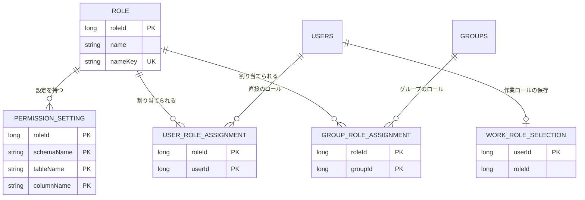

# 機能の仕様 — U4 role

## 出典

- 単位の定義 `unit-of-work.md`（`aidlc/spaces/default/intents/261004-role-menu/inception/units-generation/unit-of-work.md`、U4 role）
- ストーリーと単位の対応 `unit-of-work-story-map.md`（同じ置き場。主の単位は US1.1・US1.2・US2.2・US3.1・US4.1・US4.2。関わる単位として US2.1・US5.1）
- 要件 `requirements.md`（`aidlc/spaces/default/intents/261004-role-menu/inception/requirements-analysis/requirements.md`。FR1〜FR8・FR12、NFR1〜NFR3・NFR5・NFR6、C1・C2）
- 部品の一覧 `components.md`（`aidlc/spaces/default/intents/261004-role-menu/inception/domain-design/components.md`。RoleManagement と Entity の注）と ADR（`decisions.md` の ADR-001〜ADR-007）
- 契約の一覧 `contract-summary.md`（`aidlc/spaces/default/intents/261004-role-menu/inception/contract-design/contract-summary.md`。C3・C4・C5・C7・C8・C10）
- ストーリー `stories.md`、画面 `mockups.md`（S3・S4・S5・S7・S8・S9）、Bolt の計画 `bolt-plan.md`（B4〜B6）
- この段の答え `functional-design-questions.md`（Q1〜Q9 はすべて A。まとめの確認で「この段で決める設計の要点」も承認）
- 先に確定した単位の設計 `construction/group/functional-design/`（8・9節の引き継ぎ）、`construction/dsl-v2/functional-design/`（SafeYamlReader・版 2 のモデル）、`construction/cross-cutting/functional-design/`（ApiAccess）

この文書は、流れと状態の遷移の正である。データの形の正は `entities.md`、判断の正は `rules.md`。

---

## 1. 全体

| 置き場 | 持つもの |
|---|---|
| `role.domain` | `RoleName`・`PermissionTarget`・継承の解決の純粋な関数・`RoleProblemTypes`・`RoleAuditEvent` と `RoleAuditDetail`・作業ロールの決め方の純粋な関数 |
| `role.service` | ロールの管理・権限の設定・割り当て・作業ロール・`EffectivePermissionResolver`（C5）・`GroupDeletionGuard` の実装（C4）・受け渡しの業務処理・`RoleBarrier`（本番は何もしない）・`RoleProblemTypeCatalog`。トランザクションの境界はここだけ |
| `role.transfer` | 権限の YAML の木の読み取り（検証と `TransferError`）、書き出しの文字列の組み立て、指紋の計算（用途名の下位パッケージ。DB に触れない純粋な部品） |
| `role.repository` | 5つの表の読み書き、ロールの行の排他（待ちの上限 3 秒） |
| `role.web` | C7・C8 のコントローラー（`ApiAccess` の ADMIN・AUTHENTICATED）、DTO、`RequestBodyLimitRoute` の登録 |

- 依存: `role` → `group.service`（`GroupMembershipQuery`・`GroupDeletionGuard`）・`user.service`（利用者の有無と伏せ字の要約）・`dsl.service`（`ActiveDslModelProvider`・`SafeYamlReader`）・`common`。`audit` は `role.domain` の出来事に依存する。`navigation` は `role.service` の解決の口に依存する（`RoleBoundaryArchitectureTest`）。
- 変える管理の操作はすべて1つのトランザクションで、入力の判定 → ロールの行の排他 → 待ち合わせの口 → 拒否の判定 → 書き換え → 監査の出来事、の順に進む（BR8.1）。排他の前に書き込みは無い。業務の拒否は書き込みなしで確定し、失敗の出来事を出す。違反の例外を受けたときは巻き戻した後に新しいトランザクションで失敗の出来事だけを出す（BR8.5）。

解決の口の形（契約 C5 のまま、説明用）:

```java
public interface EffectivePermissionResolver {
    Optional<WorkRoleRef> effectiveWorkRole(long userId);   // 有効な作業ロールを決める唯一の持ち主（BR7.2）
    PermissionSnapshot snapshotFor(long userId);            // 1回の要求の中だけで使う写し（BR5.4）
    EffectivePermission resolve(long userId, PermissionTarget target);
}
```

---

## 2. 流れ

### 2.1 ロールの作成（POST /api/admin/roles、B4）

1. 本文の `name` だけを読む（BR2.3）。名前の規則を当てる（BR1.1〜BR1.3）。誤りは 400（監査なし）。
2. トランザクションを始め、鍵が同じロールがあれば `ROLE_NAME_DUPLICATE`（失敗の出来事、detail は Name）。
3. 行を足す。同時の作成で一意の違反になったら巻き戻し、新しいトランザクションで `ROLE_NAME_DUPLICATE` の失敗の出来事を出す（BR8.5）。一意の鍵の待ちの上限切れは `ROLE_BUSY`（BR8.4）。
4. 確定 → `ROLE_CREATED`。201 と作ったロール。

### 2.2 ロールの名前の変更（PUT /api/admin/roles/{roleId}、B4）

1. 入力（BR1・BR2.4）。
2. ロールの行を排他（上限切れは `ROLE_BUSY`、監査なし）。無ければ `ROLE_NOT_FOUND`。
3. 待ち合わせの口（`RoleBarrier.afterLock(RENAME, roleId)`）。
4. 今と同じ名前なら `ROLE_NO_CHANGE`。ほかのロールと鍵が同じなら `ROLE_NAME_DUPLICATE`（BR3.6 の順）。
5. 書き換え（`updatedAt` も）→ `ROLE_RENAMED`（detail は Rename）。204。

### 2.3 ロールの削除（DELETE /api/admin/roles/{roleId}、B4 で割り当てなしの前提、B5 で割り当ての確かめを足す）

1. ロールの行を排他。無ければ `ROLE_NOT_FOUND`。
2. 待ち合わせの口。
3. 直接の利用者の割り当ての数とグループの割り当ての数を数え、どちらかが 1 以上なら `ROLE_IN_USE`（応答に数、detail は InUse）（BR3.2）。
4. 権限の設定 → そのロールを指す作業ロールの保存 → ロールの順に消す（BR3.3）→ `ROLE_DELETED`（detail は Name）。204。
- 削除と割り当ての追加が重なっても、割り当ての側も同じロールの行を先に排他するため、どちらかが先に確定する。削除が先なら割り当ては `ROLE_NOT_FOUND`、割り当てが先なら削除は `ROLE_IN_USE`（AC1.1.6）。

### 2.4 ロールの一覧（GET /api/admin/roles、B4）

- `page` だけを受けて 20 件、ロールの ID の順。行は名前と直接の割り当ての数（BR3.4・BR3.5）。監査なし。

### 2.4a ロール1件の読み取り（GET /api/admin/roles/{roleId}、B4）

- ロールがあれば `Role` の形（`roleId`・`name`・`createdAt`・`updatedAt`）で 200、無ければ `ROLE_NOT_FOUND`（404）。監査なし（BR3.7）。

### 2.5 権限の木の読み取り（GET /api/admin/roles/{roleId}/permissions/schemas・tables?schema=…・columns?schema=…&table=…、B4）

0. スキーマ名・テーブル名は問い合わせの引数で受ける。欠け・空は 400。長さでは拒否しない（BR4.12）。
1. ロールの有無（無ければ 404）。DSL を読み、Absent なら `DSL_NOT_APPLIED`（409、監査なし）（BR4.5）。
2. そのロールの、開いた階層の分の設定の行を読む（スキーマの道ならそのスキーマの行、テーブルの道ならそのテーブルの行）。
3. DSL の節と設定の行を名前で合わせ、各節に明示・実効・継承の元・`inMenu`・`inCurrentDsl`・`hasChildren` を付ける（BR4.10・BR4.11）。今の DSL に無いテーブルの道でも、設定があればそのカラムを返す。

### 2.6 権限の保存（PUT .../permissions、B4）

1. 入力: `scope` と `entries` の形、値（BR4.1）、名前（BR4.3）、`scope` の外・同じ対象の二重（BR4.4）。誤りは 400（監査なし）。
2. ロールの行を排他（`ROLE_BUSY`）。無ければ `ROLE_NOT_FOUND`。
3. 待ち合わせの口。
4. DSL が Absent なら `DSL_NOT_APPLIED`（BR4.5）。値を設定する entry の対象が今の DSL に無ければ `PERMISSION_TARGET_NOT_IN_DSL`（BR4.6）。
5. 今の値と比べ、変わる対象が無ければ `ROLE_NO_CHANGE`（BR4.8）。
6. 変わる対象を書く（すべて設定なしになった行は消す、BR4.2）。ロールの `updatedAt` を更新 → `ROLE_PERMISSION_CHANGED`（detail は前後の値、超えれば要約）（BR11.6）。204。
- 2人の同時の保存はロールの行の排他で順に並び、後の保存は前の保存の値を前の値として読む。どちらも成功（後勝ち、BR4.9）。

### 2.7 今の DSL に無い設定を消す（POST .../permissions/clear、B4、Should）

- 入力 → ロールの行の排他 → 指定の対象が今の DSL にあれば 400、消す行が無ければ `ROLE_NO_CHANGE` → 行を消す → `ROLE_PERMISSION_CHANGED`（後の値は設定なし）。DSL の有無によらず受け付ける（BR4.7）。

### 2.8 割り当てと外し（POST .../assignments、DELETE .../assignments/users/{userId}・groups/{groupId}、B5）

割り当て:
1. 入力: `userId` と `groupId` のちょうど一方（BR2.3）。
2. ロールの行を排他（`ROLE_BUSY`）。無ければ `ROLE_NOT_FOUND`。
3. 利用者: `user.service` で有無を確かめる（無ければ `USER_NOT_FOUND`。停止中は受け付ける）。グループ: `lockForAssignment(groupId)` でグループの行を排他（`Busy` は `GROUP_BUSY`、`exists` が偽なら `GROUP_NOT_FOUND`）（BR6.6・BR8.2）。
4. 待ち合わせの口。
5. 組の行があれば `ROLE_NO_CHANGE`。
6. 行を足す（主キーの違反は BR8.5 で `ROLE_NO_CHANGE`）→ `ROLE_ASSIGNED`（detail は Assignment）。204。

外し: ロールの行を排他 → （グループなら `lockForAssignment`。`Busy` は `GROUP_BUSY`、`exists` が偽でも続け、組の行が無いため `ROLE_NO_CHANGE`）→ 組の行が無ければ `ROLE_NO_CHANGE`（存在しない利用者・グループも同じ、BR6.4・BR6.6）→ 行を消す → `ROLE_UNASSIGNED`。作業ロールの保存は書き換えない（BR7.3・BR7.4）。

読み取り（監査なし）:
- `GET .../assignments`: 直接の割り当ての利用者と、そのロールを持つグループのメンバー（そのグループの ID の集合を `GroupMembershipQuery.memberUserIds` に渡し、まとめて1回で読む。BR6.11）を合わせ、利用者ごとに出どころ（DIRECT・GROUP）を並べる。氏名・メールアドレス・停止は `user.service` の伏せ字の型で受け、応答の DTO を組み立てる時だけ文字列にする（BR12.1）。
- `GET /api/admin/groups/{groupId}/roles`: グループの有無（`GroupMembershipQuery.exists`、無ければ `GROUP_NOT_FOUND`）→ 割り当てたロールを ID の順に。
- `GET /api/admin/users/{userId}/roles`: 利用者の有無（無ければ `USER_NOT_FOUND`）→ 利用者のロールと出どころ（BR6.5）。

### 2.9 有効な作業ロールと解決の口（C5、B5）

1. `effectiveWorkRole(userId)`: 直接の割り当て ∪ 所属グループの割り当てで利用者のロールの集合を作り（BR6.5）、作業ロールの保存を読む。保存が集合にあればそれ、無ければ ID の最も小さいロール、集合が空なら無し（BR7.1・BR7.2）。保存は書き換えない（BR7.3）。
2. `snapshotFor(userId)`: 1 の結果のロールの設定の行をまとめて1回読み、適用中の DSL と合わせて写しを作る。写しは呼んだ要求の中だけで使う（BR5.4）。
3. `resolve(userId, target)`: 写しで継承の関数（BR5.1・BR5.2）を当てる。作業ロールが無い・DSL が Absent・名前が今の DSL に無いときは NONE・不可（BR5.3）。
- 失敗（DB の誤り）は例外のまま投げる（想定外の失敗）。

### 2.10 作業ロールの読み取りと切り替え（GET・PUT /api/me/work-role、B5）

読み取り: 主体は要求の文脈から読む。`roles` は利用者のロールを ID の順に、`current` は 2.9 の有効な作業ロール。監査なし。

切り替え:
1. 本文の `roleId` だけを読む（他人を指す値は使わない）。整数でなければ 400。
2. トランザクションを始め（行の排他は取らない、BR7.8）、利用者のロールの集合を読む。含まれなければ `ROLE_NOT_ASSIGNED`（存在しないロールも同じ。失敗の出来事）（BR7.5）。
3. 保存がすでに選んだロールを指していれば、書かずに 204（監査なし）（BR7.6）。
4. それ以外（保存が無い・別のロールを指す。選んだロールが読み替えの結果の有効な作業ロールと同じ場合も含む）は保存の行を書く（無ければ作る）→ `WORK_ROLE_SWITCHED`（detail は前の有効な作業ロール・選んだロール・書く前の保存）。204（BR7.6・BR7.7）。
- 明示で選んだ後は保存と有効な作業ロールが一致するため、作業ロール以外のロールの足し外しで作業ロールが変わらない（AC4.1.21）。BR7.4 で覚えていたロールに戻るのは、保存と有効な作業ロールが違う読み替え中だけ。
- 切り替えと外しが重なり、外しが後に確定したときは両方成功し、次の要求で 2.9 が最初のロールに読み替える（AC4.1.5）。

### 2.11 自分の権限（GET /api/me/permissions/schemas・tables?schema=…・columns?schema=…&table=…、B5、Should）

- 名前は問い合わせの引数で受ける（BR4.12）。2.5 と同じ木の形で、主体の写し（2.9 の `snapshotFor`）から実効の値と `inMenu` だけを返す。他人を指す値は受け取らない（BR2.2）。DSL が無いときは `items` が空。作業ロールが無いときは `workRole` が null で、すべて NONE・不可。監査なし。

### 2.12 グループの問う口の実装（C4、B5）

- `canDelete(groupId)`: そのグループへの直接の割り当ての数が 0 なら Allowed、そうでなければ Blocked(数)（BR10.1）。
- `assignedRoleCounts(groupIds)`: まとめて1回で数え、渡した ID のすべてにキーを返す（BR10.2）。
- B3 で `role` のパッケージに置かれた仮の実装（0 件・Allowed）を、B5 でこの実装に置き換える。仮の実装が残っていないことを B5 の終わりの条件にする（BR10.3）。グループの削除（group がグループの行を排他して問う口を呼ぶ）と、グループへの割り当て（role がロールの行 → グループの行を排他）が重なっても、グループの行で順が決まる（AC2.1.5 のロールの側）。

### 2.13 YAML の書き出し（GET /api/admin/role-transfer/export、B6）

1. すべてのロールと設定の行を読む（読み取りだけのトランザクション）。
2. ロールを ID の順、対象を名前のコードポイントの順に、設定のある対象だけを `version: 1` の形で書く（BR9.14）。DSL の有無によらない。
3. 200 と `application/yaml`、添付のファイル名。監査なし（Q7 A）。

### 2.14 YAML の確かめ（POST /api/admin/role-transfer/check、B6）

1. 本文の型が `application/yaml` でなければ 415。大きさの上限を超えれば道ごとの上限で 413（BR9.2・BR9.4）。
2. DSL が Absent なら `DSL_NOT_APPLIED`（監査なし）（BR9.13）。
3. `SafeYamlReader.read(本文, 上限)`（BR9.3）。`Rejected` は `ROLE_TRANSFER_INVALID`（errors に1件）。
4. 木を検証し、中身の誤りを最大 100 件まで集めて `ROLE_TRANSFER_INVALID`（BR9.5）。
5. 読み取りだけのトランザクションで今のロールと設定を読み、ロールを鍵で照らして一覧（`TransferPlan`）を作り、指紋を計算する（BR9.6〜BR9.9）。
6. 200 と一覧・指紋。保存しない。監査なし（BR9.15）。

### 2.15 YAML の適用（POST /api/admin/role-transfer/apply、B6）

1. 2.14 の 1〜4 と同じ。指紋のヘッダーが無い・形が誤りなら 400。
2. トランザクションを始め、置き換えに当たるロールの行を ID の昇順に排他する（`ROLE_BUSY`）。待ち合わせの口。
3. 一覧を作り直し、指紋を比べる。違えば `ROLE_TRANSFER_STALE`（失敗の出来事）（BR9.10）。DSL が Absent になっていれば `DSL_NOT_APPLIED`。一覧が空なら `ROLE_NO_CHANGE`（BR9.12）。
4. 作るロールを足し（名前の一意の違反は BR8.5 の読み替えで `ROLE_TRANSFER_STALE` ではなく巻き戻しの後に `ROLE_NAME_DUPLICATE`）、置き換えるロールの設定をファイルの状態にそろえる（BR9.7）。
5. 確定 → `ROLE_TRANSFER_APPLIED` 1件（detail は要約、BR11.7）。200 と作成・置き換えの数。途中の失敗はすべて巻き戻し、成功の出来事は出ない（BR9.11）。

### 2.16 監査の出来事

- 出来事は `role.domain` の `RoleAuditEvent` で、`ApplicationEventPublisher` で出す。`audit.service.AuditEventListener` が確定の後に別のトランザクションで記録する（今の形）。U3 が足す `target_role_id`・`target_group_id`・`detail` の列とロール向けのファクトリーを使う。
- 種類と理由は `rules.md` の BR11 と `entities.md` の `RoleAuditEvent` のとおり。残さないものは BR11.3。

---

## 3. 状態の遷移

### 3.1 ロール

| 今の状態 | きっかけ | 次の状態 |
|---|---|---|
| 無い | 作成（2.1）・import の作成（2.15） | ある（設定なし・割り当てなし） |
| ある（割り当てなし） | 削除（2.3） | 無い（設定と、そのロールを指す作業ロールの保存も消える） |
| ある（割り当てあり） | 削除 | ある（`ROLE_IN_USE` で変わらない） |
| ある | 名前の変更・権限の保存・消す・import の置き換え | ある（中身が変わる） |
| ある（割り当てなし） | 割り当て（2.8） | ある（割り当てあり） |
| ある（割り当てあり） | 最後の割り当ての外し | ある（割り当てなし） |

### 3.2 権限の設定の1つの対象

| 今の状態 | きっかけ | 次の状態 |
|---|---|---|
| 行なし（全部設定なし） | 値を設定する保存（今の DSL にある対象だけ） | 行あり |
| 行あり | すべてを設定なしにする保存・消す・import の CLEARED | 行なし |
| 行あり（今の DSL にある） | 対象の無い DSL の適用 | 行あり（今の DSL に無い。解決で使わない） |
| 行あり（今の DSL に無い） | 同じ名前のある DSL の適用 | 行あり（また効く） |

### 3.3 利用者の作業ロール（保存と有効な作業ロール）

| 今の状態 | きっかけ | 次の状態 |
|---|---|---|
| 保存なし・ロールなし | ロールが割り当てられる | 保存なし。有効な作業ロールは最初のロール |
| 有効な作業ロール R | 割り当て内のロール S への切り替え | 保存 S。有効は S（監査あり） |
| 保存 R・有効な作業ロール R | R への切り替え | 変わらない（監査なし） |
| 保存なし、または保存 S（読み替え中）・有効な作業ロール R | R への切り替え | 保存 R。有効は R のまま（監査あり。BR7.6） |
| 保存 R（R は割り当て内） | R の割り当てが外れる・グループから外れる | 保存 R のまま。有効は最初のロール、ロールが無ければ無し（監査なし） |
| 保存 R（R は割り当て外） | R がまた割り当てられる | 保存 R のまま。有効は R に戻る（Q9 A） |
| 保存 R | R が削除される | 保存なし。有効は最初のロールか無し |

---

## 4. エンティティの関係（`entities.md` から導いた図）



テキストの代替: ロール（ROLE）は権限の設定（PERMISSION_SETTING、主キーはロール・スキーマ名・テーブル名・カラム名）を 0 件以上持つ。ロールは、利用者への割り当て（USER_ROLE_ASSIGNMENT、主キーはロールと利用者の組）と、グループへの割り当て（GROUP_ROLE_ASSIGNMENT、主キーはロールとグループの組）から参照される。利用者（USERS、既存）とグループ（GROUPS、U3）は、それぞれの割り当ての相手になる。利用者は作業ロールの保存（WORK_ROLE_SELECTION）を 0 か 1 件持つ。保存のロールの ID はロールへの外部キーを持たない（図に線を引かない）。

---

## 5. 決まりの要約（`rules.md` から導いた写し）

- 名前（BR1）: 前後の空白を取り除いて 1〜64 コードポイント、制御文字は拒否、大文字と小文字を区別しない鍵で重なりを判定、同じ名前への変更は変えるものが無い。
- 認可と入力（BR2）: 管理の API は ADMIN、自分の API は AUTHENTICATED。決めた項目だけを受ける。
- ロール（BR3）: 割り当てが残れば削除できない。削除で設定と作業ロールの保存も消す。数は直接の割り当て。一覧は 20 件・ID の順。
- 権限の設定（BR4）: 名前で持ち、差分の保存、DSL が無ければ拒否、今の DSL に無い対象は消すだけ、後勝ち、木は開いた階層だけ。
- 解決（BR5）: 直近の上位の明示の値を継承、無ければ NONE・不可。要求ごとに DB から、作業ロールだけで。
- 割り当て（BR6）・作業ロール（BR7）: 和で数える、最初のロールは ID の順、読み替えは書かない、また割り当てたら戻る、切り替えは排他しない。
- 排他（BR8）: ロールの行 → グループの行、上限切れは `ROLE_BUSY`、違反は読み替えて新しいトランザクションで失敗の監査。
- YAML（BR9）: `version: 1` の入れ子の形、`application/yaml` で送り指紋はヘッダー、上限 深さ 10・別名 0・節 1,000,000・10 MiB（仮）、指紋で確かめの後の変更を拒否、1つのトランザクション。
- 問う口（BR10）・監査（BR11）・漏えい（BR12）・code（BR13）。

---

## 6. 誤りの code と状態コード

| code | 状態 | 使う所 | 監査 |
|---|---|---|---|
| VALIDATION_FAILED（共通） | 400 | 名前・値・ID の形・本文の項目・指紋のヘッダー | 残さない |
| ROLE_TRANSFER_INVALID | 400 | YAML の読み込みの拒否・中身の誤り（errors に位置と種類） | 残さない |
| AUTHENTICATION_REQUIRED（共通） | 401 | 未認証 | 既存のまま |
| ACCESS_DENIED（共通） | 403 | 管理者の印が無い・停止中 | 既存の ACCESS_DENIED の監査 |
| ROLE_NOT_FOUND | 404 | ロールが無い | 変える操作は FAILURE、1件の読み取りと木は残さない |
| USER_NOT_FOUND（user.domain） | 404 | 割り当ての利用者・利用者のロールの読み取り | 割り当ては FAILURE、読み取りは残さない |
| GROUP_NOT_FOUND（group.domain） | 404 | 割り当てのグループ・グループのロールの読み取り（外しは ROLE_NO_CHANGE） | 割り当ては FAILURE、読み取りは残さない |
| ROLE_NAME_DUPLICATE | 409 | 名前の重なり | FAILURE |
| ROLE_IN_USE | 409 | 割り当てが残るロールの削除（assignedUsers・assignedGroups） | FAILURE |
| ROLE_NO_CHANGE | 409 | 変えるものが無い管理の操作 | FAILURE |
| ROLE_NOT_ASSIGNED | 409 | 割り当ての外・存在しないロールへの切り替え | FAILURE |
| ROLE_BUSY（新しい） | 409 | ロールの行・一意の鍵の待ちの上限切れ | 残さない |
| GROUP_BUSY（group.domain） | 409 | グループの行の待ちの上限切れ | 残さない |
| PERMISSION_TARGET_NOT_IN_DSL | 409 | 今の DSL に無い対象への値の設定 | FAILURE |
| DSL_NOT_APPLIED | 409 | DSL が無いときの木・保存・確かめ・適用 | 保存と適用は FAILURE、木と確かめは残さない |
| ROLE_TRANSFER_STALE | 409 | 適用の指紋の不一致 | FAILURE |
| PAYLOAD_TOO_LARGE（共通） | 413 | YAML の大きさの上限の超過 | 残さない |
| UNSUPPORTED_MEDIA_TYPE（共通） | 415 | 確かめ・適用の本文の型の誤り | 残さない |

---

## 7. テストの観点（`team.md` の必須のテストに当てたもの）

- **権限ごとの API の認可**: C7・C8 のすべての API を表のパラメーターのテストにする。管理の API は 未認証 401・管理者の印だけを欠く利用者（全スキーマを FULL・CREATE と DELETE を可にしたロールを作業ロールにする）403・管理者 200/201/204・停止中の管理者は通らない。自分の API は 未認証 401・停止中は通らない・ログイン済み 200/204。ロールで管理の権限が増えないこと（AC2.2.14 は既存の管理の API も表に入れる）。
- **API の分類の網羅**: role が足す API にすべて `ApiAccess` を付け、U1 の構造の検査で落ちないこと（AC1.1.15 の role の分）。
- **割り当ての変更の反映**: 割り当て・外し・切り替え・権限の保存・グループのメンバーの外しの直後に、変更の前に出したアクセストークンのまま、解決の口・自分の権限の API・作業ロールの API の結果が変わること（AC1.2.5・AC2.1.9・AC2.1.10・AC2.2.3・AC2.2.4・AC4.1.1）。
- **昇格・一括代入・IDOR**: 作成・名前の変更・割り当て・切り替え・保存の本文に余分な項目を足しても反映されない。存在しないロール・利用者・グループの ID、他人を指す値（切り替え・自分の権限）を差し替えた要求は拒否され、読み直した状態が変わらない。管理の API の外（`PUT /api/me/preferences` など）の本文にロール・作業ロールの項目を足しても変わらない（AC1.1.10・AC1.1.12・AC1.2.10・AC2.2.10・AC2.2.11・AC4.1.3・AC4.1.11・AC4.1.12・AC4.2.3）。
- **組み込みのロールの保護（★）**: 当たらない（組み込みのロールを置かない）。
- **自分自身への操作と最後の管理者**: 管理者が自分に全 FULL のロールを割り当てられる。最後の有効な管理者が自分のロールをすべて外しても受け付けられ、管理の API は成功のまま、最後の管理者の保護は印で働く（AC2.2.12・AC2.2.13）。
- **同時の重なり（待ち合わせで作る）**: 削除と割り当て（AC1.1.6）、同じ名前の同時の作成（AC1.1.11、違反と待ちの上限切れのどちらでも 4xx で、失敗の監査が残る）、同じロールの同時の保存（AC1.2.12、両方成功・後勝ち・監査2行に正しい前後の値）、切り替えと外し（AC4.1.5）、グループの削除とグループへの割り当て（AC2.1.5 のロールの側）、import の確かめの後の別の管理者の変更・削除・同名の作成・DSL の適用し直し（AC3.1.4）。合否は終わった後の内部DB の状態と、負けた側の 4xx（500 にならない）。
- **監査**: 操作ごとに操作した人・対象・detail・結果が埋まる。業務の拒否は FAILURE と理由、400・BUSY・読み取り・確かめ・書き出し・保存がすでに同じロールを指す切り替え・読み替えは残らない。読み替え中に有効な作業ロールと同じロールを明示で選ぶと、保存が書かれ WORK_ROLE_SWITCHED が残る（BR7.6）。種類と理由の名前は 32 文字以内（AC1.1.16）。detail が上限を超える場合は要約になり、JSON として読める。
- **性質ベースのテスト（jqwik）**: 継承の関数（AC1.2.9）、作業ロール以外のロールの足し外しで実効の権限が変わらない（AC4.1.21）、最初のロールが集合の最小の ID であること。失敗時の乱数の種を記録する。
- **YAML の信頼できない入力**: 大きさ・深さ・別名の上限ちょうどと1つ超え（別名は 0 と 1）、展開後の節の上限、タグ（`!!` など）、重複キー（ロール・対象とも）、知らない項目、版の誤り、拒否が Problem Details で部品の例外の文を含まない（AC3.1.7・AC3.1.12・AC3.1.13）。書き出しと読み込みの往復で変わる点が無い（AC3.1.14）。適用の途中の失敗で何も変わらない（AC3.1.8）。
- **漏えい**: TRACE を有効にした `RoleSecretLeakIT` で、割り当ての一覧・利用者のロールの読み取りの氏名・メールアドレスがログに出ない。応答と監査の行にハッシュ値・ロックの内部の値が無い。YAML の木の中身・DB の例外の文がログに出ない（AC2.2.6）。
- **DSL が無い・版 1**: 木・保存・確かめ・適用が `DSL_NOT_APPLIED`、解決の口がすべて NONE・不可、書き出しは書ける（AC1.2.6・AC3.1.5・AC6.1.6 の role の分）。
- **作業ロールの明示の選び直し**: 読み替え中（保存が割り当ての外のロール）に有効な作業ロールと同じロールを選ぶと保存が書かれ監査が残り、その後に元の保存のロールをまた割り当てても作業ロールが変わらない。保存がすでに同じロールなら何も書かれず監査も残らない（BR7.6、AC4.1.13・AC4.1.21）。
- **木の引数**: スキーマ名・テーブル名に `/`・`..`・`;`・`%`・空白を含む名前でも、管理の木と自分の権限の木が 400 にならず読める。引数の欠けは 400（BR4.12）。
- **割り当ての一覧のまとめての読み取り**: グループが複数あっても `memberUserIds` を1回だけ呼ぶ（BR6.11）。
- **境界テスト**: `RoleBoundaryArchitectureTest`（依存してよい機能と、依存してよい側）。

---

## 8. 上流（契約 C4・C5・C7・C8・C10）との差

承認済みの契約・設計の文書は書き換えず、差をここに記録する（`project.md` の決まり）。

- **C7 の確かめ・適用の送り方**（Q8 A）: 契約は `multipart/form-data` の `file`（適用は `fingerprint` も）。本文を `application/yaml` で送り、適用の指紋はヘッダー `X-Role-Transfer-Fingerprint` で送る。大きさの上限は `RequestBodyLimitRoute` を `role.web` で足す。multipart の設定は足さない。
- **C7 の一覧の `RolePage`**: 契約に `page` などの引数が無い。group と同じく `page` だけを受けて 20 件に固定し、ロールの ID の順にする。`userCount`・`groupCount` は直接の割り当ての数。
- **C7 の code の表に `ROLE_BUSY`（409）を足す**（Q3 A）。
- **C7 の割り当ての外しの 404**: 契約は `ROLE_NOT_FOUND` だけ。存在しない利用者・グループの外しは `ROLE_NO_CHANGE` にそろえる（`lockForAssignment` が `exists` 偽を返しても同じ。BR6.4・BR6.6、role のレビュー R-03）。
- **C7 にロール1件の読み取りを足す**: `GET /api/admin/roles/{roleId}`（`Role`、404 `ROLE_NOT_FOUND`、ADMIN、監査なし、B4）（role-admin-ui の Q1 A、BR3.7）。
- **C7・C8 の木の道**: 契約は名前を道に入れる（`.../schemas/{schemaName}/tables` など）。名前に `%2F`・`..`・`;` などが入ると要求の検査で 400 になるため、管理の木も自分の権限の木も `.../schemas`・`.../tables?schema=…`・`.../columns?schema=…&table=…` の問い合わせの引数の形にする。名前の長さで拒否しない（BR4.12）。
- **C4 に読み取りの口を足す**: 割り当ての一覧のグループ経由の利用者を、group に足される `GroupMembershipQuery.memberUserIds(Set<groupId>) -> Map<groupId, Set<userId>>`（まとめて1回、存在しないグループは含めない）で読む（BR6.11、role のレビュー R-01。group の設計で同時に足す）。
- **C7 の `PUT .../permissions` の意味**: 契約に、載せていない対象の扱いが無い。載せた対象だけを置き換える差分の保存にした（BR4.4）。
- **C7 の指紋の並べ方**: 契約は「機能設計で決める」。BR9.9 のとおり（`dslHash` と置き換えるロールの ID を含める）。
- **C7 の `TransferCheck`**: 各ロールに `roleId`（置き換えのとき）、各変更に `inCurrentDsl` を足す（足すだけの互換の変更）。
- **C5 の「最初のロール」の順序**: ロールの ID の小さい順（Q1 A）。また割り当てられたら覚えていた作業ロールに戻る（Q9 A。契約のまま）。
- **C8**: `roles` の並びはロールの ID の順。保存がすでに同じロールを指すときだけ何もしない成功（BR7.6。契約の「今と同じロールは何もしない成功」の「今」を保存と読む）。自分の権限の道は上の引数の形。
- **C4**: group が足した `lockForAssignment`・`assignedRoleCounts` を使い・実装する（group の 8節）。
- **C10**: 種類は契約の名前のまま。失敗の理由を足し（BR11）、import の detail は要約（Q6 A）、export は残さない（Q7 A）。
- **components.md**: 割り当ては `assignmentId` を持たない2つの表、作業ロールの保存はロールへの外部キーなし（`entities.md` の差の節）。

---

## 9. Bolt との対応（コード生成の計画の入力）

| Bolt | 入る流れ | 入る決まり |
|---|---|---|
| B4 前（ロールと設定） | 2.1〜2.7（2.4a を含む）、2.13 は入らない。2.16 のロールと設定の種類 | BR1・BR2・BR3（BR3.2 は割り当ての表が無いため数は 0 の前提）・BR4・BR5.1〜BR5.3・BR5.6（純粋な関数）・BR8.1・BR8.3〜BR8.6・BR11（ROLE_CREATED・ROLE_RENAMED・ROLE_DELETED・ROLE_PERMISSION_CHANGED）・BR12・BR13 と `RoleBoundaryArchitectureTest`。ロールと設定の表の移行 |
| B5 中（割り当て・作業ロール・解決の口） | 2.3 の割り当ての確かめ、2.8〜2.12 | BR3.2（割り当ての数）・BR5.4・BR5.5・BR6・BR7・BR8.2・BR10（仮の実装の置き換え）・BR11（ROLE_ASSIGNED・ROLE_UNASSIGNED・WORK_ROLE_SWITCHED）。割り当てと作業ロールの保存の表の移行 |
| B6 後（YAML の受け渡し） | 2.13〜2.15 | BR9・BR11.7（ROLE_TRANSFER_APPLIED） |

- B4 の時点では割り当ての表が無いため、認可の 403 を確かめる「作業ロールを持ち管理者の印だけを欠く利用者」は作れない。B4 は管理者の印を持たない利用者で確かめ、B5 で作業ロールつきの利用者を表に足す（group と同じ扱い）。
- B3 の仮の問う口は B5 で置き換え、残っていないことを B5 の終わりの条件にする（BR10.3）。

---

## 10. ほかの単位への引き継ぎ

- **U5 navigation**: `EffectivePermissionResolver.snapshotFor(userId)` を1回の要求で1回呼び、テーブルの階層の実効の主権限で絞る（カラムは見ない）。作業ロールが無い・DSL が無いときの写しはすべて NONE。テーブルの置き場の問い合わせは `resolve` か写しで READ・FULL かを見る。写しを要求をまたいで持たない。
- **U6 role-admin-ui**:
  - ロールの詳細の見出しは `GET /api/admin/roles/{roleId}` で読む（無ければ 404）。
  - 権限の木は `.../permissions/schemas`・`.../permissions/tables?schema=…`・`.../permissions/columns?schema=…&table=…` で読み、名前は問い合わせの引数としてエンコードして送る。
  - 一覧は `page` で 20 件、ID の順。
  - 保存は変えた対象だけを `entries` に載せる。
  - 今の DSL に無い対象は値を設定できない（消すだけ）。
  - `ROLE_BUSY`・`GROUP_BUSY` は「ほかの操作と重なった。もう一度」の案内にする。
  - 確かめ・適用は `application/yaml` の本文で送り、適用は指紋をヘッダー `X-Role-Transfer-Fingerprint` に入れる。`ROLE_TRANSFER_INVALID` の `errors`（reason・line・column・path）を DSL の誤りの一覧と同じ形で出す。
  - 割り当ての一覧の出どころは DIRECT と GROUP。
- **U7 app-frame-ui**: `GET /api/me/work-role` の `roles` は ID の順で、先頭が「最初のロール」。`current` は読み替えの後の値。同じロールへの切り替えは 204（読み替え中なら保存が書かれる）。`ROLE_NOT_ASSIGNED` のときは作業ロールを読み直す。自分の権限の API は木の形（S8）で、`/api/me/permissions/schemas`・`tables?schema=…`・`columns?schema=…&table=…` の引数の形で読む。

---

## 11. 承認の場の決定と直し

承認の場で依頼者が Request Changes を選び、直す範囲を「推奨の案のとおり直す」（Major の指摘と、それに伴う小さな直しだけ）とした。レビュー `aidlc/spaces/default/intents/261004-role-menu/.aidlc-reviews/functional-design/units/role/590127822cc937f0/1.review.md` の指摘のうち、次を直した。ほかの Minor は直していない。

- **R-01（Major）**: 割り当ての一覧のグループ経由の利用者を、group に足される `GroupMembershipQuery.memberUserIds(Set<groupId>) -> Map<groupId, Set<userId>>` でまとめて1回で読む形に書き直した（BR6.11、2.8）。契約 C4 との差として 8節に記録した。
- **R-02（Major）**: 今の有効な作業ロールと同じロールへの切り替えでも、保存が無い・別のロール（読み替え中）を指すときは保存を書き、`WORK_ROLE_SWITCHED` を残すことにした。保存がすでにそのロールを指すときだけ、何もしない成功（204、監査なし）とする（BR7.6、2.10、3.3）。明示で選んだ後は保存と有効な作業ロールが一致し、AC4.1.21 の性質が成り立つ。
- **role-admin-ui の Q1 A に伴う追加**: `GET /api/admin/roles/{roleId}` を足した（BR3.7、2.4a、B4）。契約 C7 との差として記録した。
- **木の道の形（小さな直し）**: 自分の権限の API と管理の権限の木の API の名前を、道ではなく問い合わせの引数で受ける形にし、長さでは拒否しないことにした（BR4.12、2.5、2.11）。契約 C7・C8 との差として記録し、10節の U6・U7 への引き継ぎを直した。
- **R-03（Minor、同じ箇所）**: グループの割り当ての外しで存在しないグループは `ROLE_NO_CHANGE` に1つにそろえた（BR6.6、2.8、6節、8節）。
- **R-10（Minor、同じ箇所）**: `nameKey` は Java の1か所の関数で作る通常の列とし、group の直しで Group.nameKey も同じ作りにそろえる、と文をそろえた（entities.md、BR1.4）。
