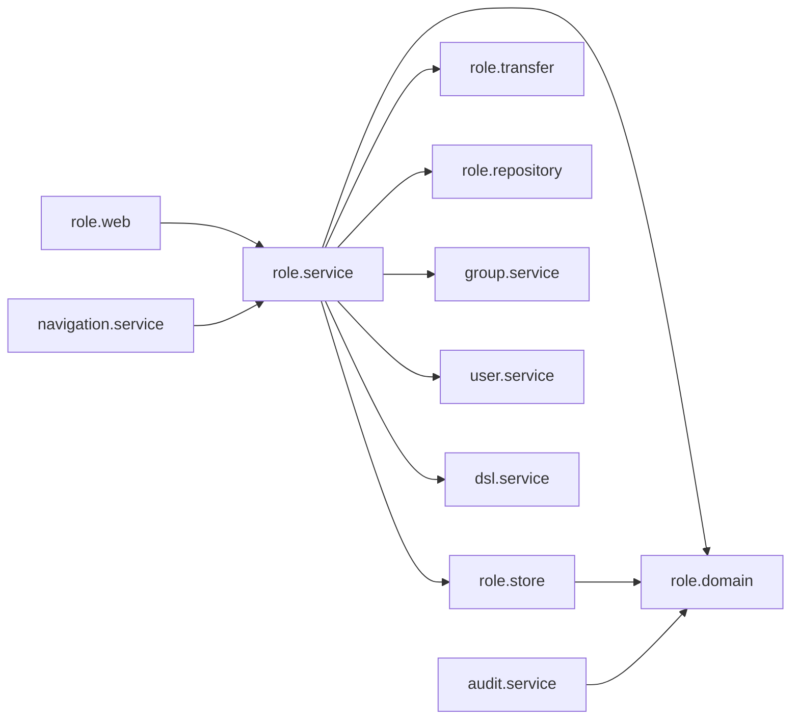

# 論理の部品 — U4 role

## 出典

- この単位の承認済みの NFR 要件 `construction/role/nfr-requirements/`（7つの成果物）
- この単位の承認済みの機能設計 `construction/role/functional-design/`（`functional-spec.md`・`rules.md`・`entities.md`）
- `contract-summary.md`（C3・C4・C5・C7・C8・C10）、`components.md`（RoleManagement・GroupManagement・DslDefinition・AuditLog・UserAccount）
- この段の答え: `nfr-design-questions.md` の Q1〜Q4（すべて A）とまとめの確認
- 捨ての試しの結果: `reliability-design.md` の 1節
- 統合の点: navigation の NFR 要件（NFR1.12、ほかの単位への引き継ぎ）と、その読み直しの R-01・R-08。group の NFR 設計の `logical-components.md`

## 1. 部品の一覧

| ID | 部品（パッケージ） | 受け持ち | TraceAspect |
|---|---|---|---|
| L1 | `RoleAdminController`・`RoleTransferController`・`MeWorkRoleController`・`MyPermissionsController`（`role.web`） | C7・C8 の口。`ApiAccess(ADMIN)`・`ApiAccess(AUTHENTICATED)`。DTO の受け渡し、結果の型を `switch` で `BusinessException` に変える。伏せ字の値を取り出すのはここだけ | 対象 |
| L2 | `RoleStore`（`role.store`、用途名の下位パッケージ） | ロールの行の排他（ヒント 3,000 ms）。違反を起こしうる書き込みと flush（作成・名前の変更・削除・保存・消す・割り当てと外し・作業ロールの保存）。import の JDBC のバッチ。例外を中で受けて区分し、`RoleStoreOutcome` を返す（巻き戻しの印は付けない。L15 が付ける）。`role.service` からだけ呼ばれる | **対象の外** |
| L15 | `RoleStoreTransactions`（`role.service`） | store を呼ぶ1つ目の `TransactionTemplate` を組み、結果が `Done` 以外なら `status.setRollbackOnly()` を付ける（付け忘れを構造で防ぐ。`reliability-design.md` の 2.4） | 対象 |
| L3 | `RoleAdminService`・`RoleAssignmentService`・`WorkRoleService`・`RoleTransferService`（`role.service`） | 業務処理。`TransactionTemplate` で1つ目と2つ目のトランザクションを組む。業務の判定、監査の出来事、待ち合わせの口 | 対象 |
| L4 | `EffectivePermissionResolverImpl`（`role.service`） | 契約 C5 の口（`effectiveWorkRole`・`snapshotFor`・`resolve`）。読み取りだけ | 対象（引数と戻り値は ID・名前の組・権限の値） |
| L5 | `RoleGroupDeletionGuard`（`role.service`、group の `GroupDeletionGuard` の実装） | `canDelete`・`assignedRoleCounts`。B3 の仮の実装を B5 で置き換える | 対象 |
| L6 | `PermissionInheritance`・`WorkRoleChooser`（`role.domain`、純粋な関数） | 継承の計算、有効な作業ロールの選び方 | 対象 |
| L7 | `RoleTransferReader`・`RoleTransferWriter`・`TransferFingerprint`（`role.transfer`） | YAML の木の検証、書き出し（二重引用符の規則）、指紋の計算。DB に触れない | **対象の外**（service との受け渡しは伏せる型） |
| L8 | `RoleBarrier`・`NoOpRoleBarrier`（`role.service`） | 排他を取った直後の待ち合わせの口。テストは `role/testsupport` の `@Primary` の部品 | 対象 |
| L9 | `RoleTransferSlot`（`role.service`） | 確かめと適用を同時に1つずつ通す。本文を読む前に `tryAcquire()` で取り、`finally` で必ず放す。待たずに取れなければ `ROLE_BUSY` | 対象 |
| L10 | `RoleRepository`・`PermissionSettingRepository`・`RoleAssignmentRepository`・`WorkRoleSelectionRepository`（`role.repository`） | 読み取りだけ（射影）。書き込みの方法と `@Modifying` を置かない | 対象 |
| L11 | `RoleName`・`RoleAuditEvent`・`RoleAuditDetail`・`RoleProblemTypes`（`role.domain`） | 名前の正規化と鍵、監査の出来事と detail の型、code の定数 | 対象 |
| L12 | `RoleProblemTypeCatalog`（`role.service`） | code の一覧を起動時に集める | 対象 |
| L13 | `RoleWebConfig`（`role.web`） | `RequestBodyLimitRoute` の登録（確かめと適用、10 MiB） | 対象外（設定） |
| L14 | `AuditEventListener` の受け取り（`audit.service`）と `AuditEventType`・`AuditFailureReason` の値（`audit.domain`） | `RoleAuditEvent` を写して記録 | 対象 |

- 本体に手が入るパッケージは `role.*`（新しい。`role.store`・`role.transfer` を含む）・`audit.domain`・`audit.service`。どれも `packagesJudgedByTotal` に入っておらず、パッケージごとの下限がそのまま当たる（NFR6.4）。
- `access`・`auth`・`common.web` の本体には手を入れない。

## 2. 依存の向き

テキストの代替:
- `role.web` は `role.service` を呼ぶ。
- `role.service` は `role.store`（書き込みと排他）・`role.transfer`（YAML）・`role.domain`・`role.repository`（読み取り）を使い、外の機能は `group.service`・`user.service`・`dsl.service` の口だけを使う。
- `audit.service` は `role.domain` の出来事に依存し、`navigation.service` は `role.service` の解決の口に依存する。
- `role` は `dsl.parse`・`dsl.validate`・`group.store`・`group.repository` に依存しない（`RoleBoundaryArchitectureTest`）。

## 3. 失敗の範囲

| 失敗 | 範囲 | 扱い |
|---|---|---|
| 違反・上限切れ | その要求だけ | `role/store` が区分して印を付け、409 か 404。上限切れは監査なし |
| 想定外の DB の誤り | その要求だけ | 包み直して 500。値は出さない |
| 監査の書き込みの失敗 | 監査の1行 | 操作は成功のまま、ERROR で分かる |
| import の適用の途中の失敗 | その適用だけ | すべて巻き戻し |
| 確かめ・適用の同時 | 2つ目の要求 | `ROLE_BUSY`（メモリの不足の広がりを防ぐ） |

## 4. 上流との差（承認済みの文書は書き換えない）

- **`resolve` の使い方の文言**（Q2: A、navigation の R-08）
  - 承認済みの NFR 要件の U5 への引き継ぎは「たくさんの対象は `snapshotFor` を1回（必須）」だった。これを「`resolve` は1回の要求で対象が1つのとき（テーブルの置き場など）に使ってよい。2つ以上の対象は `snapshotFor` を1回」に改める。
  - navigation の置き場の `resolve` 1回はこの決まりに合う。契約 C5 との差（`resolve` が写しを使わない形）の記録に、この使い分けを書き足す。
- **一致のテストを role に置く**（Q2: A）: navigation の引き継ぎの依頼のとおり、B5 に `EffectivePermissionConsistencyIT` を足す（`reliability-design.md` の 3節）。期待はテストの用意からの期待の表で持つ。
- **`RoleTransferSlot`**（L9）: 承認済みの要件・機能設計・契約に無い。依頼者の Q5 A で足した（根拠はヒープ約 1 GiB の前提、`reliability-design.md` の 2.6・6節）。
- **巻き戻しの印を service の1つの部品に集める**（L15）: 承認済みの機能設計・NFR 要件の前提（業務処理の側で付ける）を、1つの部品に集めた。group の読み直しの R-05 の手当てで、印は `TransactionTemplate` の `status.setRollbackOnly()` で付ける（group の T5 と同じ形）。
- **合否の回の形**（Q1: A）: `scalability-design.md` の 2.3・2.4。

## 5. コード生成（B4〜B6）への引き継ぎ

- **B4**
  - L1（ロール・設定・木・1件）、L2（ロールの行の排他・作成・名前の変更・削除・保存・消す）、L3 の `RoleAdminService`、L6 の `PermissionInheritance`、L8（4つの点）、L10〜L13 の該当の部分、L15 と `RoleStoreTransactionsIT`。
  - 構造の検査、`RoleStoreClassificationTest`、`RoleConflictAuditIT`・`RoleBusyApiIT` のロールの分、`RoleConnectionUsageIT` のロールの経路、`org.hibernate.orm.jdbc.error` のコメント。
  - k6 の台本の前の `k6 inspect` と試し走り（op のタグ）。
- **B5**
  - L2（割り当て・作業ロールの保存）、L3 の `RoleAssignmentService`・`WorkRoleService`、L4、L5（仮の実装の置き換え）、L6 の `WorkRoleChooser`。
  - `EffectivePermissionConsistencyIT`、`EffectivePermissionQueryCountIT`、403 の表の差の解消、`RoleConnectionUsageIT` の割り当てと切り替えの経路、k6 の `rolePoolLimit`（合否の回と記録の回）。
  - BR3.3 の作業ロールの保存の削除（NFR 要件の読み直しの R-04）。
- **B6**
  - L2（import の JDBC のバッチ。`JdbcTemplate` は main で新しい書き方で、`setQueryTimeout(10)` を明示し、`StatementCreatorUtils` のロガーを OFF にする）、L3 の `RoleTransferService`、L7、L9、L13。
  - `RoleTransferAtomicityIT`・`RoleTransferStaleIT`・`RoleTransferBusyIT`・`RoleTransferLimitsApiIT`、上限ちょうどのファイルの生成の部品、`RoleTransferRoundTripProperties`（二重引用符の名前）。

## 6. ほかの単位への引き継ぎ

- **U5 navigation**:
  - 業務のメニューは `snapshotFor` を1回、テーブルの置き場は `resolve` を1回でよい（上の文言）。
  - 2つの口の一致は role の `EffectivePermissionConsistencyIT` が、スキーマ・テーブル・カラムと補助権限、作業ロールなし、DSL なし、DSL に無い名前、読み替え中まで確かめる。navigation の `NavigationMenuAccessConsistencyIT` は、テーブルの階層を結合の側から確かめる。
  - その期待値はメニューの応答から作らない（navigation の R-01）。
  - navigation の NFR1.12 の方法の誤りを知らせる: 「集めた組に無い DSL のテーブルに送って 403 を確かめる」は、navigation の NFR1.1 の「メニューに出ないが READ のテーブルの置き場は 200」と食い違う。`NavigationMenuAccessConsistencyIT` の 403 の期待は、テストの用意から求めた実効が NONE のテーブル（期待の表）に限る。READ・FULL のテーブルは、メニューに出なくても置き場は 200 とする。navigation の NFR 設計で直してほしい。
- **U6 role-admin-ui**:
  - 確かめと適用は同時に1つしか通らない。2つ目は `ROLE_BUSY`（「ほかの読み込みが動いている。少し待ってからもう一度」の案内）。
  - 試しの見通しでは、確かめは 1 秒前後・適用は数秒。
- **U3 group**: group は、承認の場の決定で、role の rolePoolLimit の合否の形（上限 11、`acquire` の最大と時間切れの累計）と、時間に頼らない同時の重なりのテストの形（Q3 A）にそろえた。鍵・主キーの待ちの上限は、両方とも約 2 秒（依頼者が受け入れた）。

## 読み直し1回目の直し

読み直し（NOT-READY）を受け、依頼者の決定（Q5: A と、指摘をすべて直す）で、この成果物の次を直した。

- **R-01**: L2 から巻き戻しの印を外し、L15 `RoleStoreTransactions`（service の層、`TransactionTemplate` の `status.setRollbackOnly()`）を足した。
- **R-03**: L9 に取る位置と放し方を書き、4節の差の根拠を Q5 A に直した。
- **R-06**: B6 の引き継ぎに `JdbcTemplate` の文の上限とロガーを書いた。
- **R-08**: 6節の U5 への引き継ぎに、navigation の NFR1.12 の 403 の期待の誤りを名指しで書いた。
- **R-09**: L7 を `TraceAspect` の対象の外に直し、L2 は `role.service` からだけ呼ばれると書いた。

## 承認の場の決定と直し

承認の場で依頼者が Request Changes を選び、決定の文は「推奨の案のとおり直す」（直す範囲: 各単位の読み直しの Major と、単位の間でそろえる3点）。この成果物では次を直した。

- **そろえる点**: 6節の U3 group への引き継ぎを「group は role の形にそろえた」に直し、鍵の待ちの上限が両方で約 2 秒に決まったことを書いた。4節の巻き戻しの印の差を、group との差ではなく承認済みの設計との差として書き直した。
