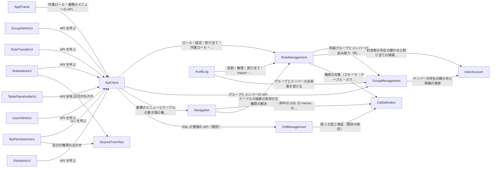

# 部品の一覧（Domain Design）— role-menu

出典の表記: FR・NFR・C・A は `aidlc/spaces/default/intents/261004-role-menu/inception/requirements-analysis/requirements.md`、US・AC・D は `aidlc/spaces/default/intents/261004-role-menu/inception/user-stories/stories.md`、画面 S1〜S10 は `aidlc/spaces/default/intents/261004-role-menu/inception/refined-mockups/mockups.md`、DQ1〜DQ5・DF1 は `domain-design-questions.md` の確定した答え（Q1〜Q5・F1）、K-32〜K-38 は `aidlc/spaces/default/codekb/mastersmith2/` の所見、TP は `team.md`、PM は `project.md`。ADR は `decisions.md`。

部品はコードとして書く論理の部品で、内部DB（H2）・make-you-chic-ui は部品の外の依存として書く。既存の部品は今のパッケージ名を併記し、この Intent で触れない部品（Authentication・Invitation・Mail・InstanceAppearance・TargetDb・UserAdministration など）は載せない。エンティティは、アプリが独自に持つデータの持ち主と形（識別子・属性名・参照）だけを書き、型や制約は機能設計で決める（PM の学び）。

## Part A — 機械が読む一覧

```yaml
components:
  - name: RoleManagement
    summary: "新規（`role`）。ロール・主権限と補助権限の設定・実効の権限の解決・権限の YAML の受け渡し・利用者とグループへの割り当て・作業ロール"
    behaviour: >
      ロールの作成・名前の変更・削除（割り当てが残れば拒否、同じ名前の重なりを拒否、変えるものが無い操作は拒否して監査）。主権限（設定なし・NONE・READ・FULL、スキーマ→テーブル→カラム）と補助権限（CREATE・DELETE の設定なし・可・不可、スキーマ→テーブル）の設定を、対象の名前（スキーマ名・テーブル名・カラム名）で持つ。設定の対象と表示名は DslDefinition の提供口から今の DSL を読み、その都度名前で照らし合わせる（ADR-004）。DSL に無い対象の設定は持ち続けるが解決では使わない。実効の値は直近の上位の明示の値を継承し、全階層が設定なしなら NONE・不可（ADR-003）。利用者のロールは直接の割り当てと、GroupManagement から読む所属グループへの割り当ての和。作業ロールは利用者ごとに自分の表に持ち、自分のロールでなくなっていたら決めた順の最初のロールに置き換える（置き換えは監査しない）。実効の権限の解決の口は要求ごとに内部DB から求め、トークンや画面の値を使わない（PM の Mandated）。グループの削除の前に、GroupManagement の「削除してよいかを問う口」を実装して割り当ての有無を答える（ADR-002）。権限の YAML は信頼できない入力として、DslDefinition の service の層の上限つきの安全な読み込みの口（上限の値は role が渡す）で読み、大きさ・入れ子・別名の上限、タグと任意の型の拒否、重複キーの誤りを当てる（ADR-007）。確かめ（変わる点の一覧）と適用の2段にし、適用の時に検証し直して確かめた内容と違えば拒否する。管理の API は /api/admin/ の下（管理者の印で守る）、作業ロールと自分の権限の API は /api/me の下（ログインだけ）。成功・業務の拒否の操作ごとに監査の出来事を出す。個人に関する値は TRACE のログに出ない型で受け渡す。
    responsibilities:
      - "ロールの管理（作成・名前の変更・削除）"
      - "主権限と補助権限の設定（名前で持つ）"
      - "実効の権限の解決の口（後の Intent とメニュー向け）"
      - "利用者・グループへのロールの割り当て"
      - "作業ロールの保持と切り替え"
      - "権限の YAML の書き出し・確かめ・適用"
      - "グループの削除の可否への回答（口の実装）"
      - "役割・権限の監査の出来事の発行"
      - "グループに割り当てたロールと、利用者のロールと出どころの読み取りの API（画面 S6・S9 向け）"
    depends_on:
      - component: GroupManagement
        interaction: "所属グループとメンバーの読み取り（利用者のロールの和）、グループの存在の確かめ"
        style: sync
      - component: UserAccount
        interaction: "利用者の存在の確かめと割り当ての候補の検索"
        style: sync
      - component: DslDefinition
        interaction: "権限の対象（スキーマ・テーブル・カラム）と表示名の読み取り、上限つきの安全な YAML の読み込みの口"
        style: sync
    dependents:
      - component: Navigation
        interaction: "テーブルの階層の実効の主権限の解決"
      - component: AuditLog
        interaction: "役割・権限・割り当て・import・作業ロールの切り替えの出来事を受ける"
      - component: ApiClient
        interaction: "ロール・設定・割り当て・作業ロール・自分の権限・受け渡しの API"
    external_dependencies:
      - name: "H2（内部DB）"
        kind: database
        purpose: "ロール・設定・割り当て・作業ロールの保存"
    entities:
      - name: Role
        identifier: "roleId"
        attributes: [name, createdAt, updatedAt]
      - name: PermissionSetting
        identifier: "roleId + schemaName + tableName + columnName"
        attributes: [roleId, schemaName, tableName, columnName, mainPermission, createPermission, deletePermission]
        references:
          - entity: Role
            owned_by: RoleManagement
            relationship: "各設定は1つのロールに属する"
      - name: RoleAssignment
        identifier: "assignmentId"
        attributes: [roleId, userId, groupId]
        references:
          - entity: Role
            owned_by: RoleManagement
            relationship: "各割り当ては1つのロールを指す"
          - entity: User
            owned_by: UserAccount
            relationship: "利用者への割り当ては1人の利用者を指す"
          - entity: Group
            owned_by: GroupManagement
            relationship: "グループへの割り当ては1つのグループを指す"
      - name: WorkRoleSelection
        identifier: "userId"
        attributes: [userId, roleId, updatedAt]
        references:
          - entity: User
            owned_by: UserAccount
            relationship: "1人の利用者に1つ"
          - entity: Role
            owned_by: RoleManagement
            relationship: "選んだロールを指す"
  - name: GroupManagement
    summary: "新規（`group`）。グループの作成・名前の変更・削除とメンバーの足し外し"
    behaviour: >
      グループの名前の重なりを拒否し、変えるものが無い操作（同じ名前への変更・重ねての追加・メンバーでない利用者の外し）は拒否して監査する。メンバーは登録の終わった利用者だけ（招待中の人は利用者の行が無く足せない）。削除は、メンバーが残れば拒否し、ロールの割り当ての有無は自分で持つ「削除してよいかを問う口」で問う（RoleManagement が実装する。group は role を知らない、ADR-002）。メンバーの読み取りの口を RoleManagement に出す。管理の API は /api/admin/ の下。操作ごとに監査の出来事を出す。
    responsibilities:
      - "グループの管理（作成・名前の変更・削除）"
      - "メンバーの足し外し"
      - "メンバーの読み取りの口"
      - "削除してよいかを問う口（インターフェース）の定義"
      - "グループの監査の出来事の発行"
    depends_on:
      - component: UserAccount
        interaction: "メンバーの存在の確かめと候補の検索"
        style: sync
    dependents:
      - component: RoleManagement
        interaction: "所属グループとメンバーの読み取り（利用者のロールの和）、グループの存在の確かめ"
      - component: AuditLog
        interaction: "グループとメンバーの出来事を受ける"
      - component: ApiClient
        interaction: "グループとメンバーの API"
    external_dependencies:
      - name: "H2（内部DB）"
        kind: database
        purpose: "グループとメンバーの保存"
    entities:
      - name: Group
        identifier: "groupId"
        attributes: [name, createdAt, updatedAt]
      - name: GroupMembership
        identifier: "groupId + userId"
        attributes: [groupId, userId, addedAt]
        references:
          - entity: Group
            owned_by: GroupManagement
            relationship: "各メンバーの行は1つのグループに属する"
          - entity: User
            owned_by: UserAccount
            relationship: "1人の利用者を指す"
  - name: Navigation
    summary: "新規（`navigation`）。業務のメニューの木を、作業ロールの実効の主権限で絞って画面に返す"
    behaviour: >
      DslDefinition の提供口から適用中の DSL の `menus` を読み、RoleManagement の解決の口でテーブルの階層の実効の主権限を求め、NONE のテーブルを指す項目と子がすべて出ないまとまりを落とす（カラムの値は見ない）。テーブルが NONE で子が見える項目は、移れないまとまりとして返す。DSL に無いテーブルを指す項目は出さない。作業ロールが無い・DSL が無い・menus が空なら空の木を返す。管理のメニューは返さない（画面の登録で作る）。テーブルの画面の置き場の権限の問い合わせ（READ・FULL か、NONE・DSL に無い）も受け持ち、NONE と DSL に無いテーブルは同じ応答にする。API は /api/me の下（ログインだけ）。
    responsibilities:
      - "業務のメニューの木を権限で絞って返す"
      - "テーブルの画面の置き場の権限の問い合わせ"
    depends_on:
      - component: DslDefinition
        interaction: "適用中の DSL の menus の読み取り"
        style: sync
      - component: RoleManagement
        interaction: "テーブルの階層の実効の主権限の解決"
        style: sync
    dependents:
      - component: ApiClient
        interaction: "業務のメニューとテーブルの置き場の権限の API"
    external_dependencies: []
    entities: []
  - name: DslDefinition
    summary: "既存（`dsl`）を広げる。書式の版 2（スキーマの階層）とメニューの深さの上限"
    behaviour: >
      DSL の型・JSON Schema・検証に、スキーマ（スキーマ名・表示名と、その下のテーブル）の階層を足し、書式の版 2 だけを受け付ける（版 1 は書式の版の誤り）。形は複数のスキーマを受け付ける。メニューの深さに上限を置き、新しい投入と復元では上限を超えると拒否し、起動時の読み直しでは深さだけを検証から外して深すぎる枝を出さず警告のログを出す（ADR-005）。適用中のモデルの提供口（`ActiveDslModelProvider`）で、スキーマ・テーブル・カラムと表示名、menus を出す。メニューの項目は、テーブルをスキーマ名とテーブル名の組で指す（版 2 ではテーブル名はスキーマの中でだけ一意）。Navigation とテーブルの画面の置き場の API は同じ組を鍵に使う。service の層に、上限つきの安全な YAML の読み込みの口を出す（上限の値は呼ぶ側が渡す。`dsl.parse` は外から直接使わせない境界テストのまま、ADR-007）。役割・権限の機能を知らない（片方向で読まれる）。
    responsibilities:
      - "DSL の型と検証（書式の版 2・スキーマの階層・メニューの深さの上限）"
      - "適用中のモデルの提供口"
      - "上限つきの安全な YAML の読み込みの口（service）"
    depends_on: []
    dependents:
      - component: RoleManagement
        interaction: "権限の対象（スキーマ・テーブル・カラム）と表示名の読み取り、上限つきの安全な YAML の読み込みの口"
      - component: Navigation
        interaction: "適用中の DSL の menus の読み取り"
      - component: DslManagement
        interaction: "版 2 の型と検証（既存の依存）"
    external_dependencies: []
    entities: []
  - name: DslManagement
    summary: "既存（`dslmanage`）を広げる。既定の DSL を書式の版 2 で生成する"
    behaviour: >
      既定の DSL の生成で、対象DB の設定のスキーマ名を DSL のスキーマとして書き、その下にテーブルを並べる（書式の版 2）。ダウンロードも版 2。版 1 の履歴の復元は書式の版の誤り（4xx）として拒否し、500 にしない。違いの表（照合）は設定のスキーマのテーブルとカラムで行う。
    responsibilities:
      - "既定の DSL の生成（版 2）"
      - "版 1 の履歴の扱い"
    depends_on:
      - component: DslDefinition
        interaction: "版 2 の型と検証（既存の依存）"
        style: sync
    dependents:
      - component: ApiClient
        interaction: "DSL の管理の API（既存）"
    external_dependencies: []
    entities: []
  - name: UserAccount
    summary: "既存（`user`）。この Intent では変えない（既存の読み取りの口を使われる）"
    behaviour: >
      利用者の存在の確かめは既存の `findById`、割り当て・メンバーの候補の検索（氏名かメールアドレスの一部、利用停止の状態を含む）は既存の `findAdminPage`（管理向けの要約の一覧と検索）で足りることをコードで確かめた。招待中の人は利用者の行が無いため、候補に出ない。`useradmin` には依存しない（境界テスト）。役割・権限は知らないまま。
    responsibilities:
      - "利用者の管理（既存）"
      - "利用者の存在・候補の読み取りの口"
    depends_on: []
    dependents:
      - component: RoleManagement
        interaction: "利用者の存在の確かめと割り当ての候補の検索"
      - component: GroupManagement
        interaction: "メンバーの存在の確かめと候補の検索"
    external_dependencies: []
    entities:
      - name: User
        identifier: "userId"
        attributes: [email, name, adminFlag, status]
  - name: AuditLog
    summary: "既存（`audit`）を広げる。役割・権限・グループ・import・作業ロールの切り替えの監査の種類を足す"
    behaviour: >
      RoleManagement と GroupManagement の出来事を受け、確定の後に別のトランザクションで記録する（今の仕組み）。監査の種類の名前は 32 文字以内。一度決めた名前は変えない。import の「変えた中身」の残し方（要約か全件か）は機能設計で決める。
    responsibilities:
      - "監査の記録（既存）"
      - "役割・権限・グループの監査の種類"
    depends_on:
      - component: RoleManagement
        interaction: "役割・権限・割り当て・import・作業ロールの切り替えの出来事を受ける"
        style: event
      - component: GroupManagement
        interaction: "グループとメンバーの出来事を受ける"
        style: event
    dependents: []
    external_dependencies:
      - name: "H2（内部DB）"
        kind: database
        purpose: "監査の記録"
    entities: []
  - name: AccessControl
    summary: "既存（`access`）。管理者の印による管理の API の認可（変えない）"
    behaviour: >
      新しい管理の API（ロール・グループ・受け渡し）は /api/admin/ の下で、今の決まり（管理者の印）で守る。作業ロール・自分の権限・業務のメニュー・テーブルの置き場は/api/** の既定（ログインだけ）で守る。API の分類は、各 API（コントローラーの口）に `common/security` に定義する注釈で印を付けて持つ。印の無い API があれば落ちるテストは、既存の `ArchitectureTest` と同じ置き場（全体の構造の検査）に置き、`access` は新しい機能を知らない（ADR-008）。本体のソースに手を入れる Bolt では `AccessBoundaryArchitectureTest` を足し、`access.service` をカバレッジの一覧から外す（TP）。
    responsibilities:
      - "管理の API の認可（既存）"
    depends_on: []
    dependents: []
    external_dependencies: []
    entities: []
  - name: ApiClient
    summary: "既存（`shared/api-client`）。画面から API を呼ぶ共通の部品"
    behaviour: >
      既存のまま使う。作業ロールの切り替えの後の読み直しは各部品が行う。
    responsibilities:
      - "API の呼び出し（既存）"
    depends_on:
      - component: RoleManagement
        interaction: "ロール・設定・割り当て・作業ロール・自分の権限・受け渡しの API"
        style: sync
      - component: GroupManagement
        interaction: "グループとメンバーの API"
        style: sync
      - component: Navigation
        interaction: "業務のメニューとテーブルの置き場の権限の API"
        style: sync
      - component: DslManagement
        interaction: "DSL の管理の API（既存）"
        style: sync
    dependents:
      - component: AppFrame
        interaction: "作業ロール・業務のメニューの API を呼ぶ"
      - component: RoleAdminUi
        interaction: "API を呼ぶ"
      - component: GroupAdminUi
        interaction: "API を呼ぶ"
      - component: RoleTransferUi
        interaction: "API を呼ぶ"
      - component: MyPermissionsUi
        interaction: "API を呼ぶ"
      - component: TablePlaceholderUi
        interaction: "API を呼ぶ"
      - component: UserAdminUi
        interaction: "API を呼ぶ"
      - component: DslAdminUi
        interaction: "API を呼ぶ"
    external_dependencies: []
    entities: []
  - name: SharedTreeView
    summary: "新規（`shared/tree`）。開閉のボタンの形の木（権限の設定と自分の権限で共有）"
    behaviour: >
      スキーマ→テーブルの木を、開閉のボタン（aria-expanded）と選択で出し、開いた所だけ子を読み込む。ARIA の tree の役割は使わない。make-you-chic-ui に木の部品が無いため frontend で作り、取り込まれたら置き換える。
    responsibilities:
      - "開閉と選択のある木の表示"
    depends_on: []
    dependents:
      - component: RoleAdminUi
        interaction: "権限の設定の左の木"
      - component: MyPermissionsUi
        interaction: "自分の権限の左の木"
    external_dependencies: []
    entities: []
  - name: AppFrame
    summary: "既存の骨組み（app の registry・navigation・layout・routing）を広げる。作業ロールの切り替えと、業務と管理のメニュー"
    behaviour: >
      トップバーに作業ロールの切り替え（Dropdown、選択中は「（使用中）」）と自分の権限への入口を置く。サイドバーに業務のメニューの木（Navigation の API）と管理のメニュー（画面の登録、管理者の印で出す）を見出しで分けて出す。入れ子のサイドバーは make-you-chic-ui に依頼する。作業ロールを切り替えたら業務のメニューを読み直す。登録の型（AccessLevel・VisibleWhen）に、ロール・グループ・受け渡しの管理の画面の登録を足す。
    responsibilities:
      - "作業ロールの切り替え"
      - "業務と管理のメニュー"
      - "画面の登録の型"
    depends_on:
      - component: ApiClient
        interaction: "作業ロール・業務のメニューの API を呼ぶ"
        style: sync
    dependents: []
    external_dependencies: []
    entities: []
  - name: RoleAdminUi
    summary: "新規（`features/roleadmin`）。ロールの一覧・詳細（権限の設定・割り当て）"
    behaviour: >
      画面 S3・S4・S5。
    responsibilities:
      - "ロールの一覧と作成・名前の変更・削除"
      - "権限の設定の木と表・保存"
      - "ロールの割り当て"
    depends_on:
      - component: ApiClient
        interaction: "API を呼ぶ"
        style: sync
      - component: SharedTreeView
        interaction: "権限の設定の左の木"
        style: sync
    dependents: []
    external_dependencies: []
    entities: []
  - name: GroupAdminUi
    summary: "新規（`features/groupadmin`）。グループの一覧・詳細（メンバー・割り当てたロールの読み取り）"
    behaviour: >
      画面 S6。割り当てたロールは RoleManagement の読み取りの API から出す。
    responsibilities:
      - "グループの一覧と作成・名前の変更・削除"
      - "メンバーの足し外し"
      - "グループに割り当てたロールの読み取りの表示"
    depends_on:
      - component: ApiClient
        interaction: "API を呼ぶ"
        style: sync
    dependents: []
    external_dependencies: []
    entities: []
  - name: RoleTransferUi
    summary: "新規（`features/roletransfer`）。権限の受け渡し（YAML の書き出し・確かめ・適用）"
    behaviour: >
      画面 S7。
    responsibilities:
      - "権限の YAML の書き出し・確かめ・適用"
    depends_on:
      - component: ApiClient
        interaction: "API を呼ぶ"
        style: sync
    dependents: []
    external_dependencies: []
    entities: []
  - name: MyPermissionsUi
    summary: "新規（`features/mypermissions`）。自分の実効の権限（Should）"
    behaviour: >
      画面 S8。読み取りだけ。
    responsibilities:
      - "自分の実効の権限の表示"
    depends_on:
      - component: ApiClient
        interaction: "API を呼ぶ"
        style: sync
      - component: SharedTreeView
        interaction: "自分の権限の左の木"
        style: sync
    dependents: []
    external_dependencies: []
    entities: []
  - name: TablePlaceholderUi
    summary: "新規（`features/tables`）。テーブルの画面の置き場（準備中・権限なし）"
    behaviour: >
      画面 S2。J で中身を差し込む。
    responsibilities:
      - "テーブルの画面の置き場"
    depends_on:
      - component: ApiClient
        interaction: "API を呼ぶ"
        style: sync
    dependents: []
    external_dependencies: []
    entities: []
  - name: UserAdminUi
    summary: "既存（`features/useradmin`）を広げる。利用者の詳細に、その人のロールと出どころを読み取りで出す"
    behaviour: >
      画面 S9。
    responsibilities:
      - "利用者の管理の画面（既存）"
      - "利用者のロールの読み取りの表示"
    depends_on:
      - component: ApiClient
        interaction: "API を呼ぶ"
        style: sync
    dependents: []
    external_dependencies: []
    entities: []
  - name: DslAdminUi
    summary: "既存（`features/dsl`）。版 2 の誤りの文言とスキーマの階層の表示を足す"
    behaviour: >
      画面 S10。
    responsibilities:
      - "DSL の管理の画面（既存）"
    depends_on:
      - component: ApiClient
        interaction: "API を呼ぶ"
        style: sync
    dependents: []
    external_dependencies: []
    entities: []
```

## Part B — 人が読む図と表

### Component Diagram



テキストの代替: 新しい `RoleManagement` は `GroupManagement`（メンバー）・`UserAccount`（利用者の既存の読み取りの口）・`DslDefinition`（権限の対象と、上限つきの安全な YAML の読み込みの口）を読む。`Navigation` は `DslDefinition`（menus）と `RoleManagement`（解決の口）を読む。`AuditLog` は `RoleManagement` と `GroupManagement` の出来事を受ける。画面の部品はすべて `ApiClient` を通してバックエンドを呼び、`RoleAdminUi` と `MyPermissionsUi` は共有の木 `SharedTreeView` を使う。`GroupManagement` は `RoleManagement` を知らない（削除してよいかを問う口は `GroupManagement` が定義し `RoleManagement` が実装する。依存の矢印は `RoleManagement` → `GroupManagement` の1本だけ、ADR-002）。`AccessControl` は新しい機能に依存しない（API の分類の網羅のテストは全体の構造の検査に置く、ADR-008）。

### Component Summary

| Component | Purpose | Depends On | Dependents | Entities Owned |
|---|---|---|---|---|
| RoleManagement | 新規（`role`）。ロール・主権限と補助権限の設定・実効の権限の解決・権限の YAML の受け渡し・利用者とグループへの割り当て・作業ロール | GroupManagement・UserAccount・DslDefinition | Navigation・AuditLog・ApiClient | Role・PermissionSetting・RoleAssignment・WorkRoleSelection |
| GroupManagement | 新規（`group`）。グループの作成・名前の変更・削除とメンバーの足し外し | UserAccount | RoleManagement・AuditLog・ApiClient | Group・GroupMembership |
| Navigation | 新規（`navigation`）。業務のメニューの木を、作業ロールの実効の主権限で絞って画面に返す | DslDefinition・RoleManagement | ApiClient | なし |
| DslDefinition | 既存（`dsl`）を広げる。書式の版 2（スキーマの階層）とメニューの深さの上限 | なし | RoleManagement・Navigation・DslManagement | なし |
| DslManagement | 既存（`dslmanage`）を広げる。既定の DSL を書式の版 2 で生成する | DslDefinition | ApiClient | なし |
| UserAccount | 既存（`user`）。この Intent では変えない（既存の読み取りの口を使われる） | なし | RoleManagement・GroupManagement | User |
| AuditLog | 既存（`audit`）を広げる。役割・権限・グループ・import・作業ロールの切り替えの監査の種類を足す | RoleManagement・GroupManagement | なし | なし |
| AccessControl | 既存（`access`）。管理者の印による管理の API の認可（変えない） | なし | なし | なし |
| ApiClient | 既存（`shared/api-client`）。画面から API を呼ぶ共通の部品 | RoleManagement・GroupManagement・Navigation・DslManagement | AppFrame・RoleAdminUi・GroupAdminUi・RoleTransferUi・MyPermissionsUi・TablePlaceholderUi・UserAdminUi・DslAdminUi | なし |
| SharedTreeView | 新規（`shared/tree`）。開閉のボタンの形の木（権限の設定と自分の権限で共有） | なし | RoleAdminUi・MyPermissionsUi | なし |
| AppFrame | 既存の骨組み（app の registry・navigation・layout・routing）を広げる。作業ロールの切り替えと、業務と管理のメニュー | ApiClient | なし | なし |
| RoleAdminUi | 新規（`features/roleadmin`）。ロールの一覧・詳細（権限の設定・割り当て） | ApiClient・SharedTreeView | なし | なし |
| GroupAdminUi | 新規（`features/groupadmin`）。グループの一覧・詳細（メンバー・割り当てたロールの読み取り） | ApiClient | なし | なし |
| RoleTransferUi | 新規（`features/roletransfer`）。権限の受け渡し（YAML の書き出し・確かめ・適用） | ApiClient | なし | なし |
| MyPermissionsUi | 新規（`features/mypermissions`）。自分の実効の権限（Should） | ApiClient・SharedTreeView | なし | なし |
| TablePlaceholderUi | 新規（`features/tables`）。テーブルの画面の置き場（準備中・権限なし） | ApiClient | なし | なし |
| UserAdminUi | 既存（`features/useradmin`）を広げる。利用者の詳細に、その人のロールと出どころを読み取りで出す | ApiClient | なし | なし |
| DslAdminUi | 既存（`features/dsl`）。版 2 の誤りの文言とスキーマの階層の表示を足す | ApiClient | なし | なし |

### Entity Ownership

| Entity | Owning Component | Identifier | Attributes | References |
|---|---|---|---|---|
| Role | RoleManagement | roleId | name・createdAt・updatedAt | なし |
| PermissionSetting | RoleManagement | roleId + schemaName + tableName + columnName | roleId・schemaName・tableName・columnName・mainPermission・createPermission・deletePermission | Role（RoleManagement） |
| RoleAssignment | RoleManagement | assignmentId | roleId・userId・groupId | Role（RoleManagement）・User（UserAccount）・Group（GroupManagement） |
| WorkRoleSelection | RoleManagement | userId | userId・roleId・updatedAt | User（UserAccount）・Role（RoleManagement） |
| Group | GroupManagement | groupId | name・createdAt・updatedAt | なし |
| GroupMembership | GroupManagement | groupId + userId | groupId・userId・addedAt | Group（GroupManagement）・User（UserAccount） |
| User | UserAccount | userId | email・name・adminFlag・status | なし |

### Entity の注（機能設計で決める点）

- **PermissionSetting**: スキーマだけ・テーブルまでの設定の行で、下位の名前をどう表すか（階層の種類の属性を持つか、下位の名前を空の印にするか）と、主キー（H2 は主キーに空の値を許さない）は機能設計で決める。主権限・CREATE・DELETE のどれを持てるかは階層で違う（カラムは主権限だけ）。
- **RoleAssignment**: 相手は利用者かグループのどちらか一方だけ。相手の種類の表し方と、同じロールを同じ相手に重ねない一意の鍵は機能設計で決める。同時の重なりの守り（ADR-002・ADR-006）もこの鍵に依る。

### External Dependencies

| Component | Dependency | Kind | Purpose |
|---|---|---|---|
| RoleManagement | H2（内部DB） | database | ロール・設定・割り当て・作業ロールの保存 |
| GroupManagement | H2（内部DB） | database | グループとメンバーの保存 |
| AuditLog | H2（内部DB） | database | 監査の記録 |

### Rationale

| 部品 | 別の部品にした理由 |
|---|---|
| RoleManagement | ロール・設定・割り当て・作業ロール・解決は、どれも「どのロールが何をできるか」を決めるデータで、同じ時に変わり同じ表を扱う（DQ1: B）。解決の口は設定の表と同じ持ち主に置き、後の Intent（J・K）とメニューが同じ口を使う |
| GroupManagement | グループとメンバーは「利用者のまとまり」で、ロールの設定と変わる時期が違う（人の出入りで変わる）。依頼者の決定で分けた（DQ1: B）。ロールを知らないまま、問う口で削除の可否を確かめる（DF1: A） |
| Navigation | 業務のメニューは DSL（menus）と権限（解決の口）の両方を使う。`dsl` に置くと `dsl` が役割を知り、`role` に置くと `role` が画面の都合を持つため、両方に依存する新しい部品にした（DQ3: A） |
| DslDefinition・DslManagement | 書式の版 2 とスキーマの階層・メニューの深さは DSL の型と検証そのもので、既存の持ち主を広げる（ストーリー US6.1） |
| AuditLog | 監査は出来事を受ける既存の仕組みのまま、種類だけを足す |
| AccessControl | 管理者の印の認可は変えない（C1）。API の分類の網羅（NFR1.3）は、各 API の注釈の印と全体の構造の検査で確かめ、`access` に新しい機能への依存を作らない（ADR-008） |
| SharedTreeView | 権限の設定（S4）と自分の権限（S8）が同じ木を使い、機能どうしで直接 import しないため共有に置く（TP） |
| AppFrame | 作業ロールの切り替えと業務のメニューは、どの画面からも使う骨組みの一部（DQ5: A） |
| RoleAdminUi・GroupAdminUi・RoleTransferUi・MyPermissionsUi・TablePlaceholderUi | 画面ごとの機能。管理の画面はロールとグループを分け（画面の段の RQ1: A）、受け渡し・自分の権限・テーブルの置き場は使う人と時期が違う（DQ5: A） |

### Alternatives Rejected（部品の境界）

- **役割・権限を1つの機能 `role` にまとめる**（DQ1: A）: 境界が少なく循環も起きないが、依頼者はグループを分ける形（B）を選んだ。
- **解決だけの小さな `permission` を分ける**（DQ1: C）: 後の Intent の依存先を小さくできるが、設定の表と解決が別の持ち主になり、照らし合わせの決まりが2か所に分かれる。
- **グループの削除を `role` が受け持つ**（DF1: B）: 循環は無いが、グループの API がグループの持ち主の外に置かれる。
- **作業ロールを `user` の列に持つ**（DQ2: B）: `user` が役割を知ることになり、`user` の境界（役割を知らない）を崩す。
- **業務のメニューを `dsl` か `role` に置く**（DQ3: B・C）: どちらも片方の部品が他方の都合を持つ。
- **DSL の適用の出来事で対象を写す**（DQ4: C）: 写しと DSL の食い違いを管理する必要が出る。今回の規模（最大 1 万カラム）では、その都度照らし合わせで足りる（ADR-004）。
