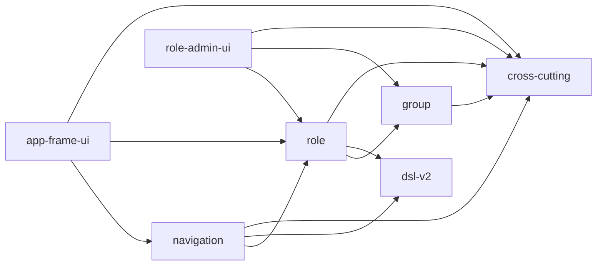

# 単位の依存（Unit of Work Dependency）— role-menu

出典: `unit-of-work.md`、部品の一覧の依存（`components.md`）、ADR-001〜008。この文書は依存の形（topology）だけを書き、作る順や重要な経路は Delivery Planning で決める。

## 依存の一覧（機械が読む形）

```yaml
units:
  - name: cross-cutting
    kind: library
    depends_on: []
  - name: dsl-v2
    kind: library
    depends_on: []
  - name: group
    kind: service
    depends_on: [cross-cutting]
  - name: role
    kind: service
    depends_on: [cross-cutting, dsl-v2, group]
  - name: navigation
    kind: service
    depends_on: [cross-cutting, dsl-v2, role]
  - name: role-admin-ui
    kind: ui
    depends_on: [cross-cutting, group, role]
  - name: app-frame-ui
    kind: ui
    depends_on: [cross-cutting, role, navigation]
```

## 依存の図



テキストの代替: `group` は `cross-cutting` に依存する。`role` は `cross-cutting`・`dsl-v2`・`group` に依存する。`navigation` は `cross-cutting`・`dsl-v2`・`role` に依存する。`role-admin-ui` は `cross-cutting`・`group`・`role` に、`app-frame-ui` は `cross-cutting`・`role`・`navigation` に依存する。`role-admin-ui` と `app-frame-ui` は互いに依存しない（共有の木と画面の登録の型は `cross-cutting` に置く）。`cross-cutting` と `dsl-v2` は何にも依存しない。循環は無い。

## 依存の理由と結合点

| 依存（A → B） | 結合点 | 種類 |
|---|---|---|
| group → cross-cutting | 新しい管理の API に分類の注釈を付け、構造の検査を通す | 共有の注釈（コード） |
| role → cross-cutting | 同上 | 共有の注釈（コード） |
| navigation → cross-cutting | 同上（ログインだけ） | 共有の注釈（コード） |
| role → dsl-v2 | 適用中の DSL の提供口（スキーマ・テーブル・カラムと表示名、版 2）、上限つきの安全な YAML の読み込みの口（ADR-004・ADR-007） | アプリの中の口（同期） |
| role → group | メンバーの読み取りの口、グループの存在の確かめ、削除してよいかを問う口の実装（ADR-002） | アプリの中の口（同期）・インターフェースの実装 |
| navigation → dsl-v2 | 適用中の DSL の menus（スキーマ名とテーブル名の組で指す） | アプリの中の口（同期） |
| navigation → role | 実効の主権限の解決の口（ADR-003） | アプリの中の口（同期） |
| role-admin-ui → cross-cutting | 共有の木 `shared/tree`、画面の登録の型（管理のメニューへの登録） | 共有のコード（画面） |
| app-frame-ui → cross-cutting | 共有の木 `shared/tree`（自分の権限）、画面の登録の型（メニューの組み立て） | 共有のコード（画面） |
| role-admin-ui → group | グループ・メンバーの管理の API | HTTP（`ApiClient`） |
| role-admin-ui → role | ロール・設定・割り当て・受け渡し・利用者とグループのロールの読み取りの API | HTTP（`ApiClient`） |
| app-frame-ui → role | 作業ロールの切り替え・自分の権限の API | HTTP（`ApiClient`） |
| app-frame-ui → navigation | 業務のメニュー・テーブルの置き場の権限の API | HTTP（`ApiClient`） |

- 監査（`audit`）は各機能の出来事を受ける既存の仕組みで、単位の依存には数えない（`group`・`role` が種類を足す）。
- `user`（利用者）・`ApiClient` は変えずに使う。

## 並行して作れる組

依存の上で互いに関係の無い単位の組（どの順でも作れる）:

- `cross-cutting` と `dsl-v2`（どちらも依存が無い）
- `group` と `dsl-v2`（`group` は `cross-cutting` だけに依存する）
- `navigation` と `role-admin-ui`（どちらも `role` の後に作れ、互いに依存しない）

どの組を実際に並べるか、どれを先に届けるかは Delivery Planning で決める。
